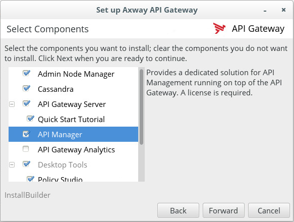
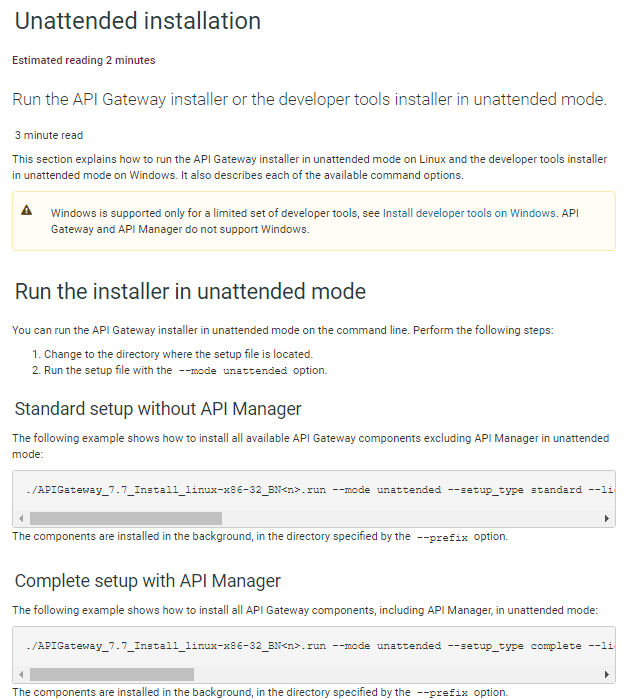
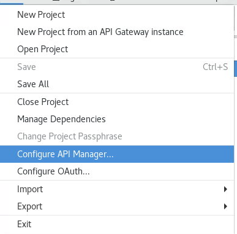
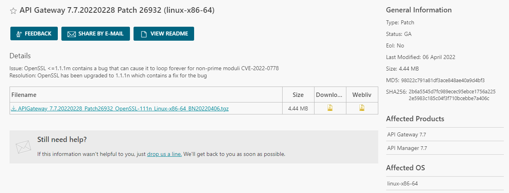
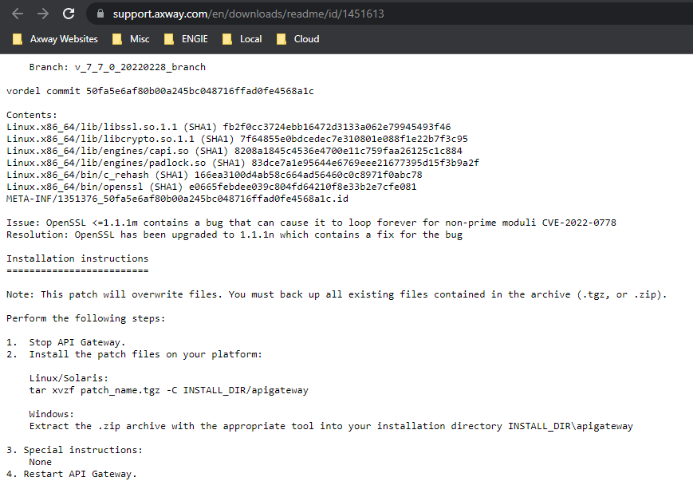
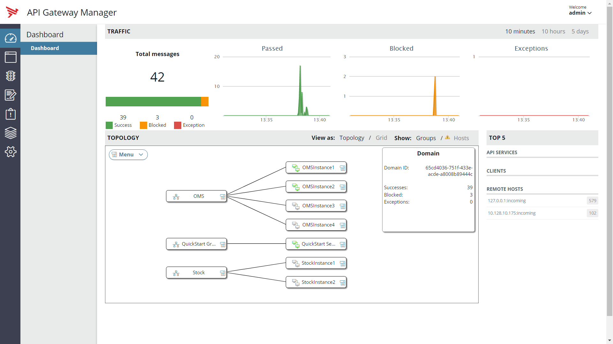
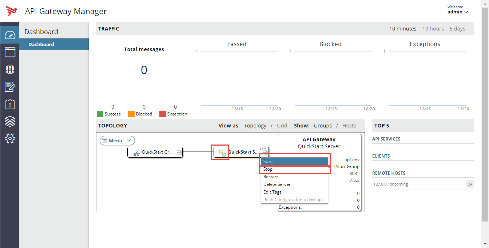
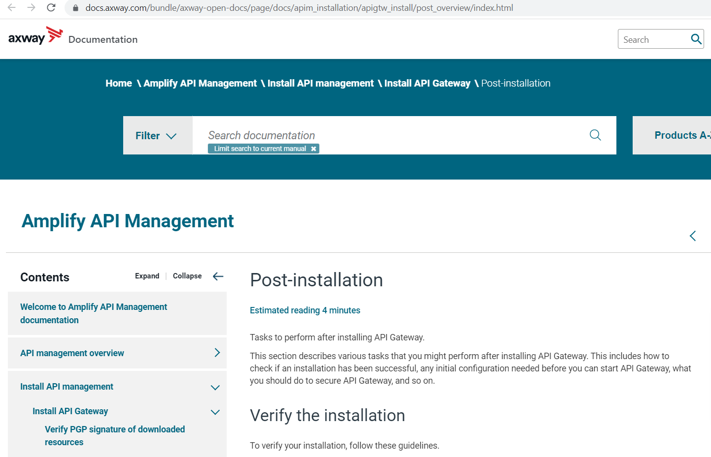

# APIM Installation Lab 

| Average time required to complete this lab | 60 minutes |
| ---- | ---- |
| Lab last updated | March 2024 |
| Lab last tested | March 2024 |

Welcome to the APIM Installation Lab! In this hands-on session, we'll delve into the installation process of the Axway API Management (APIM) solution. By the end of this lab, you'll gain the essential skills to install APIM using the QuickStart method and understand its implications. Whether you're a beginner exploring APIM or aiming to automate installations, this lab provides a foundational understanding that sets the stage for your journey with APIM.


## 1. Learning objectives

**Understanding:**
   - Explain the installation modes available for Axway API Management (APIM), distinguishing between Attended and Unattended modes.
   - Interpret the significance of prerequisites such as user credentials, installation kit, and necessary components in the APIM installation process.

**Applying:**
   - Utilize the provided instructions to execute the installation process of APIM using the QuickStart method, either through a graphical user interface or command line interface.
   - Demonstrate proficiency in selecting components and configuring settings during the APIM installation process.

**Analyzing:**
   - Evaluate the suitability of QuickStart for APIM installation in different environments, considering factors such as development versus production setups.
   - Analyze the implications of using QuickStart for APIM installation on post-installation steps and overall system stability.

**Creating:**
   - Design a customized installation strategy for APIM tailored to specific organizational requirements, considering scalability, security, and automation.
   - Develop a comprehensive documentation or guide outlining best practices for APIM installation, including pre-requisites, installation steps, and post-installation checks.

## 2. Introduction

Throughout this session, we'll focus on setting up APIM in a development environment on Linux, emphasizing simplicity and ease of installation. You'll learn how to execute basic commands like start, stop, and check status, crucial for managing APIM components such as Admin Node Manager, API Gateway Instance, and Cassandra. Let's dive in and get started with the installation process, laying the groundwork for your exploration into the world of API Management.

### 2.1. Installation mode

#### 2.1.1. Attended

With UI or command line




#### 2.1.2. Unattended

With command line, used for automation




* Lab scope is the following
    * Dev environment
    * On Linux, with default rights, no firewall
    * Done by yourself, in the next few minutes!

* Concretely it means using **QuickStart**. 
    * So, it is not production ready. We keep it simple for now.
    * See HA installation module at the end of this course 

### 2.1.3. Lab pre-requisites

* User:   
`axway/axway`

* Installation kit:
    * Installer : `/home/axway/Desktop/APIGateway_7.7.<releasedate>_Install_linux-x86-64_BN<buildnumber>.run`
    * License(s) : `/home/axway/Desktop/ReadyTech/Inbox/API_7.7_Temp.lic`

* Installation folder:  
`mkdir -p /home/axway/install/quickstart`

* Execution rights:  
`chmod +x /home/axway/Desktop/APIGateway_7.7.<releasedate>_Install_linux-x86-64_BN<buildnumber>.run`

* Components: 
    * Admin Node Manager 
    * Cassandra
    * API Gateway
    * Server
    * QuickStart Tutorial
    * API Manager
    * Policy Studio
    

## 3. Attended installation

* Execute installer: ``./APIGateway_7.X.Y_Install_linux-x86-64_ZZZ.run`
    * With UI: run it from VM Desktop
    * With command line: from Putty or option `--mode text`

* Accept license

* Use always **Custom**

* Select components checked + Configuration Studio: 
    * Admin Node Manager, Cassandra, API Gateway Server, QuickStart Tutorial, API Manager, Policy Studio, Configuration Studio

* Installation Directory: `/home/axway/install/quickstart`

* API Gateway license: absolute path to license 

* Cassandra Installation Directory: `/home/axway/install/quickstart/Cassandra`

* JRE Location: keep it

* Admin Node Manager credentials : N

* Host Name: `api-env`

* Keep all default ports: `8090`, `8085`, `8080`

* API Manager credentials: N

Launch it!


## 4. Unattended installation

* Use “--help” to display all options


* Copy, modify (marked parts) and execute:  
```
/home/axway/Desktop/APIGateway_7.7.<releasedate>_Install_linux-x86-64_BN<buildnumber>.run --mode unattended --enable-components nodemanager,cassandra,apigateway,qstart,apimgmt,policystudio,configurationstudio --disable-components packagedeploytools,analytics --setup_type advanced --licenseFilePath /home/axway/Desktop/ReadyTech/Inbox/API_7.7_Temp.lic --apimgmtLicenseFilePath /home/axway/Desktop/ReadyTech/Inbox/API_7.7_Temp.lic --prefix /home/axway/install/quickstart --cassandraInstalldir /home/axway/install/quickstart --cassandraJDK /home/axway/install/quickstart/apigateway/platform/jre --acceptGeneralConditions yes
```

**Example with 7.7.20220228:**
```
/home/axway/Desktop/APIGateway_7.7.20220228_Install_linux-x86-64_BN02.run --mode unattended --enable-components nodemanager,cassandra,apigateway,qstart,apimgmt,policystudio,configurationstudio --disable-components packagedeploytools,analytics --setup_type advanced --licenseFilePath /usr/local/readytech/Inbox/API_7.7_Temp.lic --apimgmtLicenseFilePath /usr/local/readytech/Inbox/API_7.7_Temp.lic --prefix /home/axway/install/quickstart --cassandraInstalldir /home/axway/install/quickstart --cassandraJDK /home/axway/install/quickstart/apigateway/platform/jre --acceptGeneralConditions yes
```

*Important to remember*

* Do not forget about patches
* Installation only finished once validated (see later)
* If QuickStart is installed, processes started
* Be careful of patches

What you must see as a result of installation?

* In installation folder
    * Log file (troubleshooting)
    * apigateway
    * cassandra
    * configurationstudio
    * policystudio
    * uninstall

* Process started (due to QuickStart)
    * ANM
    * Instance
    * Cassandra

### 4.1. Wait, this is not production installation!

* QuickStart simplifies creation of development environment and should not be used for production

* A realistic production installation will be done in `Installation - API Manager HA` module, in this very training.

* Some other modules are needed before, especially
    * Topology
    * Deployment
    * Cassandra

### 4.2. How do I do API Manager installation without QuickStart? 

* Cassandra (single or cluster) must be installed

* Without QuickStart, no default domain
    * See in [docs.axway.com](https://docs.axway.com/bundle/axway-open-docs/page/docs/apim_installation/apigtw_install/post_overview/index.html) to create host and instance
    * Or see in Topology module

* Then : 
    * Either use setup-apimanager
        * Modification of running instance
        * Modification of Cassandra
    * Modification of envSettings.props (environment configuration)

```
setup-apimanager --username admin --password changeme --adminName apiadmin --adminPass changeme -g mygroup -n myinstance --update
```

* Or use **Configure API Manager** option from Policy studio
    * Modifications done on local project
    * Needs packaging/deployment to running instance



### 4.3. Patching

* Patches contain non-cumulative bugfixes 

* Issued for a specific product release (ex : 7.7.20210830 Patch XXXXX)



* Installation instructions available in **Readme** file




### 4.4. Basic operations

What are basic operations here?
* Start
* Stop
* Status

What are components that are in scope of this installation?
* Admin Node Manager (ANM)
* API Gateway Instance
* Cassandra

How to achieve it? 
* Command line (for all)
* With API Gateway Manager 
    * Start/stop/status of instances with UI
    * And a UI feature means presence of an API

    

#### 4.4.1. Admin Node Manager (ANM)

Context
* ANM embeds API Gateway Manager
* There is one Node Manager (NM) per installation
    * And at least one NM is ANM
* ANM is able to manage instances and groups

Command line

* Executable  
`apigateway/posix/bin/nodemanager`

* Start  
`nodemanager -d`

* Stop  
`nodemanager -k`

* Status  
`ps -eaf | grep -i "Node Manager“`  
`netstat -an | grep 8090`

#### 4.4.2. API Gateway Instance, from ANM

*Requires ANM to be started*

URL: `https://myhost:8090`
Default login: `admin/changeme`



API (call to ANM)
* See ......[need a working link here]()  
This is not working  
http://apidocs.axway.com/swagger-ui/index.html?productname=apigateway&productversion=7.7.0&filename=api-gateway-swagger.json


#### 4.4.3. API Gateway Instance

Context

* An Instance belongs to a Group

* Names are important
    * Instance logical: `QuickStart Server`
    * Instance internal: `instance-1`
    * Group logical: `QuickStart Group`
    * Group internal: `group-2`

* Command line requires logical name

* Internal names can appear in logs

Command line

* Executable  
`apigateway/posix/bin/startinstance`

* Start  
`startinstance -n "QuickStart Server" -g "QuickStart Group" -d`

* Stop  
`startinstance -n "QuickStart Server" -g "QuickStart Group" -k`

* Status  
`ps -eaf | grep -i "QuickStart Server"`  
`netstat -an | grep 8080`

#### 4.4.4. Cassandra

Context
* API Manager repository
* And could be used as KPS
* Cassandra is supported by Axway as part of the solution
* See docs.axway.com here for management documentation  
Need a working link.....This is not working: https://docs.axway.com/bundle/axway-open-docs/page/docs/cass_admin/cassandra_manage/index.html

Command line

* Executable  
`cassandra/bin/cassandra`

* Start  
`cassandra -f`

* Stop (cf documentation)  
`kill <<pid>>`

* Status  
`netstat -an | grep 9042`

#### 4.4.5. Dependencies

Rules

* ANM and Instances can be run separately
    * No ANM implies no visibility, no deployment

* API Manager requires Cassandra
    * But instance can start without Cassandra

Recommended run order

1. Cassandra
2. ANM
3. Instances


### 4.5. Post installation steps

#### 4.5.1. Refer to docs.axway.com

[Refer to this link](https://docs.axway.com/bundle/axway-open-docs/page/docs/apim_installation/apigtw_install/post_overview/index.html)



*Important points*

* Link to start all tools
* Initial configuration, eg create domain
    * No need only with QuickStart
* Run as services
* Run with standard port (80, 443, ...) as non-root user
* Security guidelines


### 4.6. Installation validation

* Check Cassandra, ANM, Instances are started
    * Or start these in this order

* Connect to API Gateway Manager
    * `https://myhost:8090`
    * Default login: `admin/changeme`

* Connect to API Manager
    * `https://myhost:8075`
    * Default login: `apiadmin/changeme`

* Call healthcheck API
    * `curl http://myhost:8080/healthcheck`  


### 4.7. Containerized installation

* Installation resources publicly available from:  
[https://github.com/Axway/Cloud-Automation](https://github.com/Axway/Cloud-Automation)
    * Documentation

    * Helm charts (AWS, Azure, Google, Openshift, minikube,…)

* Official documentation  
https://docs.axway.com/bundle/axway-open-docs/page/docs/apim_installation/apigw_containers/index.html


## 5. Conclusion

* Installation requires good preparation and always ends with validation

* Dev environment can be quickly setup with **QuickStart**

* **API Gateway** installation can be done attended with command line or UI, or unattended, very useful for automation
