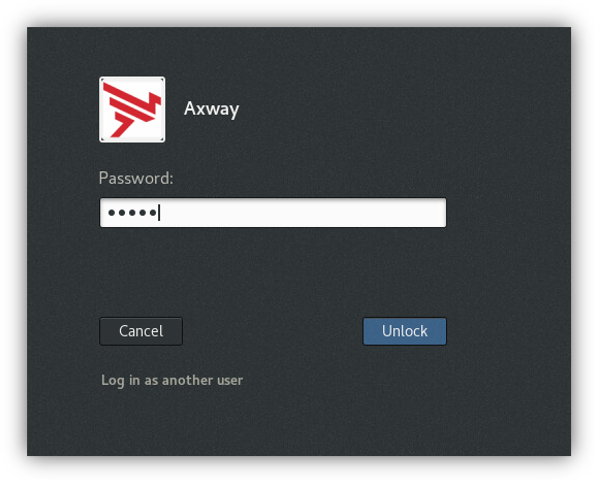
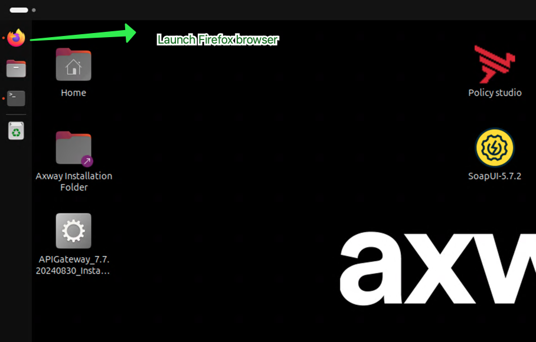
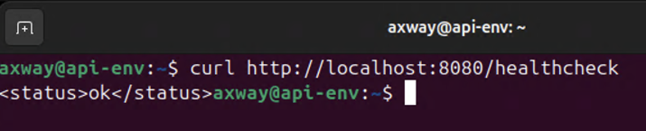
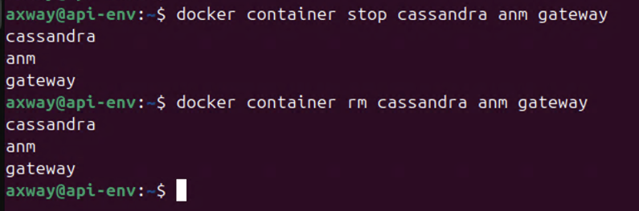

# API Gateway Docker Installation Lab 

| Average time required to complete this lab | 60 minutes |
| ---- | ---- |
| Lab last updated | March 2024 |
| Lab last tested | March 2024 |

In this lab, you have been provided with the docker images of the **Gateway** and **Cassandra**. You have been asked to install the Axway **api gateway**, **api manager** and **cassandra**. 

## Learning objectives

At the end of this lab, you will be able to 
* Install the API Gateway in a containerized environment.

## Virtual machine environment

This section will show you how to access the virtual machine which is used for this lab.

Use the following credentials to access the VM:  
* Username: `axway`  
* Password: `axway`


* If you are disconnected, click on the username **Axway**:
* Enter `axway` in the field **Password**.
* Click on the button **Unlock** 




## Installation

### View the images in the environment

Double click the **Terminal** icon on the desktop. This will open a terminal session.


Run the following command to check the images that are present in the local repository. 

```
docker image ls
```

This command lists all the images that are in the local repository. Notice that the gateway image, admin node manager image and Cassandra image are listed. 


### Start Cassandra container

Run the following command to start the cassandra container.

```
docker run --name cassandra -d --network training -p 9042:9042 cassandra:4.0.9
```

Attributes

* `--name`=   Name of the container
* `-d`= Detached mode ( Returns the prompt )
* `-p`= expose port
* `--network`= Name of the network in which all containers are running
* `cassandra:4.0.9`= Image name and tag. 


*Optional*

Check the status and logs of the container by executing the following commands.

```
docker container ls     
docker container logs cassandra
```

### Start the Admin Node Manager container

Execute the following command.

```
docker container run -d --network training -p 8090:8090 --name anm -v /opt/Axway/license:/opt/Axway/apigateway/conf/licenses -v /opt/Axway/Installs/Artifacts/Merge:/merge -e ACCEPT_GENERAL_CONDITIONS=yes docker.repository.axway.com/apigateway-docker-prod/7.7/admin-nodemanager:7.7.0.20230530-3-BN0009-ubi7
```

Attributes

* `--name`=  Name of the container (anm)
* `-d`= Detached mode (Returns the prompt )
* `--network`= Name of the network in which all containers are running
* `-p`= expose port
* `-v`= map volumes
* `-e`= environment variables
* `admin-nodemanager:7.7.0.20230530-3-BN0009-ubi7`= Image name and tag. 


*Optional*

Check the status and logs of the container.

```
docker container ls   
docker container logs anm
```

### Run the API Gateway container

Execute the following command.

```
docker container run -d --network training -p 8075:8075 -p 8065:8065 -p 8080:8080 --name gateway -v /opt/Axway/license/gatewayLicense:/opt/Axway/apigateway/conf/licenses -v /opt/Axway/merge:/merge -e ACCEPT_GENERAL_CONDITIONS=yes -e EMT_ANM_HOSTS=anm:8090 -e CASS_HOST=cassandra -e CASS_KEYSPACE=training_api_kps -e CASS_TKEYSAPCE=t_training_api_kps  docker.repository.axway.com/apigateway-docker-prod/7.7/gateway:7.7.0.20230530-3-BN0009-ubi7
```

Attributes

* `--name`= Name of the container (gateway)
* `-d`= Detached mode (Returns the prompt)
* `--network`= Name of the network in which all containers are running
* `-p`= expose port
* `-v`= map volumes
* `-e`= environment variables


*Optional*

Check the status and logs of the container.

```
docker container ls   
docker container logs gateway
```


## Testing API Gateway and API Manager installation

**API Gateway**, **API Manager** and **Cassandra** installation is now complete. Now, it is time to test the installation. 

Launch a web browser (Firefox)



Type the address: `https://api-env.demo.axway.com:8075`

This should launch the **API Manager**. 


Use the following credentials to log in.  

* Username: `apiadmin`
* Password: `changeme`


It asks you to change the password on first login. Type the new password as `Techlabs99`


You are now logged into **API Manager**


Open another tab and type the address: `https://api-env.demo.axway.com:8090`


Use the following credentials to log in.

* Username: `admin`
* Password: `changeme`

You are now logged into **API Gateway Manager**. Notice that the gateway is up and running.


In the terminal window, run the following command.

```
curl http://localhost:8080/healthcheck 
```

You must get an **ok** status similar to the screenshot below.




### Cleanup and deletion

Execute the following command to stop the containers.

```
docker container stop cassandra anm gateway
```

You should see an input similar to the screenshot below.



Switch to the Firefox tab and you will see in the **API Gateway Manager** that the gateway is no longer running and you get an error stating `unable to contact Admin Node Manager!`


Similarly, **API Manager** also returns an error.


Remove the containers by executing the following command.

```
docker container rm cassandra anm gateway
```


## Conclusion

Congratulations! You must now be able to install **API Gateway** in a container.