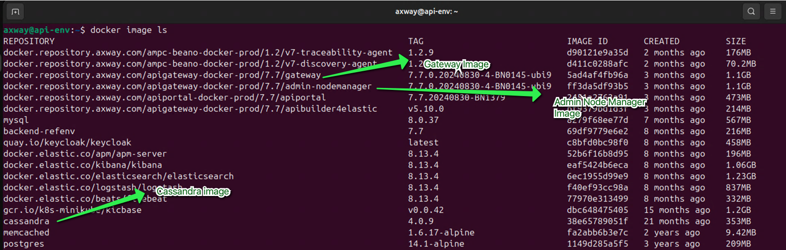

# API Gateway Docker Installation Lab 

| Average time required to complete this lab | 90 minutes |
| ---- | ---- |
| Lab last updated | Jan 2025 |
| Lab last tested | Jan 2025 |

Welcome to the API Gateway Docker Installation Lab! In this session, we will explore the process of installing the Axway API Gateway, API Manager, and Cassandra in a containerized environment. Throughout this lab, you will be provided with step-by-step instructions to install and configure these components using Docker images, offering you a hands-on experience in setting up an API Management solution in a virtualized environment.

By the end of this lab, you will have the skills to install the API Gateway in a containerized environment, gaining practical insights into deploying API Management solutions using modern containerization technology. Whether you're a beginner exploring containerization or seeking to enhance your deployment capabilities, this lab will equip you with the necessary knowledge to deploy and manage Axway API Management components effectively. Let's dive in and get started with the exciting world of containerized API Gateway installations!

## Index
- [API Gateway Docker Installation Lab](#api-gateway-docker-installation-lab)
  - [Index](#index)
  - [1. Learning objectives](#1-learning-objectives)
  - [2. Virtual machine environment](#2-virtual-machine-environment)
  - [3. Installation](#3-installation)
    - [3.1. View the images in the environment](#31-view-the-images-in-the-environment)
    - [3.2. Start Cassandra container](#32-start-cassandra-container)
    - [3.3. Start the Admin Node Manager container](#33-start-the-admin-node-manager-container)
    - [3.4. Run the API Gateway container](#34-run-the-api-gateway-container)
  - [4. Testing API Gateway and API Manager installation](#4-testing-api-gateway-and-api-manager-installation)
    - [4.1. Cleanup and deletion](#41-cleanup-and-deletion)
  - [5. Conclusion](#5-conclusion)


## 1. Learning objectives

**Remembering:**
   - Identify the commands used to view the Docker images present in the local repository, such as "docker image ls".

**Understanding:**
   - Explain the significance of using Docker containers for installing and managing API Gateway, API Manager, and Cassandra.
   - Interpret the purpose of each command used in the Docker installation process, including their parameters and functionalities.

**Applying:**
   - Utilize the provided commands to start Cassandra and Admin Node Manager containers within the Docker environment.
   - Demonstrate the ability to run API Gateway container with specified ports and network settings using Docker commands.

**Analyzing:**
   - Evaluate the implications of containerization on the deployment and scalability of API Management solutions.
   - Assess the advantages and disadvantages of using Docker containers for installing and managing API Gateway, API Manager, and Cassandra.

**Creating:**
   - Design a customized Docker deployment strategy for API Management tailored to specific organizational requirements, considering factors like resource allocation and isolation.
   - Develop a comprehensive documentation or guide outlining best practices for deploying and managing API Management components using Docker containers.

## 2. Virtual machine environment

This section will show you how to access the virtual machine which is used for this lab.

Use the following credentials to access the VM:  
* Username: `axway`  
* Password: `axway`


* If you are disconnected, click on the username **Axway**:
* Enter `axway` in the field **Password**.
* Click on the button **Unlock** 


## 3. Installation

### 3.1. View the images in the environment

Double click the **Terminal** icon on the desktop. This will open a terminal session.


Run the following command to check the images that are present in the local repository. 

```
docker image ls
```

This command lists all the images that are in the local repository. Notice that the gateway image, admin node manager image and Cassandra image are listed. 




### 3.2. Start Cassandra container

Run the following command to start the cassandra container.

```
docker run --name cassandra -d --network training -p 9042:9042 cassandra:4.0.9
```

Attributes

* `--name`=   Name of the container
* `-d`= Detached mode ( Returns the prompt )
* `-p`= expose port
* `--network`= Name of the network in which all containers are running
* `cassandra:4.0.9`= Image name and tag. 


*Optional*

Check the status and logs of the container by executing the following commands.

```
docker container ls     
docker container logs cassandra
```

### 3.3. Start the Admin Node Manager container

Execute the following command.

```
docker container run -d --network training -p 8090:8090 --name anm -v /home/axway/demo/data/licenses/docker:/opt/Axway/apigateway/conf/licenses -v /opt/Axway/Installs/Artifacts/Merge:/merge -e ACCEPT_GENERAL_CONDITIONS=yes docker.repository.axway.com/apigateway-docker-prod/7.7/admin-nodemanager:7.7.0.20240830-4-BN0145-ubi9
```

Attributes

* `--name`=  Name of the container (anm)
* `-d`= Detached mode (Returns the prompt )
* `--network`= Name of the network in which all containers are running
* `-p`= expose port
* `-v`= map volumes
* `-e`= environment variables
* `admin-nodemanager:7.7.0.20230530-3-BN0009-ubi7`= Image name and tag. 


*Optional*

Check the status and logs of the container.

```
docker container ls   
docker container logs anm
```

### 3.4. Run the API Gateway container

Execute the following command.

```
docker container run -d --network training -p 8075:8075 -p 8065:8065 -p 8080:8080 --name gateway -v /home/axway/demo/data/licenses/docker:/opt/Axway/apigateway/conf/licenses -v /opt/Axway/merge:/merge -e ACCEPT_GENERAL_CONDITIONS=yes -e EMT_ANM_HOSTS=anm:8090 -e CASS_HOST=cassandra -e CASS_KEYSPACE=training_api_kps -e CASS_TKEYSAPCE=t_training_api_kps -e CASS_PORT=9042 -e CASS_USERNAME=cassandra -e CASS_PASSWORD=cassandra docker.repository.axway.com/apigateway-docker-prod/7.7/gateway:7.7.0.20240830-4-BN0145-ubi9
```

Attributes

* `--name`= Name of the container (gateway)
* `-d`= Detached mode (Returns the prompt)
* `--network`= Name of the network in which all containers are running
* `-p`= expose port
* `-v`= map volumes
* `-e`= environment variables


*Optional*

Check the status and logs of the container.

```
docker container ls   
docker container logs gateway
```


## 4. Testing API Gateway and API Manager installation

**API Gateway**, **API Manager** and **Cassandra** installation is now complete. Now, it is time to test the installation. 

Launch a web browser (Firefox)


Type the address: `https://api-env:8075`

This should launch the **API Manager**. 


Use the following credentials to log in.  

* Username: `apiadmin`
* Password: `changeme`


It asks you to change the password on first login. Type the new password as `Techlabs99`


You are now logged into **API Manager**


Open another tab and type the address: `https://api-env:8090`


Use the following credentials to log in.

* Username: `admin`
* Password: `changeme`

You are now logged into **API Gateway Manager**. Notice that the gateway is up and running.


In the terminal window, run the following command.

```
curl http://localhost:8080/healthcheck 
```

You must get an **ok** status similar to the screenshot below.


### 4.1. Cleanup and deletion

Execute the following command to stop the containers.

```
docker container stop cassandra anm gateway
```

You should see an input similar to the screenshot below.


Switch to the Firefox tab and you will see in the **API Gateway Manager** that the gateway is no longer running and you get an error stating `unable to contact Admin Node Manager!`


Similarly, **API Manager** also returns an error.


Remove the containers by executing the following command.

```
docker container rm cassandra anm gateway
```


## 5. Conclusion

Congratulations! You must now be able to install **API Gateway** in a container.