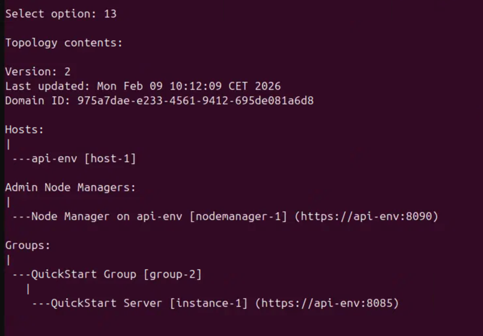
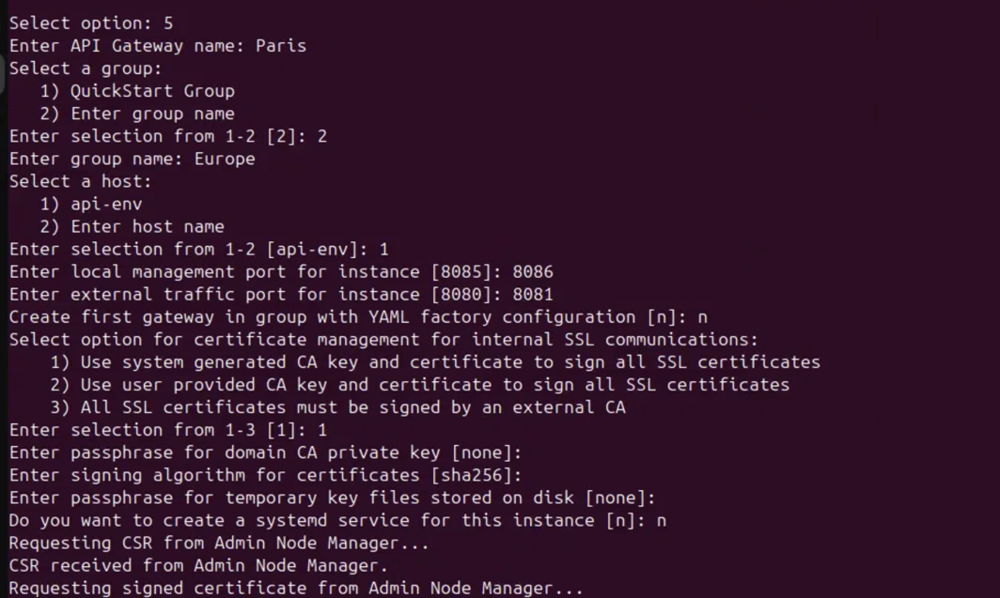
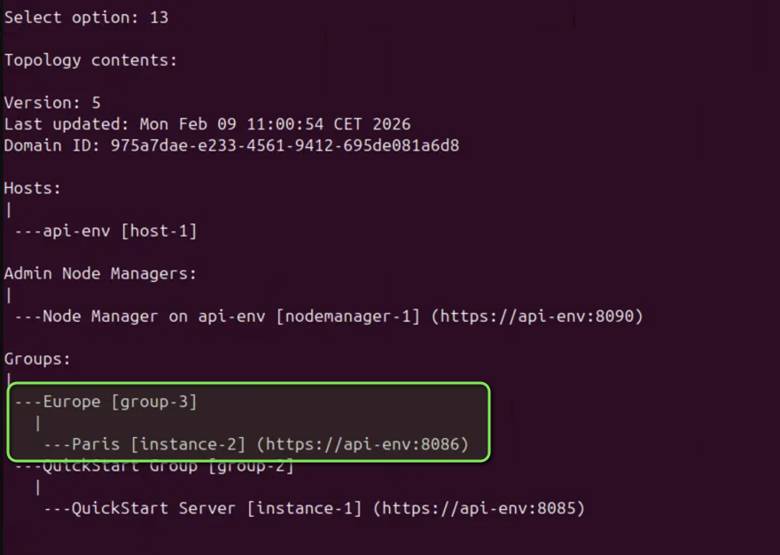
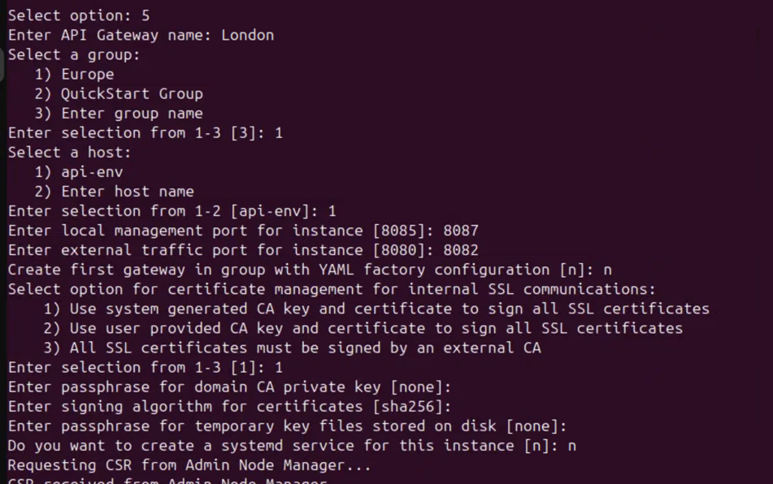
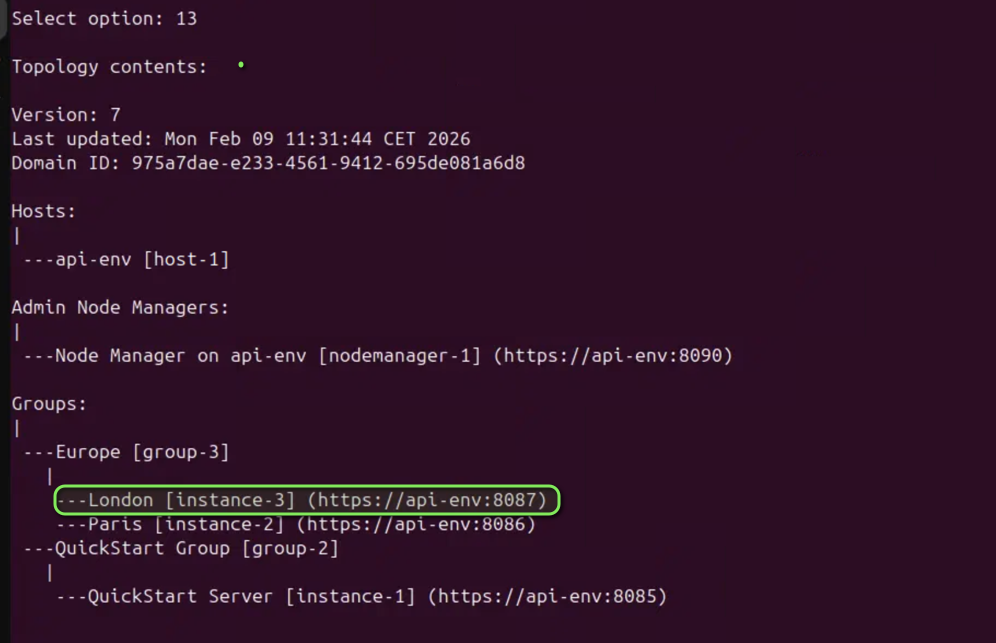

# APIM Create Groups and Instances Lab

| Average time required to complete this lab | 30 minutes |
| ---- | ---- |
| Lab last updated | Feb 2026 |
| Lab last tested | Feb 2026 |

Welcome to the APIM Create Groups and Instances Lab! In this session, you'll create groups and instances in the newly created gateway installation. 

- Instance is a process, running some configuration ( ie policies). An instance belongs to one and only one group 
- Group is a set of instances and their configuration
- There is a Node Manager (NM) per server, managing instances. Admin Node Manager (ANM) is a kind of Node Manager
- Admin Node Manager (ANM) is a kind of Node Manager (NM), responsible for communication with other programs (like Policy Studio).


## Index

- [APIM Create Groups and Instances Lab](#apim-create-groups-and-instances-lab)
  - [Index](#index)
  - [1. Learning objectives](#1-learning-objectives)
  - [2. Tasks](#2-tasks)
    - [2.1 Task 1: Create a group named "Europe" and an instances named "Paris".](#21-task-1-create-a-group-named-europe-and-an-instances-named-paris)
    - [2.2 Task 2: Create an instance named "London" within the "Europe" group.](#22-task-2-create-an-instance-named-london-within-the-europe-group)
  - [3. Conclusion](#3-conclusion)

## 1. Learning objectives

By the end of this lab, you will be able to: 
- Create a group.
- Create two instances within a group.

## 2. Tasks

- Create a group named "Europe"
- Create two instances named "Paris" and "London" within the "Europe" group.

> **Pre-requisites:**
- Ensure that the api gateway service is running on the server. This is the newly installed api gateway in the previous lab. You can check the status of the service using the following command:

```bash
ps -ef | grep vshell
```
### 2.1 Task 1: Create a group named "Europe" and an instances named "Paris".

Open a terminal window and run the following command

```bash
/home/axway/install/quickstart/apigateway/posix/bin/managedomain --menu
```
Use the credentials as admin/changeme


Select option: ***13*** 
This will show you the list of existing groups and instances. Since this is a new installation with quickstart, there should be one group and one instances listed.



Select optioin: ***5***

Enter API Gateway name: ***Paris***
Choose : ***2***    ( Enter a group name )
Enter a group name: ***Europe***
Select a host (api-env): ***1***
Enter local management port for instance : ***8086***
Enter external traffic port for instance : ***8081***
Create first gateway in group with YAML factory configuration : ***n***
Select ***1*** to choose system generated CA key and certificate to sign all SSL certificates
Leave a blank passphrase for domain CA privagte key
Leave the derault signig algorithm (SHA256)
Leave a blank passphrase for temporary key files stored in disk
Choose ***n*** to create system generated SSL certificates for the instance
Press enter to continue



A new group named "Europe" and an instance named "Paris" will be created.
Select opton ***13*** to list all groups and instances again. You should see the new group and instance in the list.


### 2.2 Task 2: Create an instance named "London" within the "Europe" group.

In this task, you'll create another instance named "London" within the "Europe" group using the same `managedomain` tool.

Select optioin: ***5***
Enter API Gateway name: ***London***
Select ***1*** to choose Europe group
Select a host (api-env): ***1***
Enter local management port for instance : ***8087***
Enter external traffic port for instance : ***8082***
Create first gateway in group with YAML factory configuration : ***n***
Select ***1*** to choose system generated CA key and certificate to sign all SSL certificates
Leave a blank passphrase for domain CA privagte key
Leave the derault signig algorithm (SHA256)
Leave a blank passphrase for temporary key files stored in disk
Choose ***n*** to create system generated SSL certificates for the instance
Press enter to continue




Now, there should be two instances (Paris and London) under the Europe group. Select opton ***13*** to list all groups and instances again to verify.


## 3. Conclusion

Congratulations! You have successfully created a group named "Europe" and two instances named "Paris" and "London" within the "Europe" group using the `managedomain` tool. This is a crucial step in setting up your API Gateway environment, allowing you to manage and organize your instances effectively.