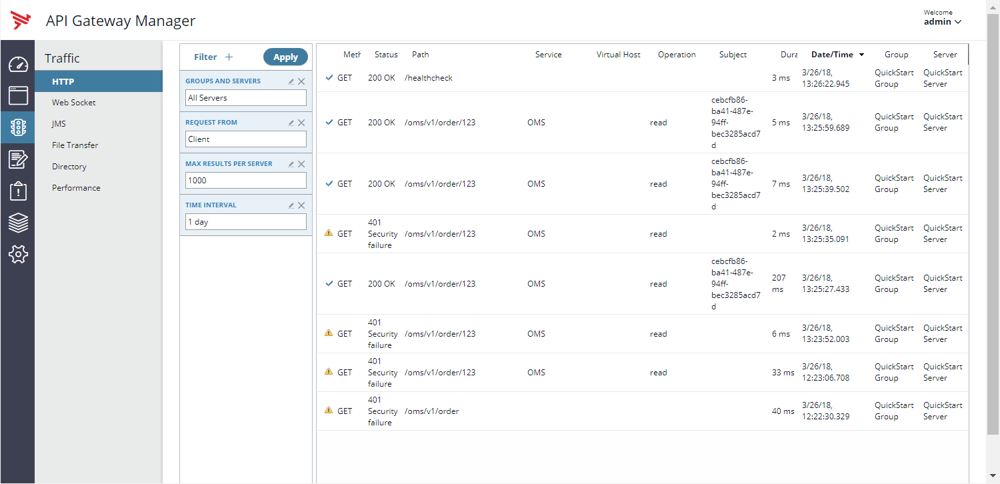
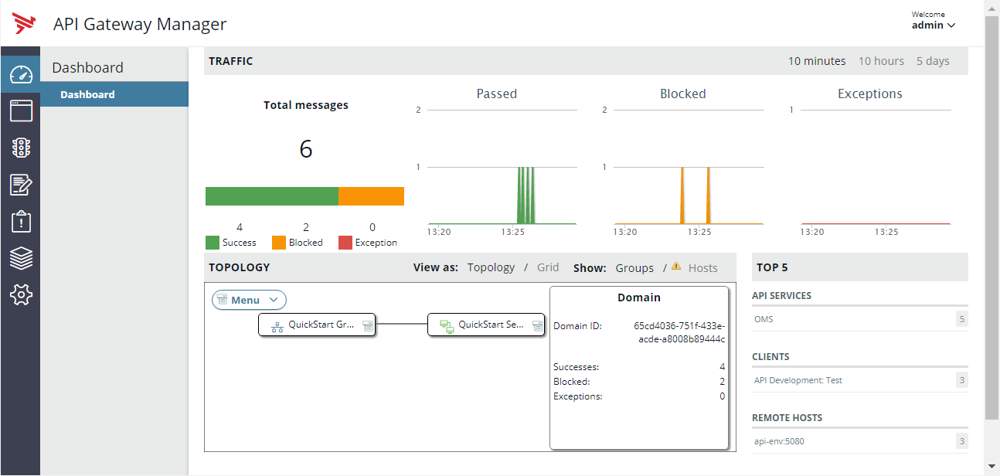

# Testing and Troubleshooting Lab 

| Average time required to complete this lab | 60 minutes |
| ---- | ---- |
| Lab last updated | March 2024 |
| Lab last tested | March 2024 |

In this lab, 

## Learning objectives

At the end of this lab, you will be able to 
* Test and get response from any service

## Exercise

### API testing

#### Test from API Management interfaces

**StockQuote** is a trading API providing the value of a company stock

Test the `GET` method of **StockQuote**, for the company Google, meaning with parameter `symbol = GOOG`. Get a positive response

*Note*: Stockquote is running on the Backend Server. Backend services must be started

**With API Portal**

* Connect with `anna/anna` to **API Portal** and test **Stockquote** API

**With API Manager**

* If **API Portal** is not present, you have to know how to use **API Manager**
* It works exactly like **API Portal**
* Connect with `anna/anna` to **API Manager** and test Stockquote API

#### Test from a browser

The **API Gateway** has an API to test the connection to an API Gateway instance called `healthcheck`.

Test the `healthcheck` API with the following parameters
* Method: `GET`
* Security: `HTTP`
* Host: `api-env`
* Port: `8080`
* Path: `healthcheck`

#### Test using Curl from command line

Curl basics for HTTP

* Syntax : curl [options] url

Options :
* `-X`/--request HTTP verb: GET, POST PUT, DELETE
* `-H`/--header  : header, e.g. `-H “keyId: YTphB”`. Multiple authorized
* `-u`/--user  `<user:password>`: send user and password in HTTP Basic
* `-d`/--data: payload. Prefix by @ to load a file. Use --data-binary if required
* `-k`/--insecure:  validates any HTTPS certificate
* `-v`/-- verbose: more talkative for debugging purposes

See `man curl` for more info.

**Task**

Test the healthcheck API with a CURL command and the following parameters
* Method: `GET`
* Security: `HTTP`
* Host: `api-env`
* Port: `8080`
* Path: `healthcheck`

**Task**

Test the Stockquote API with a CURL command and the following parameters
* Method: `GET`
* Security: `HTTPS`
* Host: `api-env`
* Port: `8065`
* Path: `/stockquote/rest`
* Parameter: `symbol= GOOG`
* KeyId: get the apikey from an application in API Portal or API Manager

**Task**

Test the Stockpurchase API with a CURL command and the following parameters
* Method: `POST`
* Security: `HTTP`
* Host: `api-env`
* Port: `5080`
* Path: `/mockup/stockpurchase/rest`
* Parameter: `symbol = GOOG`
* Data to provide in the request body: `{“buyStockSymbol” : ”1”}`

### Activity troubleshooting

* Connect to **API Gateway Manager** to follow transactions
    * `https://api-env.demo.axway.com:8090/` with user/password: `admin/changeme` 

* Look at the dashboard and see traffic overview: which are the calls?

* Click on the messages in the graph to see transaction details

* Click on a request and see HTTP request and response

## Solutions

## Conclusion