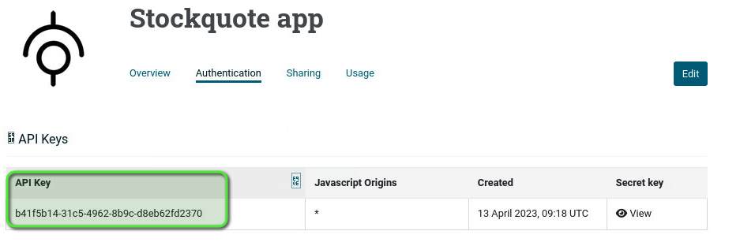

# Testing and Troubleshooting Lab 

| Average time required to complete this lab | 60 minutes |
| ---- | ---- |
| Lab last updated | March 2024 |
| Lab last tested | March 2024 |

In this lab, 

## Learning objectives

At the end of this lab, you will be able to 
* Test and get response from any service

## Exercise

### API testing

#### Test from API Management interfaces

**StockQuote** is a trading API providing the value of a company stock

Test the `GET` method of **StockQuote**, for the company Google, meaning with parameter `symbol = GOOG`. Get a positive response

*Note*: Stockquote is running on the Backend Server. Backend services must be started

**With API Portal**

* Connect with `anna/anna` to **API Portal** and test **Stockquote** API

**With API Manager**

* If **API Portal** is not present, you have to know how to use **API Manager**
* It works exactly like **API Portal**
* Connect with `anna/anna` to **API Manager** and test Stockquote API


#### Test from a browser

The **API Gateway** has an API to test the connection to an API Gateway instance called `healthcheck`.

Test the `healthcheck` API with the following parameters
* Method: `GET`
* Security: `HTTP`
* Host: `api-env`
* Port: `8080`
* Path: `healthcheck`


#### Test using Curl from command line

Curl basics for HTTP

* Syntax : curl [options] url

Options :
* `-X`/--request HTTP verb: GET, POST PUT, DELETE
* `-H`/--header  : header, e.g. `-H “keyId: YTphB”`. Multiple authorized
* `-u`/--user  `<user:password>`: send user and password in HTTP Basic
* `-d`/--data: payload. Prefix by @ to load a file. Use --data-binary if required
* `-k`/--insecure:  validates any HTTPS certificate
* `-v`/-- verbose: more talkative for debugging purposes

See `man curl` for more info.

**Task**

Test the healthcheck API with a CURL command and the following parameters
* Method: `GET`
* Security: `HTTP`
* Host: `api-env`
* Port: `8080`
* Path: `healthcheck`

**Task**

Test the Stockquote API with a CURL command and the following parameters
* Method: `GET`
* Security: `HTTPS`
* Host: `api-env`
* Port: `8065`
* Path: `/stockquote/rest`
* Parameter: `symbol= GOOG`
* KeyId: get the apikey from an application in API Portal or API Manager

**Task**

Test the Stockpurchase API with a CURL command and the following parameters
* Method: `POST`
* Security: `HTTP`
* Host: `api-env`
* Port: `5080`
* Path: `/mockup/stockpurchase/rest`
* Parameter: `symbol = GOOG`
* Data to provide in the request body: `{“buyStockSymbol” : ”1”}`


### Activity troubleshooting

* Connect to **API Gateway Manager** to follow transactions
    * `https://api-env.demo.axway.com:8090/` with user/password: `admin/changeme` 

* Look at the dashboard and see traffic overview: which are the calls?

* Click on the messages in the graph to see transaction details

* Click on a request and see HTTP request and response


## Solutions

### Test from API Management interfaces - API Portal

* Connect to **API Portal** with `anna/anna`:   
`https://api-env.demo.axway.com/`

* In **Applications** tab, create an application to define rights for API Stockquote called **Stockquote app**

* Select **Stockquote API** and click **Next**

* Click **Save**


* Open and edit the application you just created

* In the authentication tab, generate an API Key

* Go to the API tab. From the **API Catalog**, test the API




* Add the query parameter `GOOG` for the `symbol` and execute the Get method 


* See the 200 OK result, and the response headers and body. 

*If the result is not 200 OK, check that backend services are started*


### Test from API Management interfaces - API Manager

* Connect to **API Manager** with `anna/anna`:  
`https://api-env.demo.axway.com:8075/`

* Go to **Clients --> Applications** and create a new application called **Stockquote application**

* Add API access for `Stockquote`

* Click **Create** to save the application


* Go to the **Authentication** tab

* Click on **New API Key**

* Add `*` for javascript origins


* Go to **API --> API Catalog** and click on **Stockquote**

* Click **Try it** for API method `GetQuote`


* Select the application and **keyId** you have just created

* Add `GOOG` for the symbol

* Click **Try method**


### Test from your browser

* Type `http://api-env:8080/healthcheck` in a browser


### Test using Curl from command line

#### Healthcheck
```
curl http://api-env:8080/healthcheck
```

Result:
```
<status>ok</status>
```

#### Stockquote

```
curl -k -H "KeyId:e315a8b5-45f6-4f96-b20a-0b586a2a96c6" https://api-env.demo.axway.com:8065/stockquote/rest?symbol=GOOG
```

Result:


## Conclusion

We used the following to test APIs:
    * CURL commands for unit testing or automation
    * **API Portal** and **API Manager** with interfaces to try APIs

**API Gateway Manager** offers monitoring dashboards and precious troubleshooting information
