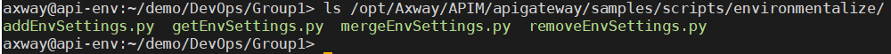
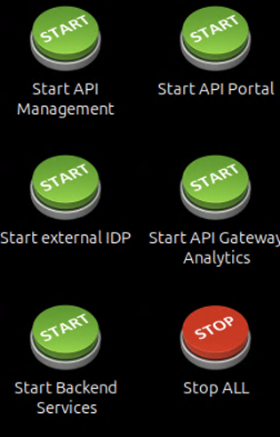
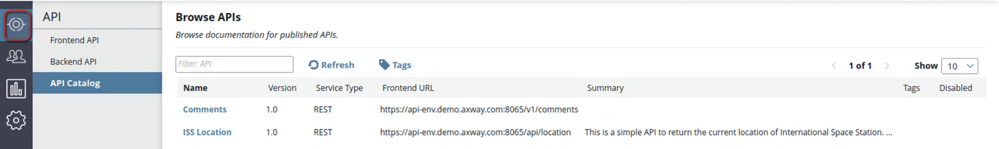
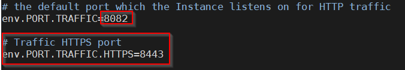

# Deployment Lab 

| Average time required to complete this lab | 60 minutes |
| ---- | ---- |
| Lab last updated | March 2024 |
| Lab last tested | March 2024 |

In this lab, we'll delve into essential processes and tools vital for understanding and enhancing your DevOps practices within the APIM environment. By the end of this session, you'll gain valuable insights into project build processes, environmentalization techniques, deployment procedures, and API promotion strategies using command-line tools provided by Axway.

Throughout this hands-on experience, we'll explore two key scenarios. Firstly, we'll focus on packaging and deploying Policy Studio projects, emphasizing the importance of externalizing parameters and variables for dynamic adjustments across various environments. Secondly, we'll delve into the usage of the apimanager-promote tool to seamlessly promote API collections to target environments, demonstrating the integration of DevOps principles into the APIM workflow. Through practical exercises and guided instructions, you'll acquire the skills necessary to automate build, deployment, and promotion processes effectively, ensuring streamlined operations within your API management ecosystem. Let's embark on this journey to optimize your deployment processes and leverage the power of automation in APIM!

## 1. Learning objectives

**Remembering:**
   - Recall the steps involved in packaging and deploying Policy Studio projects using command-line tools like projpack and projdeploy.
   - Identify the environmentalization techniques used in APIM, such as externalizing parameters and variables for dynamic configuration changes.

**Understanding:**
   - Explain the significance of environmentalization techniques in DevOps practices within API Management solutions.
   - Interpret the relationship between Policy Studio projects, API Manager scripts, and deployment processes in the context of automation and streamlining operations.

**Applying:**
   - Utilize projpack and projdeploy commands to package and deploy Policy Studio projects to target environments effectively.
   - Demonstrate the application of environmentalization techniques to dynamically adjust deployment parameters for different environments.

**Analyzing:**
   - Evaluate the advantages of using command-line tools for packaging and deploying Policy Studio projects compared to manual processes.
   - Assess the implications of environmentalization techniques on the scalability and efficiency of deployment processes within API Management solutions.

**Creating:**
   - Design a customized deployment strategy tailored to specific organizational requirements, incorporating environmentalization techniques and command-line tools.
   - Develop a comprehensive documentation or guide outlining best practices for packaging, deploying, and promoting Policy Studio projects within API Management environments, emphasizing the importance of automation and efficiency.


## 2. Introduction

The lab explores two scenarios:
1. Package and deploy three Policy Studio projects
    * You will understand how you can externalize parameters and variable, so you can dynamically change them for each target environment
    * You will build and deploy a package to a target environment using command line tools
2. Use the apimanager-promote tool to promote an API collection to a target environment

Both scenarios targets DevOps and how you can automate build and deployment steps in your pipeline.


### 2.1. Scope of the lab

You work with:
* Policy Studio to make your projects suitable for deploying to multiple environments
* API Management scripts – projpack/projdeploy/apimanager-promote – to understand the build and deploy/promote processes

### 2.2. Accelerating your deployment process

Sample scripts are in  
`/opt/Axway/APIM/apigateway/samples/scripts/environmentalize/`



And

`/opt/Axway/APIM/apigateway/samples/scripts/certs`


Here are some details about the *environmentalize* scripts

<table>
<tbody>
<tr>
<td>addEnvSettings.py</td>
<td>Downloadsa deployment package (.fed) from an API Gateway. Marks the <b>Traffic HTTP Interface</b> port field to be environmentalized. Creates an environment settings entry for the port, and sets it to <code>7878</code>.</td>
</tr>
<tr>
<td>getEnvSettings.py</td>
<td>Connects to an API Gateway and lists all the fields that have been marked for environmentalization. the associated values in environment settings are output.</td>
</tr>
<tr>
<td>mergeEnvSettings.py</td>
<td>Offline script that does not connect to an API Gateway. Merges a policy package (.pol) from downstream with an environment package (.env) from upstream, and merges them to create a deployment package (.fed).</td>
</tr>
<tr>
<td>removeEnvSettings.py</td>
<td>Downloads a deployment package (.fed) from an API Gateway. Removes the <b>Traffic HTTP Interface</b> port field from being environmentalized (opposite of the <code>addEnvSettings.py</code> script).</td>
</tr>
</tbody>
</table>


<hr style="background-color:blue;">

Here are some details about the *certs* scripts

<table>
<tbody>
<tr>
<td>addCertFromFile.py</td>
<td>Connect to a target Admin Node Manager and add a new certificate to the certificate store from a referenced file</td>
</tr>
<tr>
<td>addCert.py</td>
<td>A utility script with the methods used by other 3 scripts to manipulate certificates</td>
</tr>
<tr>
<td>addCertsFromSSL.py</td>
<td>Connect to a target Admin Node Manager and add a new certificate downloaded from an SSL server</td>
</tr>
<tr>
<td>addFromP12File.py</td>
<td>Connect to a target Admin Node Manager and add a new certificate and key from a P12 file to the certificate store</td>
</tr>
</tbody>
</table>


### 2.3. Virtual machine environment

#### 2.3.1. Login/password


* If you are disconnected, click on the username **Axway**
* Enter `axway` in the field **Password**.
* Click on the button **Unlock**


#### 2.3.2. Start server components

If products are not started (you can check with the command `statusAll` anywhere from a terminal), double click the following desktop shortcut: 
* Start API Management
* Start Backend Services




#### 2.3.3. API Manager access

Connect to the API Manager:
* Start **Firefox** by double-clicking the icon on the desktop.

* Click on the shortcut **API Manager** which is available in Firefox (URL: `https://api-env.demo.axway.com:8075/`).


Login as administrator.

Enter the following information in the login screen:
* Enter `apiadmin` in the field **Username**
* Enter `changeme` in the field **Password**
* Click on **Login**
* Click on the tab **API**


Some APIs are already virtualized. The goal of this scenario is to virtualize the Order Management System (OMS) of the company.



## 3. Tasks and steps

We will use two scenarios:
1.	Using the API Gateway and Manager to modify a couple of policies and deploy them to a target environment. 
2.	We also explore how to use API Manager promotion script to deploy previously exported API collections to a target environment.

Let's start with exploring a project directory:
1.	Open a terminal window by clicking the Terminal icon on the desktop.

2.	Switch to the project directory:  
    ```
    cd /home/axway/demo/DevOps/Group1
    ```

3.	This folder represents a repository of your development artifacts. It is a directory that you cloned from your source control manager (SCM) tool, like Git.  
This folder contains several subfolders that represent different resources of your solution:
    

4.	The solution has been developed by a team of developers where each subfolder, like `apicommon` was created by a different team member. They used the Team Development feature in Policy Studio to achieve this.

In the following sections, you will understand  
* How to dynamically change some of the project parameters depending on a target environment
* Package multiple Policy Studio projects into a deployable package
* Deploy this package along with an API collection to a target environment

### 3.1. Optimizing the deployment process

We will environmentalize a project made up of 3 policy projects:
* apicommon
* apiproject1
* apiproject2

#### 3.1.1. Environmentalizing variables

It is very important in a DevOps pipeline to be able to dynamically adjust your deployment parameters for each environment. In this section we will explore two techniques: 
* with environment properties and 
* with environment package.

**apiproject1**

1.	Start Policy Studio by double-clicking the Policy Studio icon on the desktop.
2.	Click Open Project.
    
3.	Navigate to the `/home/axway/demo/DevOps/Group1/apiproject1` directory and click **OK**
    

```
Note: Policy Studio projects version upgrade

In the case where the policy projects were developed with an older version of Policy Studio, you may have to upgrade the policy projects:
* It will be done automatically by Policy Studio if the versions are not too different.
```


```
If not, it can be done with the projupgrade command:  

/opt/Axway/APIM/apigateway/posix/bin/projupgrade --projdir /home/axway/demo/DevOps/Group1

projupgrade will process all the PolicyStudio projects contained within the ‘--projdir’ directory.
```


```
Once project has been updated, projupgrade should display 3 projects as “successfully upgraded”
```

* If an upgrade was needed, open the apiproject1 project again.

4.	Expand **Environment Configuration → Listeners → API Gateway → Default Services** in the navigation tree.

5.	Click **Paths**. The Paths value shows a relative path with configured policy `test1`. It means that when API Gateway receives a call with this relative path (on a specific port, see the next step), it will invoke the test1 policy.

    

6.	Click **Ports**. You should see one port configured.

    

7.	The port’s value is set using the environment variable `env.PORT.TRAFFIC`. This represents one of the techniques for environmentalizing the API gateway parameters. We’ll touch about these environment variables later.

8.	We explore another technique that is more versatile. Let’s open the `test1` policy under the **Policies** container (you need to double-click the policy).

9.	Double-click the **Set Message filter** in the policy.

10.	Click inside the text filed called **Content-Type**

          

11.	Once you do it, you should see the “globe” icon next to the field. Click the “globe” icon. The field will become greyed out. It means that this parameter has become environmentalized.

12.	Repeat this step for the **Message Body** field.  
Don’t forget to click Finish when you’re done!

           

13.	You can see these variables by expanding **Environment Configuration → Environment Settings → Policies → test1**

       

14.	You can see two variables here with the values that have been set in the policy when you externalized these fields. 

We will show you later how these fields can be dynamically set for each target environment by using an environment package. We will show a very simple example to demonstrate the technique. But even with this example you may change what type of data your policy returns, for example JSON or XML. 


**apiproject2**

15.	Repeat these steps for environmentalizing the same fields in the policy `test2` for the second API project located in the directory:
    ```
    /home/axway/demo/DevOps/Group1/apiproject2/
    ```
16.	Expand **Environment Configuration → Listeners → API Gateway → Default Services** in the navigation tree.

17.	Click **Paths**. You will see that this project uses relative path `/test2`. Later, when we package three projects together (apicommon, apiproject1 and apiproject2), the packaging tool will correctly merge the **Default Services** listener setting from the projects.


**apicommon**

18.	The last change that we are going to make in these projects is to enable an HTTPS traffic port. Close the **apiproject2** and open the **apicommon** project located here:
    ```
    /home/axway/demo/DevOps/Group1/apicommon
    ```

19.	Expand to the API Gateway under Listeners. Right-click it and select **Add HTTP Services**.

      

20.	In the pop-up window type **Default Services** and click **OK**. The Default Services listener setting exists now in all 3 projects. The projpack tool will properly merge all settings for Default Services from 3 projects.

21.	Expand **Default Services**, right-click **Ports** and select **Add HTTPS**.

      

22.	Add a new HTTPS port:
    * Type `Traffic HTTPS` in the Name field.
    * We’ll use environment variable for the Port field: 
          


#### 3.1.2. Setting environment variables in `envSettings.props`

The following instructions explain how to set and modify environment variables in the envSettings.props file:

1.	These “env” variables are set in a file specific for each gateway.
Open the following file to see the current values for our target API Gateway:
    ```
    vi /opt/Axway/APIM/apigateway/groups/group-2/instance-1/conf/envSettings.props
    ```

2.	The file lists values for multiple environment variables. You can set additional values by using a selector that starts with “env”, like this:
    ```
    ${env.XXX}
    ```

3.	Find the `env.PORT.TRAFFIC` variable and change its value to `8082`.

4.	Add a new HTTPS port as shown in the screen capture:
     

5.	With this change, after changes have been deployed in the next chapter, you will access your policies through HTTP port 8082. For example:

    `http://api-env.demo.axway.com:8082/test1`  
    or  
    `https://api-env.demo.axway.com:8443/test1`

6.	Save this file and exit. For the variables to take effect, you need to restart a gateway.

7.	The drawback of using this technique is that you need to update the **envSettings.props** file for each API Gateway in your target installation.


### 3.2. Some administration tasks

The following tasks are performed by an administrator or a person responsible for a DevOps pipeline. 

#### 3.2.1. Building a deployable package

Now that we’re done with development steps, we need to build a deployable package and test it on a target environment. Follow these steps:
1.	Switch to the terminal window.

2.	Make sure you’re in the following folder:
    ```
    /home/axway/demo/DevOps/Group1
    ```

3.	Run the projpack command to explore its syntax:
    ```
    /opt/Axway/APIM/apigateway/posix/bin/projpack –help
    ```

4.	The command allows you to build a deployable package (*.fed or *.pol) from several Policy Studio projects. In this lab, we will build a package from three projects: apicommon, apiproject1 and apiproject2.  
Run this command:
    ```
    /opt/Axway/APIM/apigateway/posix/bin/projpack --create --dir=/home/axway/demo/DevOps/Group1/Group1-package/ --passphrase-none  --name=deployment --type=pol --add /home/axway/demo/DevOps/Group1/apicommon /home/axway/demo/DevOps/Group1/apiproject1 /home/axway/demo/DevOps/Group1/apiproject2 --projpass-none
    ```

5.	You should see output like the following screen capture

     

6.	You should see the **deployment.pol** file in the Group1-package/ subdirectory. Errors in this output are somewhat misleading. They tell you that the listed variables are not set in the projects. But as we stated earlier, we set them in the *envSettings.props* file.  

#### 3.2.2. Using Configuration Studio to create an environment package

Let’s see how a developer or a business person can set the environment specific values for those fields that have been externalized previously.

1.	Start **Configuration Studio** by double-clicking its icon on the desktop.

2.	Select **File → Open File** from the menu.

3.	Click the `…` button and select the `/home/axway/demo/DevOps/Group1/Group1-package/deployment.pol` file in the Policy Package field.

4.	Click **OK** in the file selection window and the passphrase window.

5.	Expand **Environment Configuration → Environment Settings → Policies → test1** and **test2** in the navigation tree. You should see `?` next to all fields that need to be set:

    

6.	Set **Content-Type** to `application/json`.

7.	Set **message body** for **test1** to 
    ```
    {"message" : "Test 1 1.0"}
    ```

8.	Set **message body** for **test2** to 
    ```
    {"message" : "Test 2 1.0"}
    ```

9.	Make sure to save your changes by clicking the **Save** button.

10.	Expand **Environment Configuration → Environment Settings → Listeners → API Gateway → Default Services → Ports**

11.	Select the **Traffic HTTPS** entry and click the **Signing Key** button.

    

12.	In the next window click the **Create/Import** button.

13.	In the next window click the **Import Certificate + Key** button

    

14.	Navigate to `/home/axway/demo/data/training/admin/APIM_HTTPS_Server_chain.p12`  and click **OK**.

15.	Enter password in the pop-up window: `Axway123`

16.	Click **OK**.

17.	Then click **OK** again in the **Import the certificate chain** window.

18.	Click the **Use Subject** button to set **Alias Name**.

19.	Finally, click **OK** in the **Configure Certificate and Private Key** window.

20.	Back in the **Select Certificate** window, click a check mark next to the certificate.

    

21.	Click **OK** in the Select Certificate window. 

22.	You should see your certificate set for this environmentalized variable. 

    

23.	Click the **Save** button. As you can see this is a clean way of letting DevOps teams to configure a certificate for each environment.

24.	Save all your environment values to an environment package by selecting **File → Save → Environment Package** from the menu.

25.	Select **Use the project passphrase**

26.	Navigate to `/home/axway/demo/DevOps/Group1/Group1-package/` folder and select **deployment.env**. 

27.	Click **OK** and yes to the overwrite warning.


You should create one Environment Package per deployment environment. During a deployment process, your DevOps tooling should promote/deploy: 
* The same Policy Package, since it is the same for all environments
* The environment specific Environment Package  
*Note: You’ve noticed in Configuration Studio two fields when you select a *.pol file*

    

The second field is used to enter a location of the corresponding Environment Package. It is done in all iterations after the first one. Your developers add or change what fields are environmentalized in the projects. 

For example, in the next release, a developer adds one more global environment field. You will need to open the new *.pol file and the existing *.env file. Configuration Studio will show you what new/changed fields exist in the Policy Package. You set or change values in Configuration Studio and save them as a new version of Environment Package. Now, new Policy Package has a corresponding Environment Package. You use your versioning technique to match these two files.


#### 3.2.3. Deploying and testing your projects

Perform these steps:
1.	In the terminal window switch to the following directory:
`/home/axway/demo/DevOps/Group1`

2.	Run the projdeploy command with the `–help` option:
    ```
    /opt/Axway/APIM/apigateway/posix/bin/projdeploy --help
    ```

3.	Look at the help output to see examples and available command line options.

4.	Deploy your packages using the following command:
    ```
    /opt/Axway/APIM/apigateway/posix/bin/projdeploy --dir=./Group1-package --passphrase-none --name=deployment --apply-env=./Group1-package/deployment.env --deploy-to --host-name=api-env.demo.axway.com --port=8090 --user-name=admin --password=changeme --group-name="QuickStart Group"
    ```

5.	We used options for deploying Policy and Environment packages. You should see output like in the following screen capture:

     

6.	Using this command, you can enable automation for deploying Policy and Environment Packages to your target environments.

7.	Test deployment  
See newly created messages when calling curl commands:
    ```
    curl http://api-env.demo.axway.com:8082/test1
    curl -k https://api-env.demo.axway.com:8443/test1
    curl http://api-env.demo.axway.com:8082/test2
    curl -k https://api-env.demo.axway.com:8443/test2
    ```

Not only have you updated the configuration, but you also have merged different projects so that all methods can work at the same time.

### 3.3. Promoting/deploying the APIs in API Manager

If you need to promote APIs between the environments, you can use two approaches. The product provides a GUI interface in API Manager, but it also includes a command line options called: apimanager-promote. This script can be used to deploy APIs for testing, or as an API promotion script for the upstream environments.
For this part of the lab, you will work with a different configuration that contains an API called “oms”. It is a different project from the one you’ve used in the previous sections. Consider it as developed for another department within your organization.
Let’s understand how we can use this command line option:

1.	To complete this lab, we will deploy our target configuration in API Management. Please, run this projdeploy command:
    ```
    /opt/Axway/APIM/apigateway/posix/bin/projdeploy --dir=/opt/DevOps/util/Resources --passphrase-none --name=DevOpsClone --type=fed --deploy-to --host-name=api-env.demo.axway.com --port=8090 --user-name=admin --password=changeme --group-name="QuickStart Group"
    ```

2.	In the terminal window, change to the following directory:
`/home/axway/demo/DevOps/Group1/oms-apimanager/src/API`

3.	You should see the **api-export.dat** file. This file was created by an API developer in API Manager using the **Export API Collection** option.

4.	To promote this API to a target environment, we need to fulfil two prerequisites:
    * The API file name must start with “api-” and must have the “*.dat” extension. You can also promote applications from API manager. In that case, the file name should start with “application-“. 
    * You should create the promotion.properties file. This file contains properties that control how API or application are deployed.

5.	Let’s create **promotion.properties**. Run this command:

    ```
    /opt/Axway/APIM/apigateway/posix/bin/apimanager-promote -template
    ```

6.	The command outputs the default content of the promotion.properties file:

    ```
    # promotion.properties (generated 4/29/18 3:58 PM)
    organization.apipromotion.import=API Development
    organization.target=Community
    api.conflict.upgrade=false
    application.conflict.upgrade=false
    application.apikey.upgrade=false
    application.oauthclient.upgrade=false
    application.oauthresource.upgrade=false
    api.publish.virtualhost=
    api.unpublished.remove=false

    On the VM :
    # promotion.properties (generated 5/28/19 9:15 AM)
    organization.apipromotion.import=API Development
    organization.target=Community
    organization.apis.targets=
    organization.apis.<apiname>.targets=
    organization.applications.<appname>.target=
    api.conflict.upgrade=false
    application.conflict.upgrade=false
    application.apikey.upgrade=false
    application.oauthclient.upgrade=false
    application.oauthresource.upgrade=false
    api.publish.virtualhost=
    api.unpublished.remove=false

    ```

7.	Copy this output.

8.	Open a VI editor by running this command:
    ```
    vi promotion.properties
    ```

9.	Past the generated content.

10.	Change value for `organization.target` to API Development:
    ```
    organization.target=API Development
    ```

11.	You can change values for other parameters as needed.

12.	Save your file and exit from VI.

13.	Make sure that your API Gateway/Manager and BackendInstance are running (run statusAll).

14.	Execute the following command to promote the API to the target environment:

    ```
    /opt/Axway/APIM/apigateway/posix/bin/apimanager-promote --target https://api-env.demo.axway.com:8075 --username apiadmin --decrypt-password changeme --password  changeme .
    ```
    *Note: make sure you enter “.” at the end of the command. It indicates that the api-export.dat and promotion.properties files are located in the current directory.*

15.	Open API Manager UI (`https://api-env.demo.axway.com:8075`). 

16.	Click **API → Frontend API**

17.	Click **oms1.1.json**

     

18.	You may test your API by going to the API Method tab and clicking Try method for **Update order**.

     

19.	Enter `112` for product, `Shipped` for status and click **Try method**.

     

20.	You must see output like the screenshot below

     


## 4. Conclusion

* Well thought deployment process and tooling are critical to the overall success of DevOps

* You have explored some of the available options for automating your DevOps for Axway API Management

* Axway API Management REST APIs along with demonstrated command line tools provide a flexible environment for integrating the product with almost any existent DevOps

Congratulations! You have seen in this exercise how to use packaging and deployment scripts provided by Axway API Management. Understanding these command line options will help you to automate packaging your **Policy Studio** projects and promoting/deploying these packages along with API collection files to the target environments. 

Environmentalization techniques of the `envSettings.props` file and **Configuration Studio** with Environment Package will help you to simplify deployment process for different environments.
