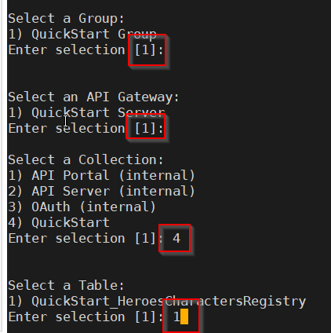
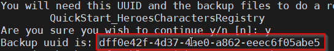
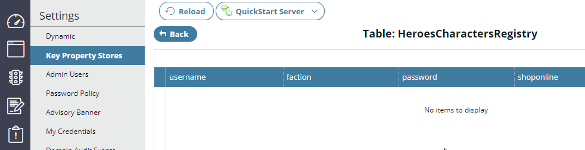
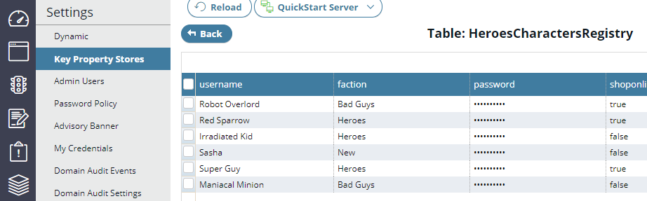
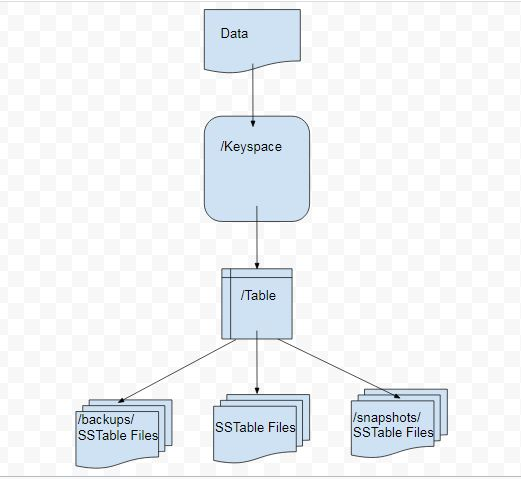
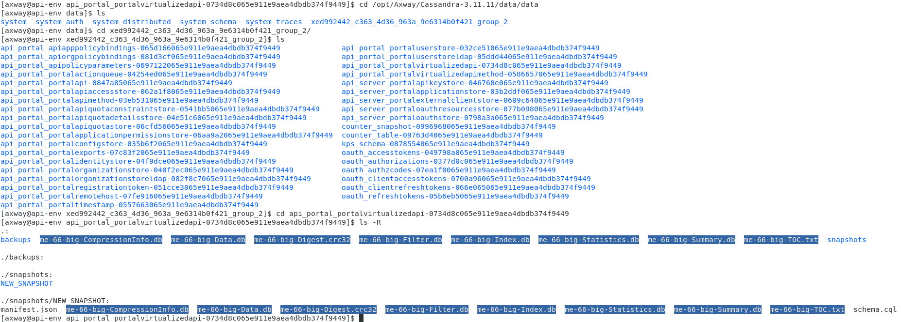
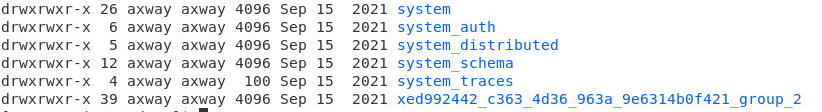
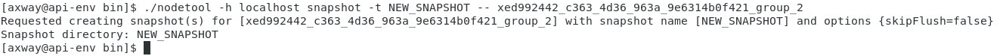
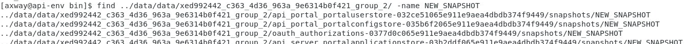

# API Gateway and API Manager Upkeep Lab 

| Average time required to complete this lab | 60 minutes |
| ---- | ---- |
| Lab last updated | March 2024 |
| Lab last tested | March 2024 |

Welcome to the API Gateway and API Manager Upkeep Lab! In this session, you'll delve into the essential maintenance tasks necessary for keeping your API Management platform running smoothly. Through hands-on exercises, you'll learn how to perform routine administration operations such as backup, recovery, file archiving, and API Gateway audit. These tasks are crucial for ensuring the reliability and resilience of your API infrastructure.

Throughout this lab, you'll have the opportunity to simulate various scenarios, including backing up a Quickstart KPS table, simulating a disaster by deleting the table, and then restoring the data. Additionally, you'll explore Cassandra upkeep, understanding its data directory structure, identifying API Management keyspaces, and performing snapshots. By mastering these maintenance tasks, you'll be equipped with the skills to effectively manage and optimize your API Gateway and API Manager environments. Let's dive in and explore the fundamental aspects of API upkeep together!


## 1. Learning objectives

**Remembering:**
   - Recall the steps involved in performing maintenance tasks related to backup, recovery, file archiving, and API Gateway audit.
   - Remember the commands and procedures for backing up and restoring a Quickstart KPS table using the kpsadmin tool.
   - Recall the steps for performing maintenance tasks related to Cassandra, including understanding its data directory structure and identifying API Management keyspaces.

**Understanding:**
   - Explain the importance of routine administration operations in maintaining the health and reliability of an API Management platform.
   - Understand the significance of backing up and restoring data in ensuring data integrity and continuity of operations.
   - Interpret the purpose and functionality of Cassandra in the context of API Management and its role in data storage and management.

**Applying:**
   - Utilize the kpsadmin tool to perform backup and restore operations on a Quickstart KPS table.
   - Apply the knowledge of Cassandra maintenance tasks to perform snapshots of Cassandra keyspaces.
   - Demonstrate the ability to execute routine administration operations effectively within the API Gateway and API Manager environments.

**Analyzing:**
   - Analyze the potential consequences of not performing regular maintenance tasks on an API Management platform.
   - Evaluate different scenarios where data loss or corruption could occur and assess the impact on API availability and performance.
   - Compare and contrast different approaches to maintenance and identify best practices for ensuring the stability and reliability of the platform.

**Creating:**
   - Design a comprehensive upkeep plan for an API Management installation, including scheduling regular backups and snapshots.
   - Develop documentation outlining step-by-step procedures for performing maintenance tasks and troubleshooting common issues.
   - Create a customized maintenance strategy tailored to specific organizational requirements and infrastructure configurations within an API Management environment.


## 2. Tasks

### 2.1. KPS table upkeep

In this task, you are required to
* Perform a backup of a Quickstart KPS table (*HeroesCharactersRegistry* table)
* Simulate a disaster by manually deleting the table
* Check data is missing in API Gateway Manager
* Restore data

#### 2.1.1. Using kpsadmin tool for backup

* In a terminal window switch to:  
    ```
    cd /opt/Axway/APIM/apigateway/posix/bin
    ```

* Run kpsadmin in interactive mode (ID/pwd – admin/changeme):  
    ```
    ./kpsadmin
    ```

* Select option 11 to backup a table

* Pick default options for Group and API Gateway

* Pick QuickStart collection

* Pick default for Table

* Type y  to confirm your selections



* Copy and save UUID (see the screenshot below)



* Quit the tool

* Find your backed up table in  
`/opt/Axway/APIM/apigateway/groups/group-2/instance-1/conf/kps/backup/`


#### 2.1.2. Using kpsadmin tool for restore

* Run kpsadmin tool in interactive mode

* Pick option 10 to clear a table that you’ve just backed up  
`QuickStart_HeroesCharactersRegistry`

* Go to API Gateway Manager UI and confirm that your table is empty



* Back in the terminal window, pick option 12 and restore the same table (use saved UUID from back up)

* Verify your data is restored in API Gateway Manager UI 




### 2.2. Cassandra upkeep

In this task, you will
* Understand Cassandra data directory structure
* Identify an API Management keyspace
* Perform a snapshot of one Cassandra keyspace

#### 2.2.1. Understand Cassandra data directory structure

* Cassandra data is segregated by keyspace

* Keyspaces are organized by table

* Each table directory contains :
    * Table data (SSTable files)
    * Snapshot data 
    * Incremental backup data 





#### 2.2.2. Identify an API Management keyspace

* In a terminal window switch to  
    ```
    cd /opt/Axway/cassandra/bin
    ```

* Display your keyspaces  
    ```
    ll ../data/data/
    ```

* You should see 6 keyspace directories:
    * System keyspaces: system*
    * API Management keyspaces : x<DOMAIN_ID>_<GROUP_ID>




#### 2.2.3. Perform a snapshot of one Cassandra keyspace

* Clear all previous snapshots  
    ```
    ./nodetool -h ::FFFF:127.0.0.1 clearsnapshot -- x<DOMAIN_ID>_<GROUP_ID>
    ```


* Verify that there is no more snapshots directories  
    ```
    find ../data/data/x<DOMAIN_ID>_<GROUP_ID> -name snapshots
    ```


* Take a snapshot of one keyspace  
    ```
    ./nodetool -h ::FFFF:127.0.0.1 snapshot -t NEW_SNAPSHOT -- x<DOMAIN_ID>_<GROUP_ID>
    ```


* Verify that the new snapshots directories have been created  
    ```
    find ../data/data/x<DOMAIN_ID>_<GROUP_ID> -name NEW_SNAPSHOT
    ```



## 3. Conclusion

* Keeping your API Management healthy requires good planning

* Create an “upkeeping” plan for your installation

* Consult product documentation for additional information and tips

