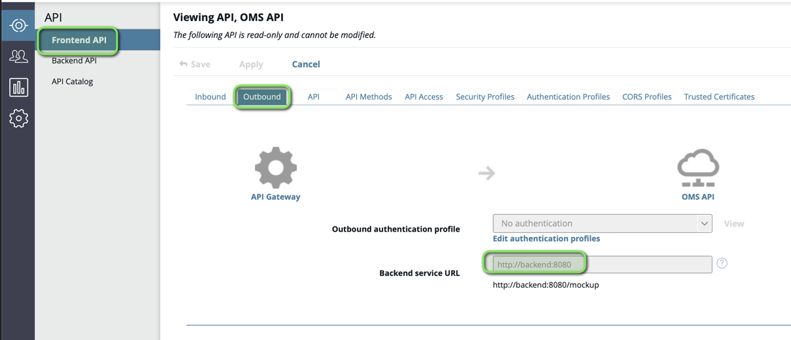

# APIM CLI Lab

| Average time required to complete this lab | 30 minutes |
| ---- | ---- |
| Lab last updated | Jan 2026 |
| Lab last tested | Jan 2026 |

Welcome to the APIM CLI Lab! In this session, you'll delve into how to use the command line interface (CLI) to manage and maintain your API Management platform. Through hands-on exercises, you'll learn how to perform routine administration operations such as listing and managing APIs, applications, and users using the APIM CLI. 

## Index

- [APIM CLI Lab](#apim-cli-lab)
  - [Index](#index)
  - [1. Learning objectives](#1-learning-objectives)
  - [2. Tasks](#2-tasks)
    - [2.1 Task 1: List all APIs](#21-task-1-list-all-apis)
    - [2.2 Task 2: Import an API to API Manager using APIM CLI](#22-task-2-import-an-api-to-api-manager-using-apim-cli)
    - [2.3 Task 3: Export an API using APIM CLI to a config file](#23-task-3-export-an-api-using-apim-cli-to-a-config-file)
    - [2.4 Task 4: Change the API definition](#24-task-4-change-the-api-definition)
  - [3. Conclusion](#3-conclusion)

## 1. Learning objectives

By the end of this lab, you will be able to: 
- Understand the basics of APIM CLI and its capabilities.
- Perform common administrative tasks using the APIM CLI.
- Navigate and manage APIs through the command line.

## 2. Tasks

- Get a list of all APIs in the APIM Manager.
- Import a new API using the APIM CLI and config file.
- Export an existing API to a config file.
- Change the backend url of an existing API.
- Delete an API using the APIM CLI.


> **Pre-requisites:**
- Ensure that the api gateway service is running.
- Use the Start API Management icon on the desktop to start the API Management services if they are not already running.

### 2.1 Task 1: List all APIs

Open a terminal window and ensure you are in the `/home/axway` directory.

Run the following command to list all APIs:

```bash
apim api get -s api-env
```

You should see a list of all APIs currently managed by your APIM instance.

For a more detailed view of each API, including additional attributes such as version, context, and backend URL, use the `-wide` flag:

```bash
apim api get -s api-env -wide
```

For an ultra-detailed view that shows everything including organization, created date, and more, use the `-ultra` flag:

```bash
apim api get -s api-env -ultra
```

> **Note:** The more data you want to view, the more time it will take. However caching is used, therefore if you rerun the same command, it takes much lower time.

### 2.2 Task 2: Import an API to API Manager using APIM CLI

In this task, you'll import a new API called "OMS API" using a configuration file.

**Step 1:** Create a config file at the following location:

`/home/axway/oms_config.json`

Add the following content to the file:

```json
{
  "name": "OMS API",
  "path": "/oms/v1",
  "state": "published",
  "version": "1.0",
  "organization": "API Development"
}
```

**Step 2:** Verify that OMS API is not yet in the API Manager by listing all APIs:

```bash
apim api get -s api-env
```

Note that OMS is not in the list.

**Step 3:** Import the OMS API using the config file and the API specification:

```bash
apim api import -c /home/axway/oms_config.json -a '/home/axway/TechLabs/TechLabs Resources/oms_v1.json' -s api-env
```

**Step 4:** Verify the OMSAPI has been imported by listing all APIs again:

```bash
apim api get -s api-env
```

You should now see the OMS API in the list.

### 2.3 Task 3: Export an API using APIM CLI to a config file

In this task, you'll export the OMS API definition to a configuration file.

**Step 1:** Find the ID of the OMS API:

```bash
apim api get -s api-env
```

Look for the OMS API in the list and note its ID (e.g., `0fd392aa-7c4b-42a6-84e8-585c423101c8`).

**Step 2:** Export the API definition using its ID:

```bash
apim api get -s api-env -id 0fd392aa-7c4b-42a6-84e8-585c423101c8 -o json
```

This command creates a folder (oms-v1)in the current location containing the complete API definition, including the `api-config.json` file.

### 2.4 Task 4: Change the API definition

In this task, you'll modify the backend URL of the OMS API.

**Step 1:** Navigate to the exported API location(/home/axway/oms-v1) and open the `api-config.json` file.

**Step 2:** Find the backend URL configuration and change it from:

```
http://backend:5080
```

To:

```
http://backend:8080
```

**Step 3:** Import the modified API configuration using the `-force` flag:

```bash
apim api import -s api-env -c api-config.json -force
```

> **Note:** The `-force` flag is required because changing the backend URL is considered a breaking change.

**Step 4:** Verify the change by checking the API Manager GUI or by exporting the API again to confirm the backend URL has been updated.

To export the API again, use the following command:

```bash
apim api get -s api-env -ultra -id <id-of-oms-api>```

To view the change in Graphical User Interface (GUI), log in to the API Manager (https://api-env.demo.axway.com:8075), navigate to the "APIs" section --> Frontend API,  and select the "OMS API". Choose the Outbound tab, check the backend URL service to confirm it has been updated to `http://backend:8080`.



### 2.5 Task 5: Delete the API

In this task, you'll delete the OMS API using the APIM CLI.

**Step 1:** Find the ID of the OMS API:

```bash
apim api get -s api-env
```

Note the API ID (e.g., `3e1cce15-8b2e-4877-8d69-b7af04daa037`).

**Step 2:** Delete the API using its ID:

```bash
apim api delete -s api-env -id 3e1cce15-8b2e-4877-8d69-b7af04daa037
```

**Step 3:** Verify the API has been deleted by listing all APIs:

```bash
apim api get -s api-env
```

The OMS API should no longer appear in the list.

## 3. Conclusion

Congratulations! You have successfully completed the APIM CLI Lab. In this lab, you have learned how to:

- **List APIs** - View all APIs managed by your APIM instance using the `apim api get` command
- **Import APIs** - Create and import a new API using a configuration file with the `apim api import` command
- **Export APIs** - Export API definitions to configuration files for backup or migration purposes
- **Update APIs** - Modify API configurations such as backend URLs and re-import them using the `--force` flag for breaking changes
- **Delete APIs** - Remove APIs from the API Manager using the `apim api delete` command

The APIM CLI is a powerful tool that enables you to automate API management tasks, integrate with CI/CD pipelines, and manage your API lifecycle without relying on the Web UI. These skills form the foundation for more advanced API management automation and DevOps practices.

For more information about APIM CLI capabilities, refer to the [APIM CLI Wiki](https://github.com/Axway-API-Management-Plus/apim-cli/wiki).