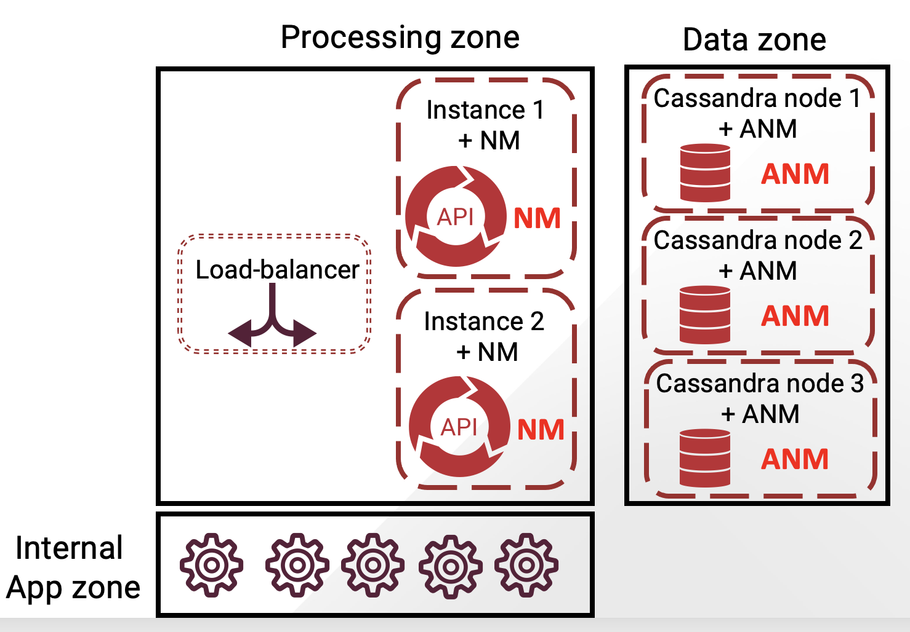
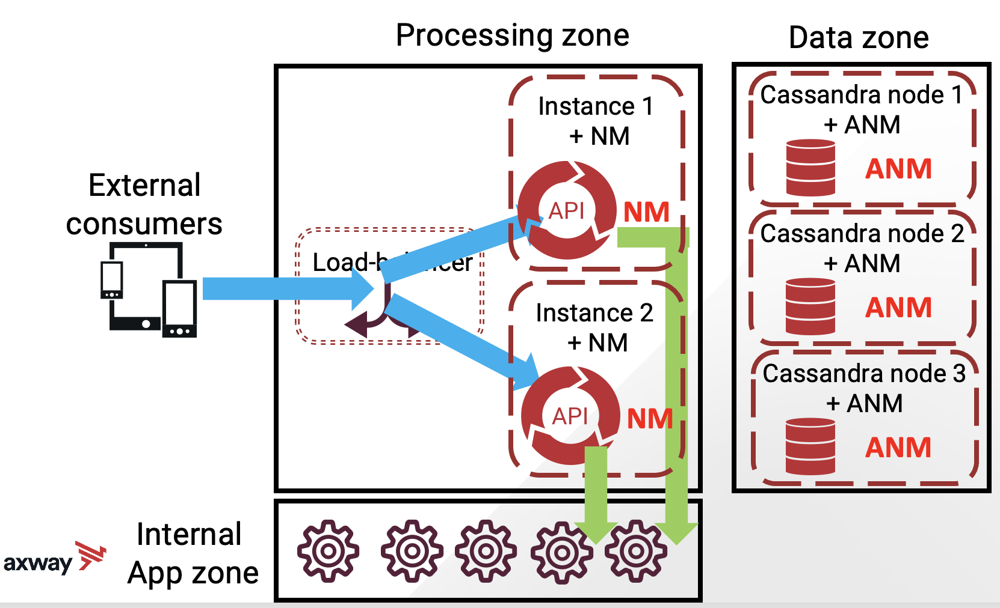
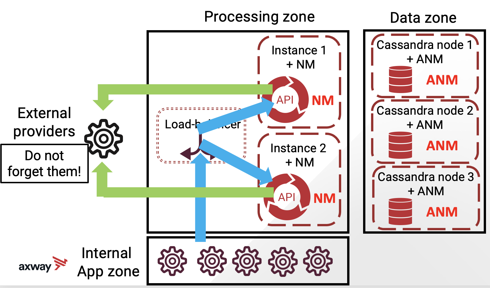
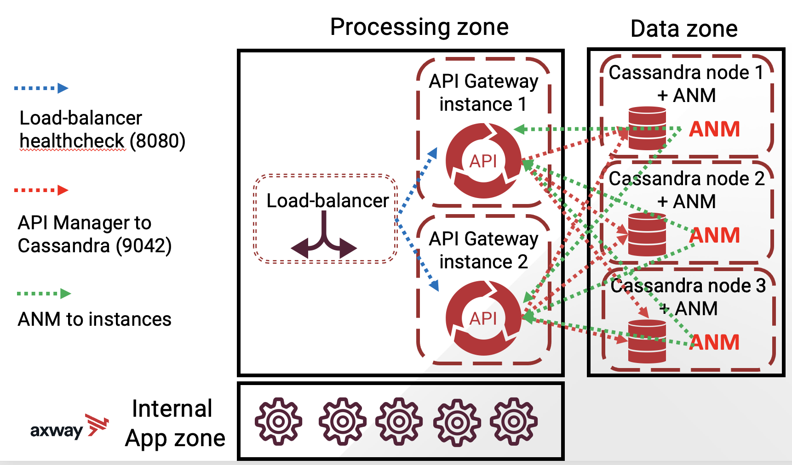
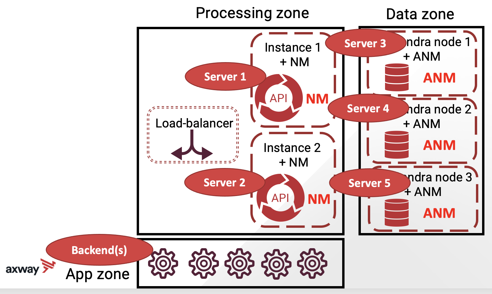
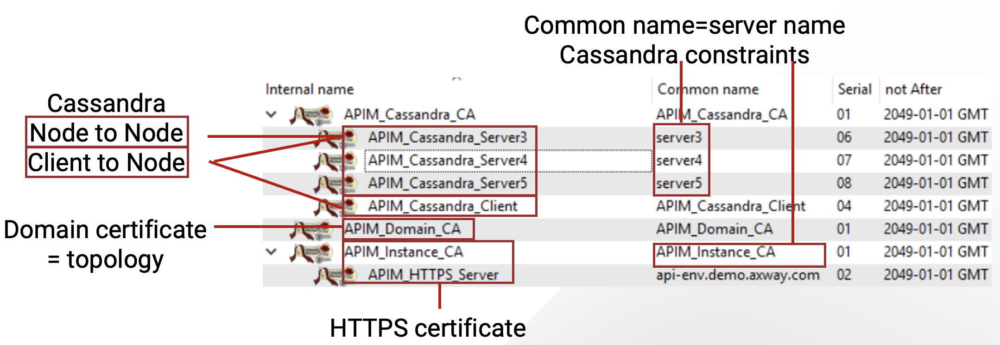

# High Availability Installation of API Manager

| Average time required to complete this lab | 60 minutes |
| ---- | ---- |
| Lab last updated | March 2024 |
| Lab last tested | March 2024 |

In this lab, you will learn how to exercise routine administration operations on the platform.


## Learning objectives

At the end of this lab, you will be able to 
* Install API Manager in High Availability
* Do a reasonably secure installation
* Check that the installation is working properly

## Introduction

* Installation is based on an architecture definition

* Some of the common constraints:
    * Security requirement
    * Network
    * Team coordination

* And each company has its own unique constraints

### Scope of this lab

* API Manager HA
    * API Manager monitoring not used, ie no DB

* Installation done by you

* Secured installation
    * No default certificate
    * Default password changed: Axway123
        * For all
    * TLS internal connections

* 5 servers
    * 2 in “Process zone”, highly secured
    * 3 in “Data zone”, LAN

* Technical pre-requisites already met
    * VMs delivered
    * Credentials and roles provided
    * Ports opened

### Target architecture



### API call 1 - flow



### API call 2



### Internal connections



Why 3 ANMs in the exercise?

* There is the need for 3 Cassandra nodes for HA
* But, only 2 ANMs are required for HA
* 3 ANMs are used in the exercise to have consistent configuration across all 3 servers in Data zone.

Could I do installation differently?

* Yes, in your Information System! 
* Performing different installations is one of the flexibility provided by the Axway solution
* Note minimum number of servers is 3 (due to Cassandra). 
* 7 servers installation could make sense too. And adding components (API Portal, Embedded Analytics) can affect the number of servers used


For now, let’s focus on our 5 servers installation!

## Installation preparation

* Similar to single server installation

* Be careful to review your requirement/dependency with other teams

* Pay particular attention to 
    * Logins with appropriate permissions
    * Whether the ports are opened
    * Whether the load balancers are factored in

### Checklist

* Login for all servers, with right credentials  
* Port listed and opened  
    * In and out  
* Load-balancer configured
* Licenses reviewed and uploaded to API Gateway servers
* Installer downloaded from support site and uploaded to all required servers
* Check patches, select which to install (by default the latest) and upload to all required servers 


## Installation

### Installation setup



### Installation instructions for high availability on a single server

Of course, it is not HA! But lets review why this exercise is still relevant.

#### What is different from multi-server installation?

* Only one user/login
    * No relog
* Different folders
    * Same function = same folder
* Different ports
    * Same function = same port
* Same processes on same machine
* Resources consumption
* No firewall activated


#### What is same in both?

* Everything else!
* Particularly, configuration set in products for network is the same (hosts file)


### How we are trying to simulate this 

#### 5 server installations on 1 physical server

* Root installation folder: /home/axway/install/ha
* Each server is a subfolder
    * E.g. `/home/axway/install/ha`
* Single OS login: axway/axway
    * Standard Linux user
* Port prefix, corresponding to server number
* Cassandra requires same port. So different interface used for Cassandra configuration
    * Except for JMX, that requires localhost interface
* So different loopback network interfaces will be used
* Cluster ports:
    * Storage port:`7000`
    * SSL Storage port:`7001`
    * Native transport port:`9042`
    * RPC port:`9160`

Let us now review each server configuration.

#### Server 1: instance 1

* Hostname: `server1`
* Folder: `$HA_HOME/server1`
* Components (process standpoint)
    * API Gateway/Manager instance
    * Node manager
* Port: prefix 1
    * Default Service: `18080`
    * Admin port: `18085`

#### Server 2: instance 2

* Hostname: `server2`
* Folder: `$HA_HOME/server2`
* Components (process standpoint)
    * API Gateway/Manager instance
    * Node manager
* Port: prefix 2
    * Default Service: `28080`
    * Admin port: `28085`

#### Server 3: Cassandra node 1 + ANM 1

* Hostname: `server3`
* Folder: `$HA_HOME/server3`
* Components (process standpoint)
    * Admin Node manager
    * Cassandra Node
* Port: prefix 3
    * ANM port: `38090`
    * Cassandra JMX: `37199`

#### Server 4: Cassandra node 2 + ANM 2

* Hostname: `server4`
* Folder: `$HA_HOME/server4`
* Components (process standpoint)
    * Admin Node manager
    * Cassandra Node
* Port: prefix 4
    * ANM port: 48090
    * Cassandra JMX: 47199

#### Server 5: Cassandra node 3 + ANM 3

* Hostname: `server5`
* Folder: `$HA_HOME/server5`
* Components (process standpoint)
    * Admin Node manager
    * Cassandra Node
* Port: prefix 5
    * ANM port: `58090`
    * Cassandra JMX: `57199`

#### What binary package you must have?

* Installer: APIGateway_7.X.Y_Install_linux-x86-64_ZZZ.run
* License: mylicense.lic
* Federation file: myproject.fed
* Certificates 
* Configuration files

#### What you must do?

* Setup the environment
* Prepare your environment
    * Use the instructions in this lab
    * File editor opened
    * Putty to execute commands
    * Connect then execute profile script

#### Certificates generated for this lab



*Note: Real certificates must be managed by the company*

#### Setup the environment

* Get the HA installer kit and follow instructor's instructions!

* Basic steps are: 
```
mkdir -p /home/axway/install
cd  /home/axway/install
unzip /usr/local/readytech/Inbox/ha_install_kit.zip
cd script
chmod +x *.sh
vi /home/axway/install/script/ha_profile.sh
. /home/axway/install/script/ha_profile.sh
```

Verify in the `/etc/hosts` file that all servers are correctly declared


Let us now perform the installation


### Installation

*Disclaimer*

* QuickStart installation was simple
* Domain management is simple
* Installing API Gateway on multiple servers is a bit long, but not difficult
* Installing Cassandra secured and high availability is not simple
* This is the interactive, manual version. Cassandra installation is scriptable. We will see an automated version at the end.

#### Step by step installation

**First step:** Preparation 
1. Install first ANM + Cassandra node
2. Initialize Domain and start it
3. Initialize first Cassandra node and start it
4. Install and configure ANM + Cassandra 2 and 3
5. Secure cassandra installation
6. Install the 2 API Manager nodes, declare NM and create group and instances
7. Update fed file and deploy policies
8. setup-apimanager
9. Redeploy policy, deploy APIs  

**Last step:** Validation

For the sake of ease, the above steps are categorized into 5 parts.

1. Installation of 3 ANMs and 3 Cassandra nodes
    * Install first ANM + Cassandra node
    * Initialize Domain and start it
    * Initialize first Cassandra node and start it
    * Install and configure ANM + Cassandra 2 and 3

2. Secure Cassandra installation
    * Secure Cassandra installation

3. Install 2 API Managers
    * Install the 2 API Manager nodes, declare NM and create group and instances
    * Update fed file and deploy policies
    * setup-apimanager
    * Redeploy policy

4. Change API Manager Password 
    * API Manager requires a password change for the 1st connection, this script does it automtically

5. Deploy API
    * Create the `API Development` organization 
    * Deploy `OMS` API

#### Install first ANM + Cassandra node

Documentation references:
* [Reference 1](https://docs.axway.com/bundle/APIGateway_753_InstallationGuide_allOS_en_HTML5/page/Content/InstallGuideTopics/install_node_manager.htm)

* [Reference 2](https://docs.axway.com/bundle/APIGateway_753_InstallationGuide_allOS_en_HTML5/page/Content/InstallGuideTopics/cassandra_install.htm)

* Install ANM and Cassandra

```
$APIGTW_INSTALL --debuglevel 0 --mode unattended  --setup_type advanced --enable-components apigateway,cassandra --disable-components analytics,qstart,policystudio,configurationstudio,apitester,apimgmt,packagedeploytools --nmPort 38090 --firstInNewDomain 1 --prefix $SERVER3 --cassandraInstalldir $SERVER3 --cassandraJDK $SERVER3/apigateway/platform/jre  --changeCredentials 1 --username admin --adminpasswd Axway123
```

*Notes:*
* Mix Cassandra + ANM installation, ANM JDK reused for Cassandra
* Default password changed to Axway123
* Whole API Gateway installation, but no license asked
* Instance cannot be started though

* Initialize domain with external certificates, account.

```
$SERVER3/apigateway/posix/bin/managedomain --initialize --host server3 --port 38090 --nm_name ANM1 --domain_name Domain --username admin --password Axway123 --sign_with_user_provided --ca $CERT_FOLDER/APIM_Domain_CA.p12 --sign_alg sha256 --domain_passphrase Axway123 --key_passphrase Axway123
```

*Note:*
You’ll need to copy license file to prevent the warning below.  
`NO PRODUCT LICENSE FOUND in /home/axway/install/ha/server3/apigateway/conf/licenses
`

* Start and verify
```
ps –ef | grep vshell
netstat -anp | grep <PID>  (where PID is from ps command output)
```
*Notes:*
* Certificates can be auto-generated, provided (as here) or using CSR
* Or HSM can be used


