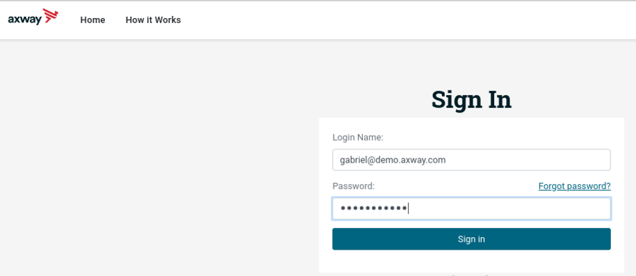
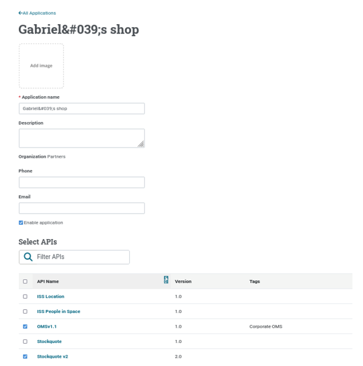
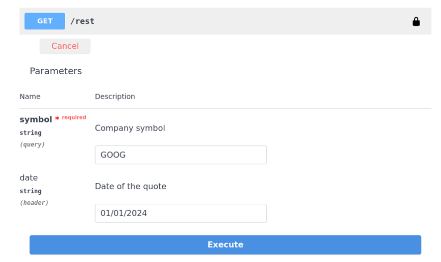
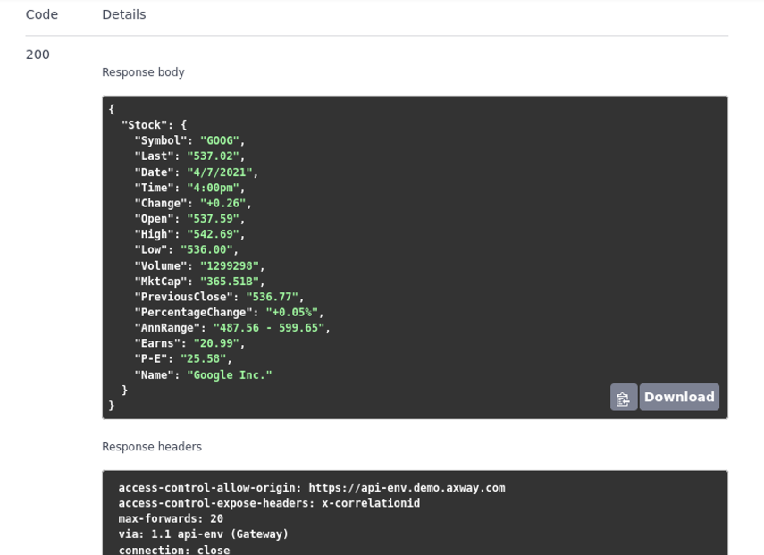
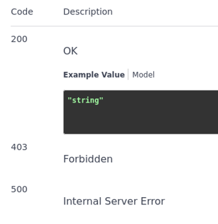
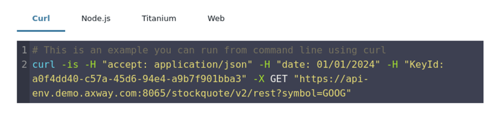
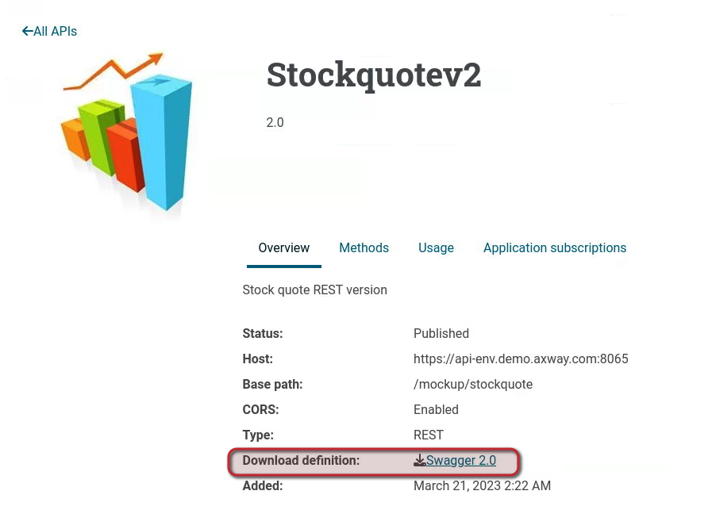

# API Testing using API Portal

| Average time required to complete this lab | TBD minutes |
| ---- | ---- |
| Lab last updated | March 2024 |
| Lab last tested | March 2024 |

Welcome to the API Testing lab using API Portal! In this session, we'll delve into the intricacies of API Portal, exploring its fundamental features through hands-on exercises. Our primary focus will be on testing the Stockquote v2 API, where you'll gain practical experience in navigating API Portal and conducting API tests.

Throughout this lab, you'll have the opportunity to modify an existing application, Gabriel’s shop, to incorporate the Stockquote v2 API. By doing so, you'll learn how to integrate APIs into applications effectively. Additionally, we'll explore HTTP error responses and analyze CURL examples to deepen your understanding of API testing nuances. So, let's dive in and embark on this journey of discovering API Portal's capabilities together!

## 1. Learning objectives

**Remembering:**
   - Remember the process of modifying an existing application

**Understanding:**
   - Explain the significance of HTTP error responses in the context of API testing and troubleshooting.
   - Understand the basics of CURL commands and their application in testing APIs.

**Applying:**
   - Utilize API Portal to test the Stockquote v2 API with specific parameters, such as "symbol=GOOG" and "date=01/01/2018".
   - Apply modifications to an application within API Portal to integrate the Stockquote v2 API effectively.

**Analyzing:**
   - Analyze the HTTP responses received during API testing and interpret their implications on the functionality of the API.
   - Evaluate the effectiveness of API testing methods and identify areas for improvement in the testing process.

**Creating:**
   - Design a comprehensive API testing strategy tailored to the specific requirements of an organization, considering factors such as security, reliability, and scalability.

## 2. Tasks
**Task**:  
Test API `Stockquote v2`` with API Portal and user gabriel
* Modify the application Gabriel’s shop to use Stockquote
Test API Stockquote v2 with:
    * symbol=GOOG
    * date=01/01/2018

**Task**:
Observe HTTP error responses

**Task**:
Observe CURL example

**Task**:
Download the API Swagger definition

## 3. Solutions

* Connect to the API Portal with user gabriel
* Enter `gabriel@demo.axway.com` in the field `Login Name`
* Enter `Techlabs99*` in the field `Password`
* Click **Sign In**

* Edit the application `Gabriel’s shop` and add API `Stockquote v2`
* Click **Save** to apply changes

* From the **APIs** tab, test the API for **Stockquote v2**
* Select an API Key and test the API 
    * with `symbol=GOOG`
    * `date=01/01/2018`

* See the result of the call: `200 OK`

* Look at the explanation of HTTP responses

* See the corresponding `CURL` command

* Download the API Swagger definition

## 4. Conclusion

The API Portal is a customizable interface for API Developers
* With API Portal, browse and test available APIs
* Download swagger files from your Apps.

