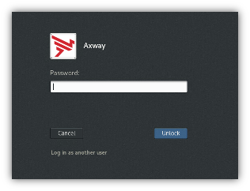
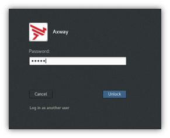
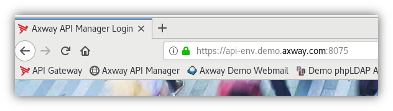
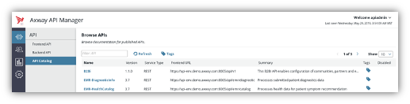

# API Management using API Manager and API Portal

In this lab, you will perform some tasks that will help you to get yourself familiar with some of the important features of API Manager and API Portal.

## Learning Objectives

At the end of this lab, you will be able to 
* Provide a bulleted list of learning objectives. Try to adhere to Bloom's taxonomy.
* Expose and publish an API from API Manager
* Manage a community of users with API Manager
* Consume an API as an Application Developer from the API Portal

## Scenario

Wherever possible, we use scenarios to make learning more relevant and engaging. You will be using the following scenario for this lab.

A company wants to increase their agility and the speed of application development.

You as a developer is tasked with the following goals
* Easily virtualize an API
* Manage users and API consumption

In today’s world, companies publish APIs to increase their agility and as such the speed with which they develop new applications, thus responding to new demands of existing clients, partners and suppliers.

Gerard Lambert is the architect, designer and responsible of security in the department of system integration of the Roboulot Group. In short, it’s the person to blame if something does not work as it is supposed to (you probably saw this before…).

To optimize their business, the Roboulot Group has launched an ambitious program. The group wants to provide automated services through APIs to the partners and affiliates. The service would allow external parties:
* To process orders more quickly 
* To follow a manufacturing process using their applications

Partners are encouraged to use these services to optimize their own processes. It’s a win-win situation that facilitates commercial relationships by improving margins. 

Gerard is entrusted with the mission to enable such services through APIs. The new APIs accelerate creation of the new applications within the ecosystem of the group and that of its partners (and of course this needs to be done yesterday!). These applications should be able to easily use functionality and services from other applications.

In his role of overseeing the “APIsation” program of the company, he should make sure that the publication of the APIs is easy, and that the usage of these APIs is controlled and that their utilization does not harm the IT systems.

Gerard Lambert needs your expert knowledge to put a Portal in place that allows to expose APIs to the external parties. Ideally, he needs a solution which allows to control the usage of these APIs depending on the type of applications that are using them.

| Current situation without API Management solution | Target state using API Management with API Manager and API Portal|
| ------ | ------ |
|  |  |
| In the existing system, as shown in the diagram above, consumers directly access the order management system (OMS) backend system. The consumers also do not have any means to follow-up on the order once they have made the order. | Thanks to Axway's API Management solution, the company can now secure the access to the OMS backend system. The consumers will also be able to track their order from a branded API Portal. |

## High level instructions for completing this lab

1. Expose the API
    
    Virtualize the REST API so that it can be made available to a community of developers for testing.

2. Publish the API

    Update documentation, security, and implementation so that the API can by used by external partners.

3. Community management

    Show how a community allows to quickly manage the enrollment of application developers.

4. Application developer point of view

    As an application developer, interact with the API Portal to search for relevant APIs, obtain API keys and manage the application usage.

## Detailed solution steps

### Virtual Machine Environment

#### Login / password

If you are disconnected, click on the username “Axway”:

 

Enter “axway” in the field “Password”.
Click on the button “Unlock” 
 
{:centered}

#### Start Server Components
If products are not started (you can check with the command “statusAll” anywhere from a terminal), double click the following desktop shortcut:
* “Start API Management”
* “Start Backend Services”

#### API Manager access
Connect to the API Manager:

* Start “Firefox” by double-clicking the icon on the desktop:

* Click on the shortcut “API Manager” which is available in Firefox (URL: “https://api-env.demo.axway.com:8075/”).
 

Login as administrator.
Enter the following information in the login screen:
* Enter “apiadmin” in the field “Username”
* Enter “changeme” in the field “Password”
* Click on “Login”.
* Click on the tab “API”

Some APIs are already virtualized. The goal of this scenario is to virtualize the Order Management System (OMS) of the company. 

 

### Lab solution steps

## Summary

The API Manager is an easy to use interface to
* Virtualize APIs in just a few steps
* Expose APIs with authentication mechanisms and quotas
* Manage APIs consumers

The API Portal is the interface for consumers to
* Self-register and self-service for user independence
* Search with filters into API Catalog and documentation
* Test API with inline Try-it
* Monitor API usage

