# API Management using API Manager and API Portal

| Average time required to complete this lab | 60 minutes |
| ---- | ---- |
| Lab last updated | March 2024 |
| Lab last tested | March 2024 |

In this lab, we'll dive into the fundamentals of API virtualization, publication, and consumption using Axway's API Manager. We'll walk through the process of defining APIs, testing them, and making them available to developers securely and efficiently. By the end of this session, you'll have a solid understanding of how to manage APIs effectively within your organization's ecosystem.

Through hands-on exercises, we'll explore how to publish APIs, configure authentication mechanisms, and set up quotas to regulate API usage. You'll also learn how to manage organizations, roles, and permissions to facilitate collaboration between internal teams and external partners. 

## Index
- [1. Learning Objectives](#1-learning-objectives)
- [2. Scenario](#2-scenario)
- [3.High level instructions to complete this lab](#3-high-level-instructions-for-completing-this-lab)
- [4. Virtual Machine Environment](#4-virtual-machine-environment)
- [5. Lab Solution Steps](#5-lab-solution-steps)
- [6. Summary](#6-summary)

## 1. Learning Objectives

**Remembering:**
   - Recall the steps involved in configuring APIs in Axway API Manager, including selecting backend APIs, defining inbound security, and saving configurations.
   - Identify the options available for inbound security when setting up APIs, such as Pass Through and API Key.

**Understanding:**
   - Explain the significance of virtualizing APIs and testing them before publishing to ensure functionality and reliability.
   - Interpret the role of authentication mechanisms, such as API Key and Pass Through, in controlling access to APIs and protecting backend servers.

**Applying:**
   - Utilize the provided instructions to configure API authentication settings within Axway API Manager, including selecting security options and saving configurations.
   - Demonstrate the ability to test APIs and verify their functionality by consuming resources and receiving responses.

**Analyzing:**
   - Evaluate the advantages and disadvantages of different authentication mechanisms, such as Pass Through and API Key, in terms of security and ease of use.
   - Assess the impact of API authentication settings on the overall performance and accessibility of APIs for application developers and partners.

**Creating:**
   - Design a customized API authentication strategy tailored to specific organizational requirements, considering factors such as security policies and user experience.
   - Develop a comprehensive documentation or guide outlining best practices for configuring API authentication settings within Axway API Manager, including step-by-step instructions and troubleshooting tips.

## 2. Scenario

Wherever possible, we use scenarios to make learning more relevant and engaging. You will be using the following scenario for this lab.

A company wants to increase their agility and the speed of application development.

You as a developer is tasked with the following goals
* Easily virtualize an API
* Manage users and API consumption

In today’s world, companies publish APIs to increase their agility and as such the speed with which they develop new applications, thus responding to new demands of existing clients, partners and suppliers.

Gerard Lambert is the architect designer and responsible for security in the department of system integration of the Roboulot Group. In short, he is the person to blame if something does not work as intended (you probably experienced this before…).

To optimize their business, the Roboulot Group has launched an ambitious program. The group wants to provide automated services through APIs to the partners and affiliates. The service would allow external parties:
* To process orders more quickly 
* To follow-up on a manufacturing process using their applications

Partners are encouraged to use these services to optimize their own processes. It’s a win-win situation that facilitates commercial relationships by improving margins. 

Gerard is entrusted with the mission to enable such services through APIs. The new APIs accelerate creation of the new applications within the ecosystem of the group and that of its partners (and of course this needs to be done yesterday!). These applications should be able to easily use functionality and services from other applications.

In his role of overseeing the “APIsation” program of the company, he should make sure that the publication of the APIs is easy, and that the usage of these APIs is controlled and that their utilization does not harm the IT systems.

Gerard Lambert needs your expert knowledge to put a Portal in place that allows to expose APIs to the external parties. Ideally, he needs a solution which allows to control the usage of these APIs depending on the type of applications that are using them.

<table>
    <thead>
        <tr>
            <th>
Current situation without API Management solution
</th>
            <th>
Target state using API Management with API Manager and API Portal
</th>
        </tr>
    </thead>
    <tbody>
        <tr>
            <td>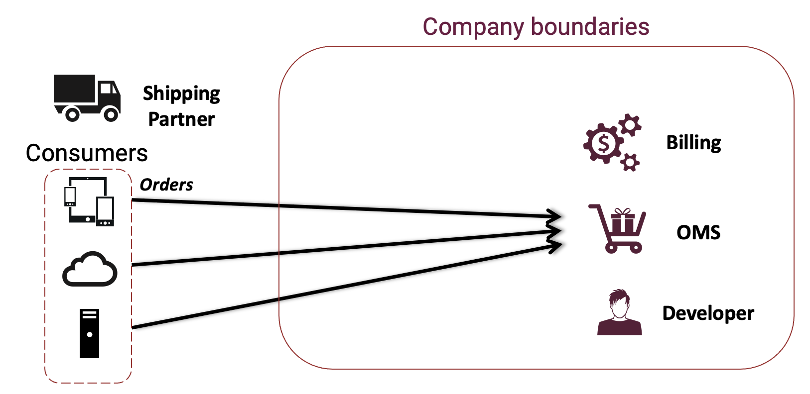</td>
            <td>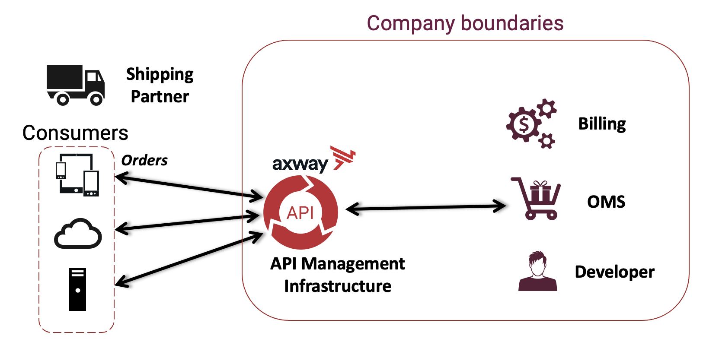 </td>
        </tr>
        <tr>
            <td>In the existing system, as shown in the diagram above, consumers directly access the order management system (OMS) backend system. The consumers also do not have any means to follow-up on the order once they have made the order. </td>
            <td>Thanks to Axway's API Management solution, the company can now secure the access to the OMS backend system. The consumers will also be able to track their order from a branded API Portal.</td>
        </tr>        
    </tbody>
</table>

## 3. High level instructions for completing this lab

1. Expose the API
    
    Virtualize the REST API so that it can be made available to a community of developers for testing.

2. Publish the API

    Update documentation, security, and implementation so that the API can by used by external partners.

3. Community management

    Show how a community allows to quickly manage the enrollment of application developers.

4. Application developer point of view

    As an application developer, interact with the API Portal to search for relevant APIs, obtain API keys and manage the application usage.

## 4. Virtual Machine Environment

#### 4.1. Login / password

If you are disconnected, click on the username “Axway”:

 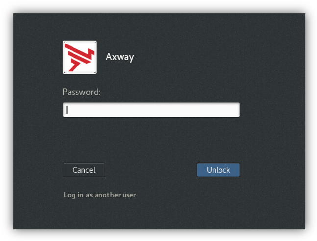

Enter `axway` in the field **Password**.
Click on the button **Unlock** 
 
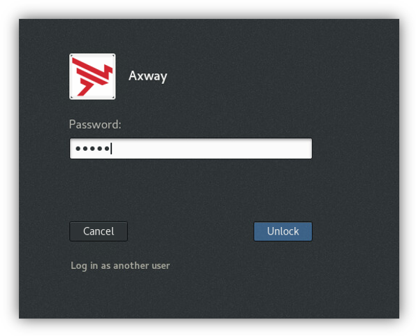

#### 4.2. Start Server Components
If products are not started (you can check with the command “statusAll” anywhere from a terminal), double click the following desktop shortcut:
* Start API Management
* Start Backend Services

#### 4.3. API Manager access
Connect to the API Manager:

* Start **Firefox** by double-clicking the icon on the desktop:

* Click on the shortcut **API Manager** which is available in Firefox (URL: `https://api-env.demo.axway.com:8075/`).
 
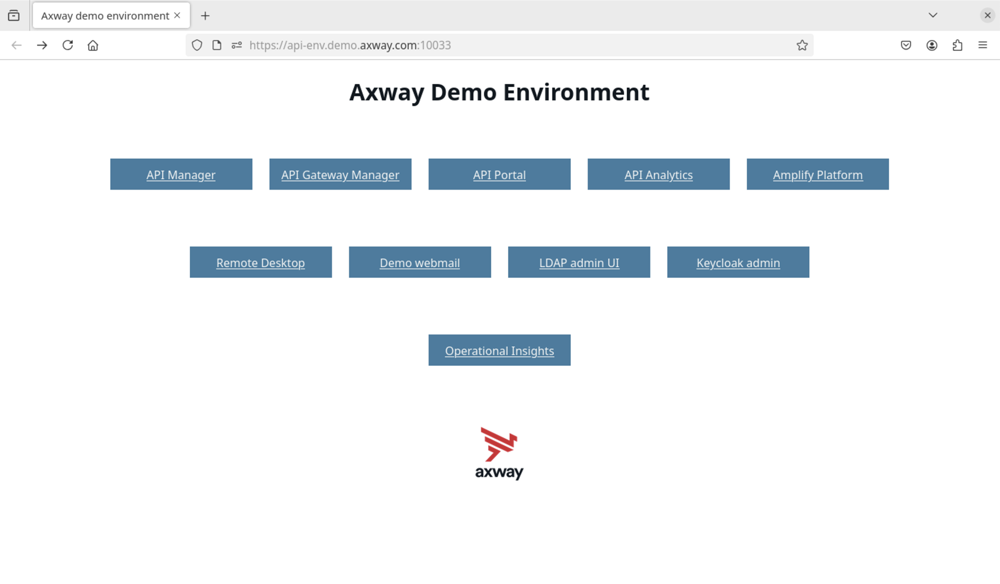

Login as administrator.
Enter the following information in the login screen:
* Enter `apiadmin` in the field **Username**
* Enter `changeme` in the field **Password**
* Click on **Login**.
* Click on the tab **API**

 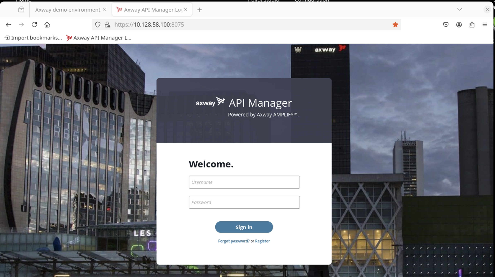

 Some APIs are already virtualized. The goal of this scenario is to virtualize the Order Management System (OMS) of the company. 

  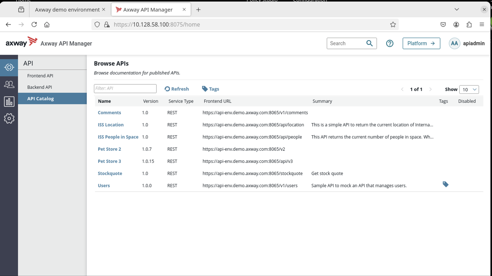

## 5 Lab solution steps

### 5.1. API Virtualization

The following points explain the virtualization process:
* The **Consumer** (on the left) calls a service **Supplier** (on the right) through the **API Management** solution.
* There are 2 connections to access the virtualized service / API
    * From the consumer to the API Management solution: **Frontend API**
    * From the API Management solution to the backend service: **Backend API**

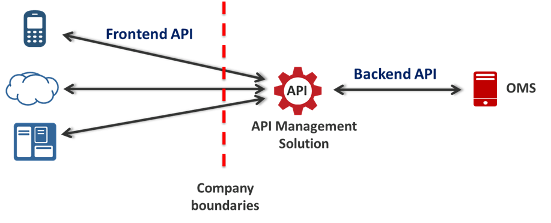

The virtualization of a service with the **API Manager** consists of creating the Backend and Frontend APIs.

#### 5.1.1. Creation of the Backend API

The **Backend API** represents the API provided by the backend system in API Manager. This **Backend API** can be created manually or by importing a file that describes a service contract.  

In this example, we are going to import a file in **Swagger** format provided by the Order Management System and which describes the service.

* Click on the tab **API**, 
* Select **Backend API** in the menu
* Click **New API**
* Select **Import Swagger API**

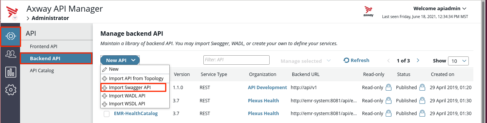

You are currently in the menu which allows to create or reference an API that will be managed by the API Manager.  

In the window **Import from**,
* Keep the default value **Swagger definition file** in the field **Source**
* Click **Select file** in the field **File**

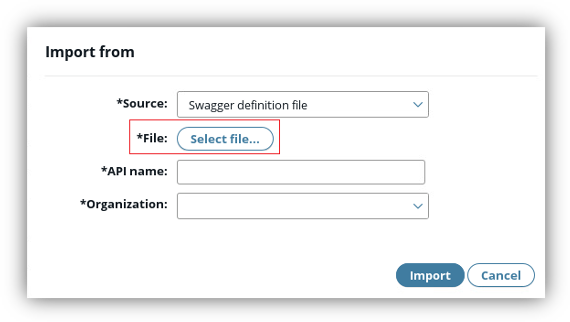

In the menu **File Upload** that opens:
* Click the path **axway** -> **TechLab** -> **TechLabs Resources**  
    Note : Depending on the screen, it is possible that you need to use the vertical scrollbar to show the entire path
* In the right section, select the file **oms_v1.json** (this file describes the service)
* Click **Open**

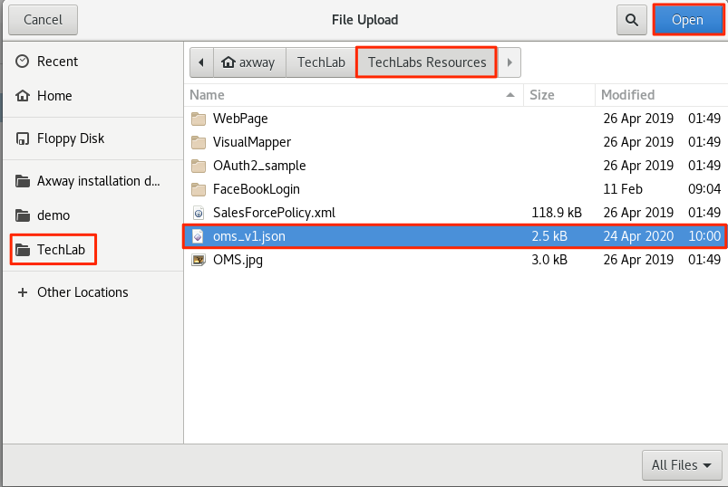

In the window **Import from**:
* Replace the default text with **OMSv1.1** in the field **API Name**
* Select **API Development** in the list **Organization**
* Click **Import**

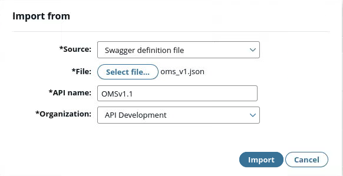

You will see a message that the API is successfully imported.
* Click **ok**

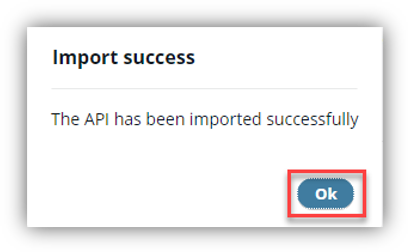

Let’s take a look at the imported API.

Click the **OMSv1.1** API in the list (you may need to select “All” in the “Show” drop-down menu on the right)

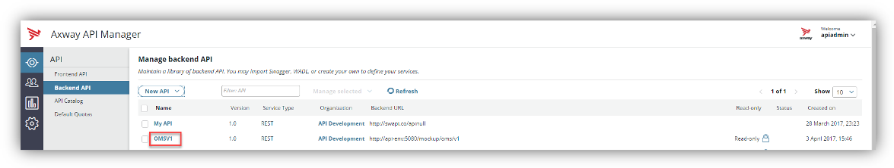

In the first tab **API**, you find all the general information like name, type (REST or SOAP), Base Path URL, Resource Path and a summary.

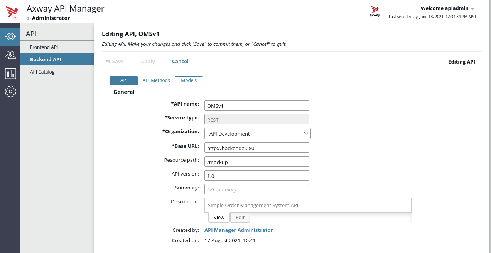

The second tab **API Methods** shows all the available API Methods belonging to the API:
* Click **API Methods**. The OMS API provides two methods **read** and **submit**.

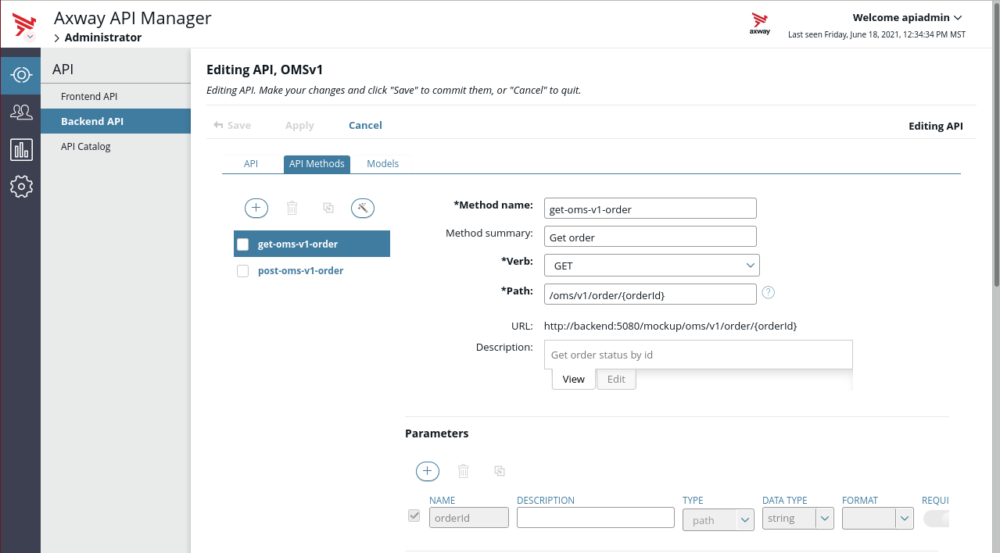

In the next steps, we will use the **read** method to get details of an order.

#### 5.1.2. Creation of a public _Frontend_ API

The public API allows to define the way that the internal resource (“Backend” API) will be exposed so that it can be consumed.

Open the administration console of the API Manager (if you are disconnected, check the instructions in section 3.3)
* Select the tab **API**
* Select the sub-tab **Frontend API**
* Click **New API**
* Select **New API from backend API**

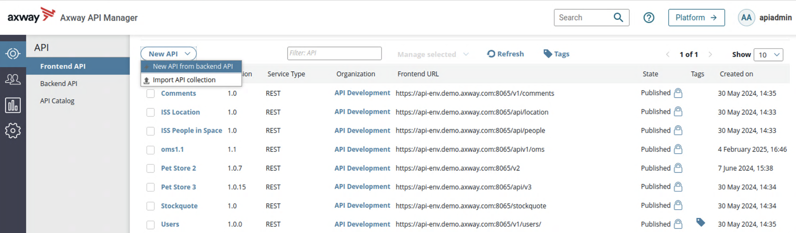

* Select **OMSv1 1.0** in the list
* Click **OK**

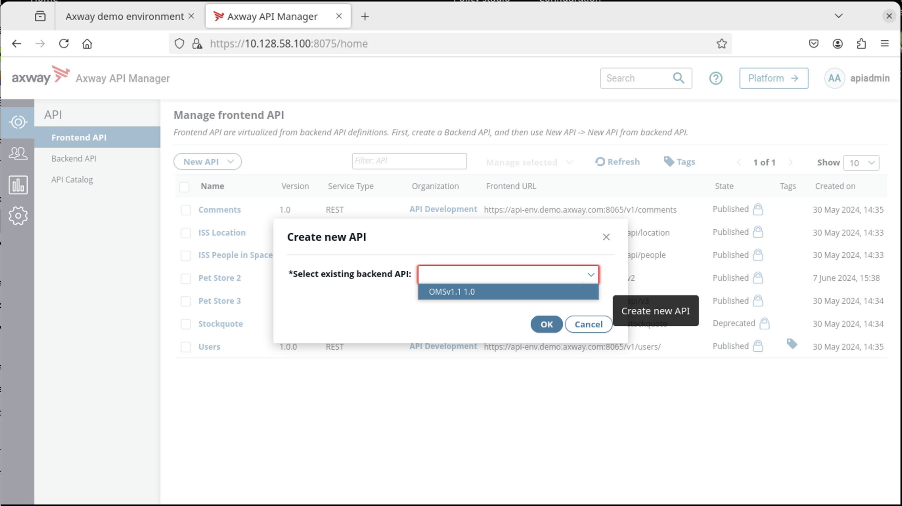

You will now see a form that allows you to create the public API.

In the tab **Inbound**,
* Select **Pass Through** in the field **Inbound Security**. This allows you to verify if the API is working without having to manage access rights. We will change it later.

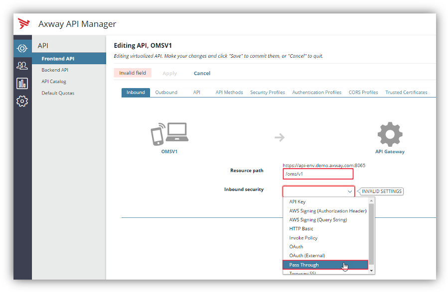

A configuration window **Pass Through Device** appears.
* Keep the default value and click **OK**

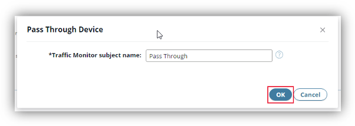

* Click **Save**

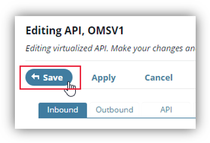

The API is now ready to be tested.
* Open a new tab in Firefox (blue “+” button)
* Enter the URL: `https://api-env.demo.axway.com:8065/mockup/oms/v1/order/123123`
* Hit enter on the keyboard 

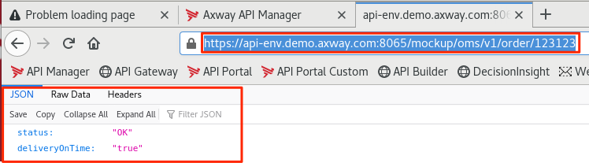

The resource is consumed and returns a value. it works!

### 5.2. Publishing the API

Now that the API has been defined and tested, it can be published.

As you’ve noticed, the virtualization of an API is simple and fast.
Some additional steps are required to allow this API to be shared with the application developers.
* Change the authentication
* Update the documentation
* Change the status of the API
* Share the API with the partners
* Put quotas in place

Let’s go back to the **Frontend API** to change the authentication mechanism:
* Go back to the page **Axway API Manager**
* Select **Frontend API** in the menu **API**
* Type oms in filter API to find it easily

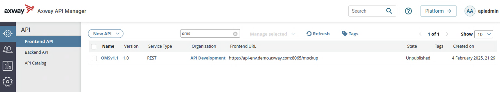

* Click **OMSv1.1**

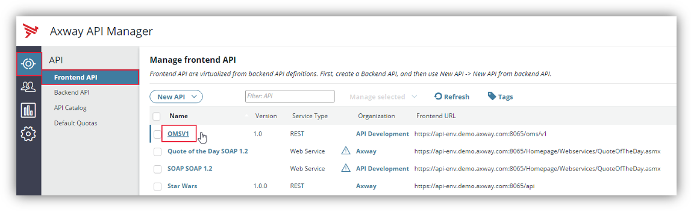

 In the **Inbound** tab,  
 * Select **API Key** for the field **Inbound security**, to indicate that this resource requires an API key

 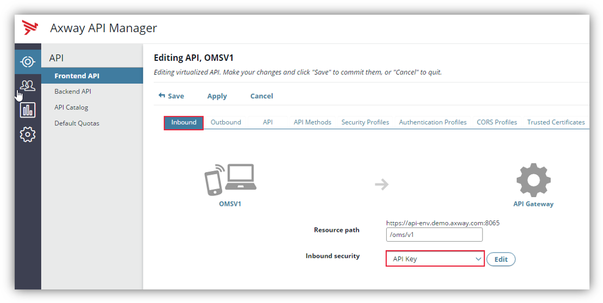

 In a new window, **API Key Device** appears:

 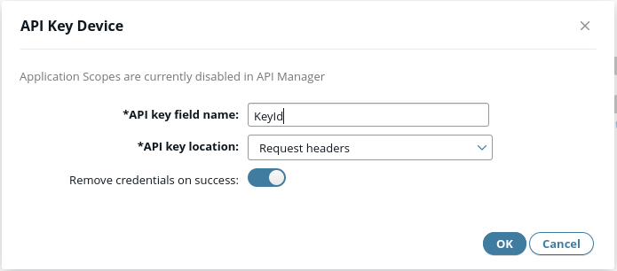

 * Click **OK** (Leave the default options, the API key is passed in an http header)

Now we will complete information related to this API. 
* Click the **API** tab.
* Enter **Order Management System** in the field **API Summary**

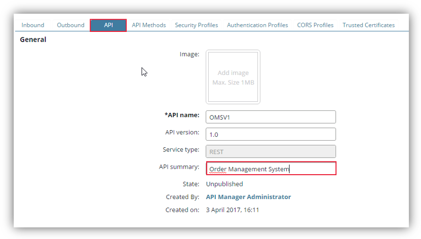

* Click **Add image**

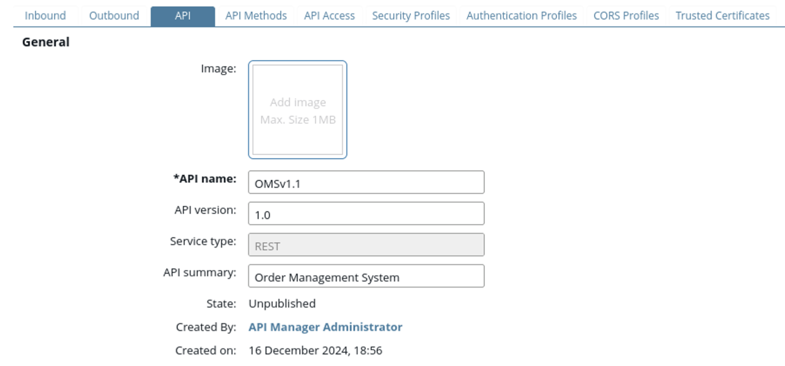

The menu **File Upload** opens:
* Click **Axway -> TechLab -> TechLabs Resources**
* Select **OMS.jpg**
* Click **Open**

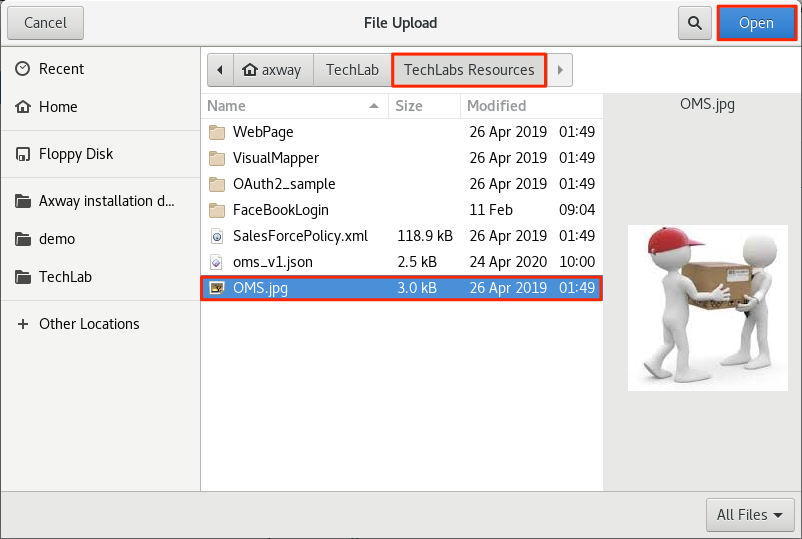

You should have the following screen:

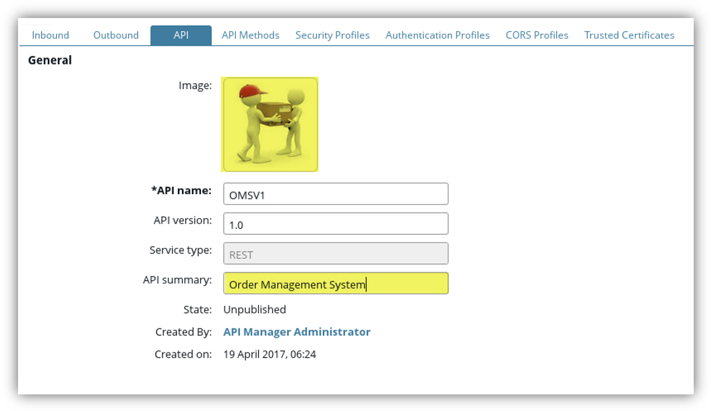

Tags allow application developers to search for APIs in the API Catalog. Let’s add one:
* At the bottom of the tab **API**, in the section **Tags**, create a new tag by clicking **“+”**  
**Note:** You may need to scroll down to see **Tags**

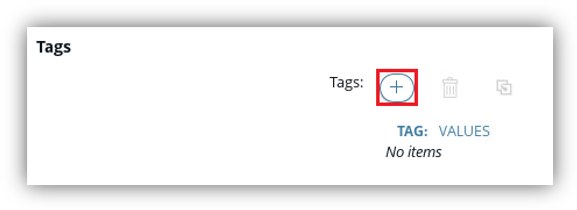

* Enter **Type** in the field **Tag** 
* Enter **Corporate OMS** in the field **Values**

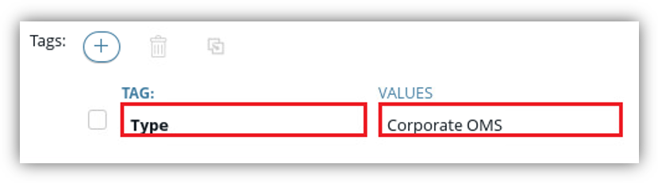

The update of the **Frontend API** is now finished. 

* Click **Save** at the top of the page

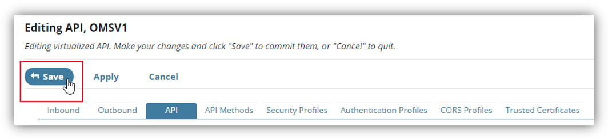

The last step consists of publishing the API from **Manage frontend API**:
* Check the box next to the **OMSv1.1** API

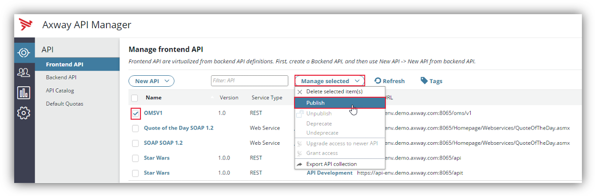

* In the top menu, click **Manage selected**
* Select **Publish**

Leave the default values in the window **Publish API** that pops ups:
* Click **OK**

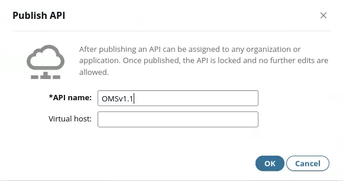

The status of the API becomes **Published**. Your API is now published!

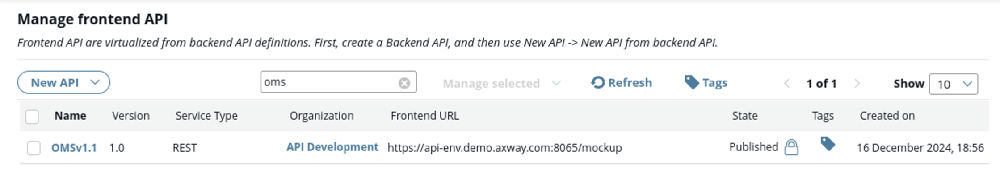

Every API belongs to an organization. In the current example, **OMSv1** belongs to the organization **API Development**. This organization is only for internal developers.

To make the **OMSv1** API available in the **Partners** organization, we will grant access to it:
* Select a check box next to the **OMSv1** API in the **Manage frontend API** screen
* Click **Manage selected** in the top menu

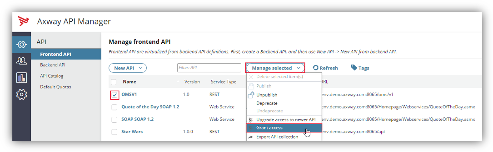

* Select **Grant access**

A new window **Grant API access** appears:
* Select **The following organizations** for the field **Grant API access to**
* Click **“+”**
* Select **Partners**
* Click **OK**

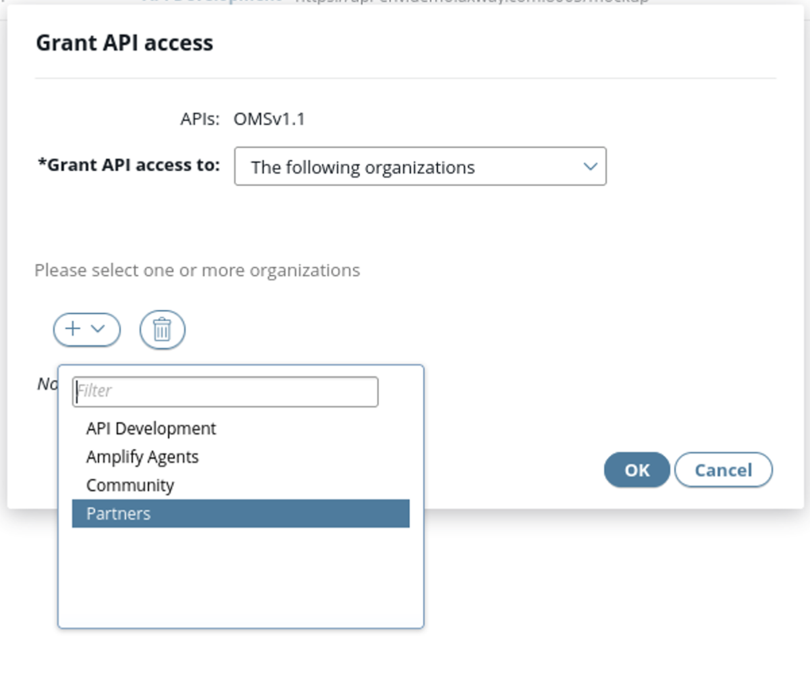

A confirmation window “Grant access” appears:
* Click **ok**

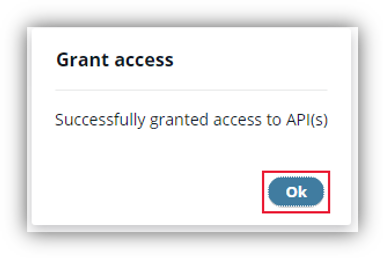

Now we will set quota to protect our backend servers and allocate resources between the applications. We will configure two types of quota:
* A global system quota: API Manager calculates the total amount of transactions for all the applications.
* A quota per “Application”: API Manager measures the number of transactions per application.

To limit the number of transactions on a system level (100 transactions per second):
* Select from the menu **Clients**
* Click **Default Quotas**
* Click **System**

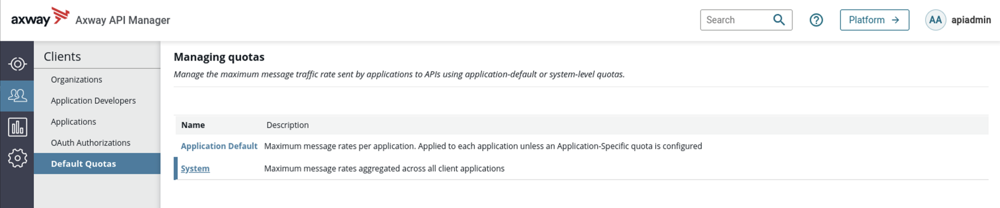

* Click **Add API**
* In the list, select **OMSv1.1** (you may start typing in the “Filter” text box for quick selection of an API)

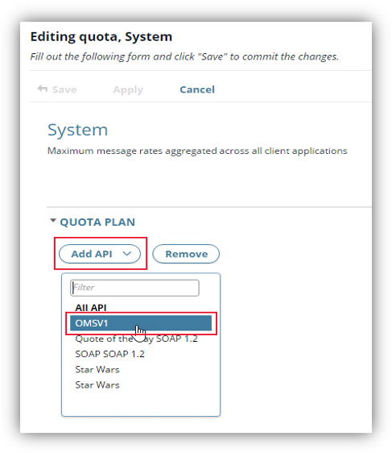

* Set the number of messages as **100**
* Set the number of seconds as **1**

Note: if these 2 values are not entered, the orange button indicates that there are still invalid fields present.

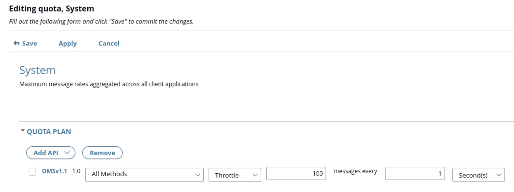

* Click outside the field and click **Save**

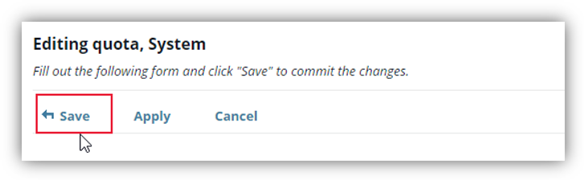

To limit the number of transactions per application (In our case, a transaction every 3 seconds):
* Click **Application Default**

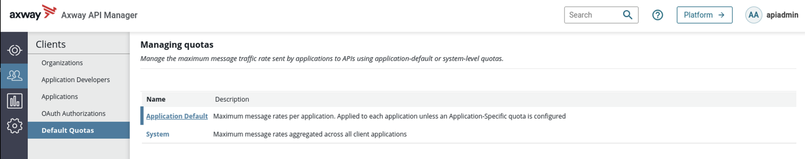

* Click **Add API**
* Select **OMSv1**

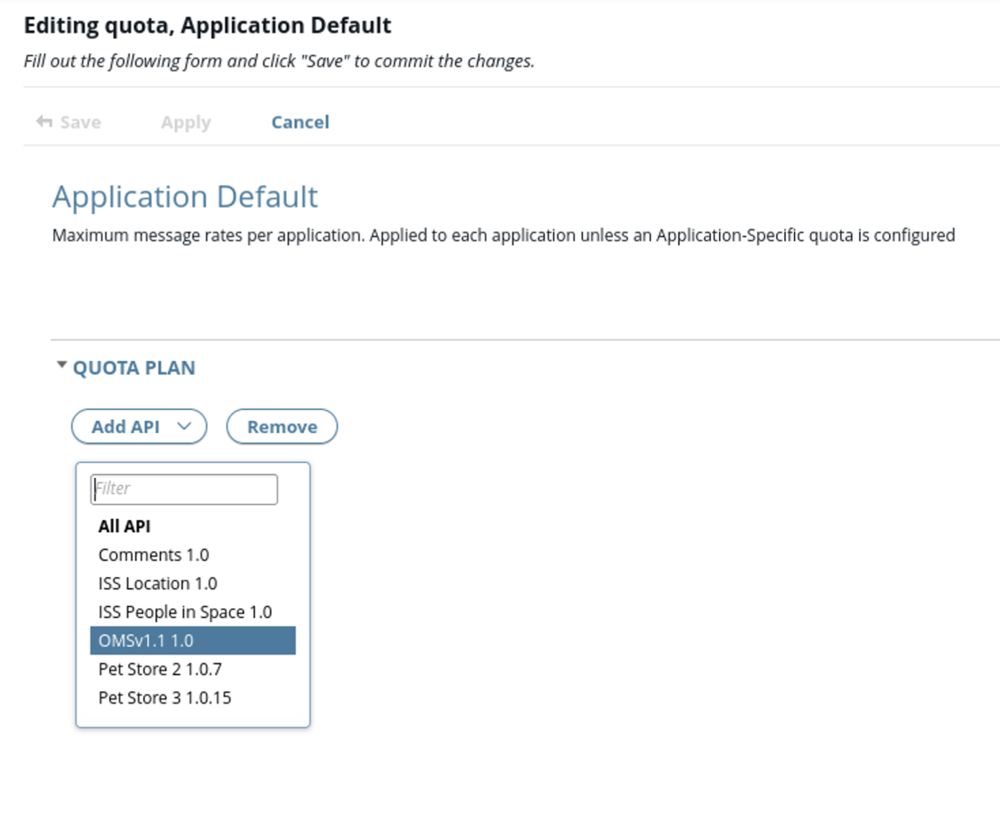

* Set the number of messages as “1” and the number of seconds as “3”
* Click outside the field and click **Save**

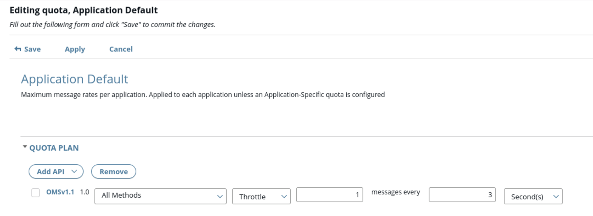

This configuration allows the API Manager to apply the following quota:
* The total amount of calls to the OMSv1 API, for all methods and all consumers, is limited to 100 messages per second. This prevents an overload of the backend system.
* By default, an application can make 1 call every 3 seconds. This allows to allocate resources between all the applications. This is the default behavior and this behavior can be overwritten per application basis.

### 5.3. Manage organizations

Until now, the scenario has been realized with the “apiadmin” account that has all rights. We have virtualized an API and executed the necessary steps to make it accessible to external partners.

Now, we will look at the management of roles with 2 different users:
* In this lab, Renée, responsible for client relations, would like to propose APIs to the partners
* In one of the next labs, we will continue with Gabriel, an external app developer, who is enrolled by Renée

We will connect with the user **Renée**. She has the role of **Organization Manager** of the organization **Partners**. This role provides him the rights to enroll new developers and manage the APIs available to the Partners organization.

Log out as the **apiadmin** user:
* Click on the menu at the top right (cog wheel)
* Click **Sign Out**

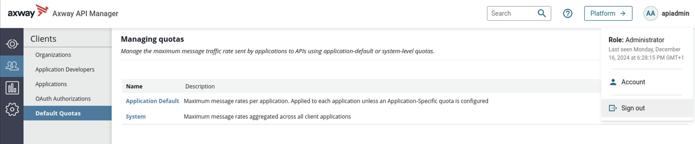

A sign-in window appears:
* Enter `renee` as **Username** 
* Enter `renee` in **Password**
* Click **Sign in**

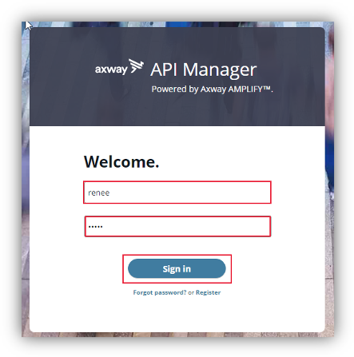

* Click on the menu **Clients**

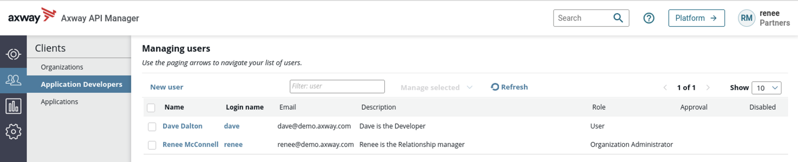

* Click **Application Developers**.  
    * You can notice that Renée is member of the organization. She will provide a registration code to new developers so that they can enroll in the **Partners** organization. They will enroll using the subscription mechanism of the API Manager.
* Click **Organizations**
* Click on the organization **Partners**

Renée manages the organization, the APIs, the users and the applications that we will use in a following lab.

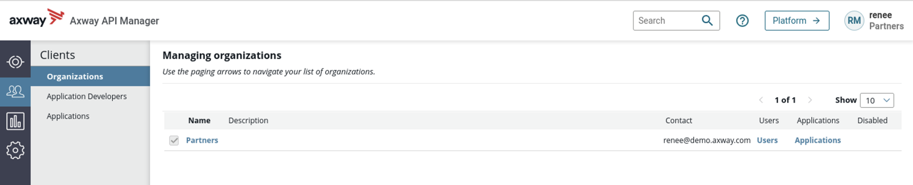

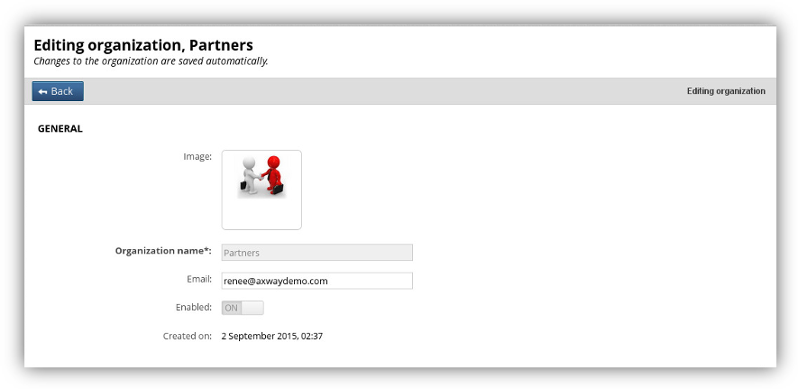

The available APIs are listed for this organization. We can see the API “OMSv1.1”.  
**Note:** You may need to scroll down to see the APIs.

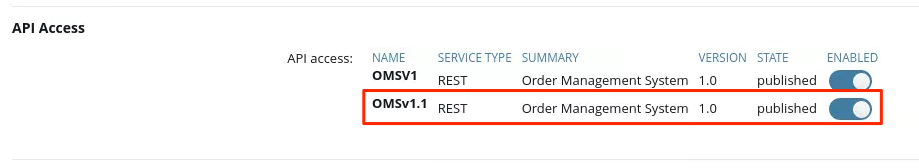

Now, we need to create the registration codes that allows application developers to enroll automatically.

* Click **Generate code** in the menu **Registration Codes** with default values selected
* In the window that opens, click **Generate**

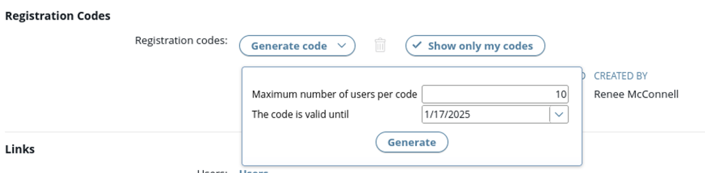

This action creates an auto registration code, as it can be seen in the example below. This code is valid for 10 user registrations over a period of one month (here by example the 29th of June 2019). Past this date, the code will no longer be valid.

**Click in the code box, select all, copy and paste your code somewhere. We will need it later.**

You can log out as Renee.

### 5.4. Application developer point of view

Renée has created a registration code.

Following an email campaign, the developers of the “Partners” organization have received an invitation to connect to the API Portal, the developer portal.

Gabriel, an application developer, uses this code to access to the API Portal. The link in his e-mail refers to: `https://api-env.demo.axway.com`.

Gabriel connects using Firefox:
* Open a new tab in Firefox (blue “+” button)
* Click on the “Portal” shortcut available in Firefox (URL: `https://api-env.demo.axway.com`)

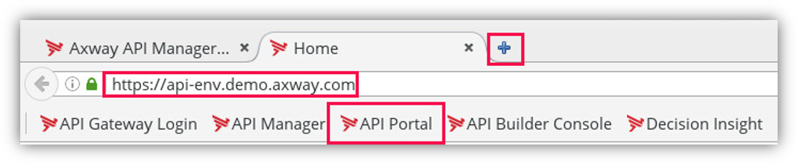

The following screen opens:

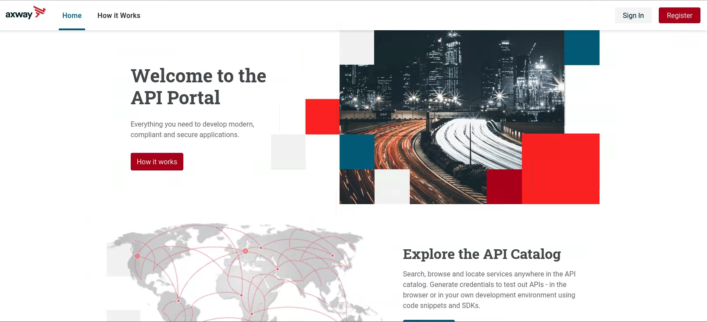

* Click **Sign In**

* Click **Sign up**

In the registration screen of the API Portal:
* Enter **Gabriel** in the field **Full name**
* Enter **gabriel@demo.axway.com** in the field **Email**
* Enter **Techlabs99*** in the field **Password** 
* Enter **Techlabs99*** in the field **Confirm Password**
* In the field **Organization Code (optional)**, use the registration code obtained previously in section 5.3.
* Accept the Terms & Conditions and Privacy Policy by checking the boxes
* Click **Sign up** to register

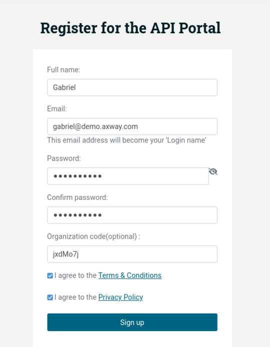
You will see a message on the top.

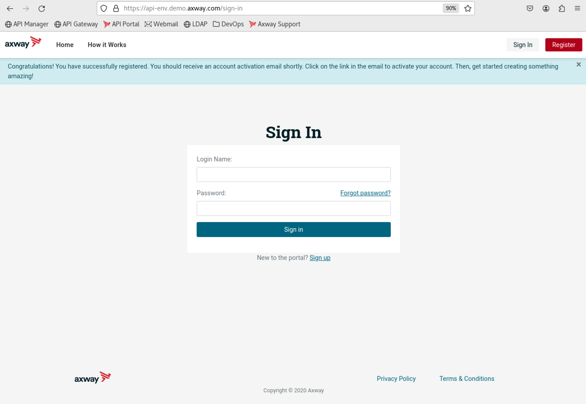

The message indicates that you will receive an activation email for the account. You will consult your email to finalize your registration in the API Portal.

You will use the Webmail interface to read the emails of Gabriel:
* Open a new tab in Firefox (blue “+” button)
* Click the shortcut **Webmail** 
* Enter **gabriel** in the field **Username**
* Enter **gabriel** in the field **Password**
* Click on the front arrow or press Enter 

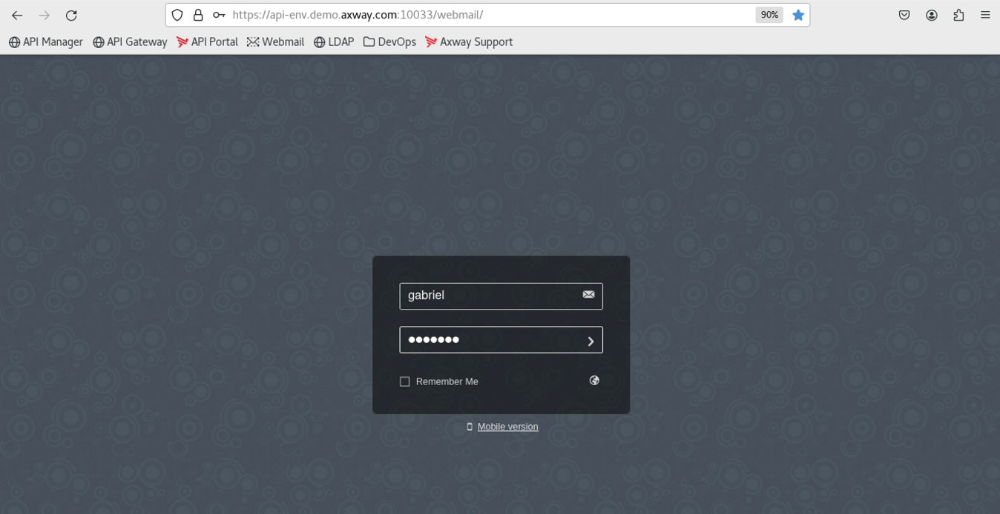

In the inbox, you see a new email:
* Click on the mail with the subject: “Registration Request”

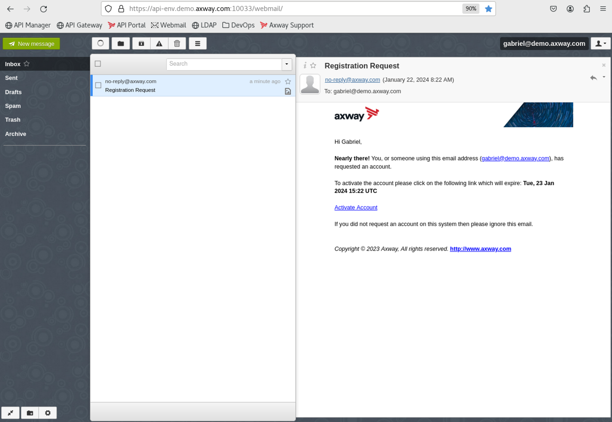

* Click the **Activate Account** link to complete the registration process.

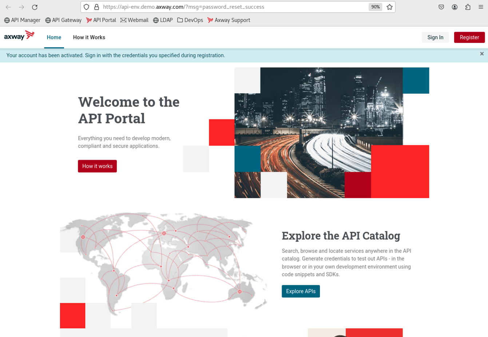

Your account is activated

Connect to the API Portal:
* Enter **gabriel@demo.axway.com** in the field **Login Name**
* Enter **Techlabs99*** in the field **Password**
* Click **Sign In**

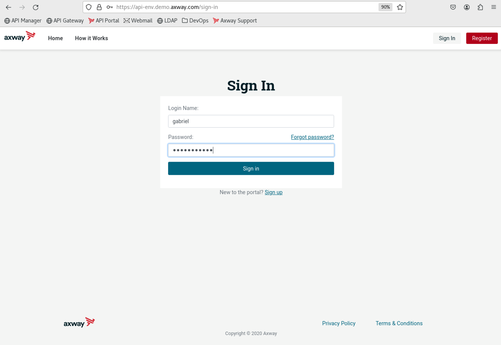

As you may have noticed, an application developer has fewer rights than an organization administrator or an administrator of the API Manager. The application developer uses the API Portal to:
* Look for APIs and check their documentation: **API Catalog**
* Get identification information for the applications: **Applications** 
* Check the consumption of APIs by his applications: **Monitoring**

First, let’s access the API catalog:
* The menu API Catalog should already be open. Click **APIs** if it is not the case.
* Click the **Documentation** link in **OMSv1.1** for more details

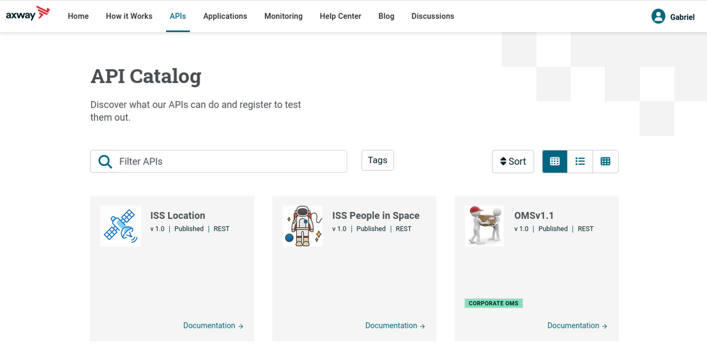

The documentation allows an application developer to discover the functionality of an API.

The service contract of an API is available in the API Portal in Swagger 2.0 format. You can find this in the **Methods** tab.

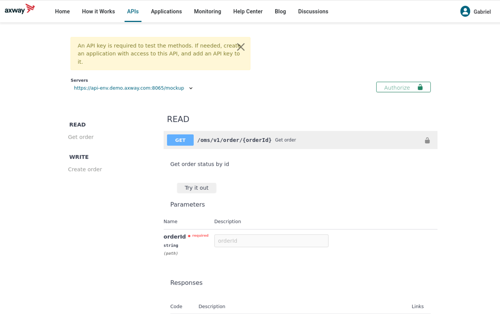

Gabriel wishes to get information on the GET method:
* Click **Get order**  

Looking at the description of the API method, an API key is required. The next step consists of creating one.

The creation of an API key is done through the creation of an “Application”. An “Application” represents a set of API usage rights for the final application (e.g. a mobile application)

* Click on the menu **Applications**

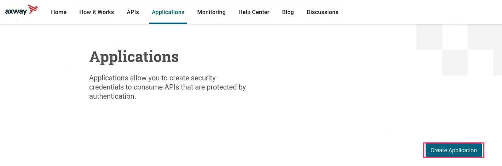

* Click **Create application**
* Enter **Gabriel’s shop** in the field **Application name** 
* Check **Enable application** to activate the application
* On the bottom, in the table **Select APIs**, check the box corresponding to **OMSv1.1**
* Click **Next**

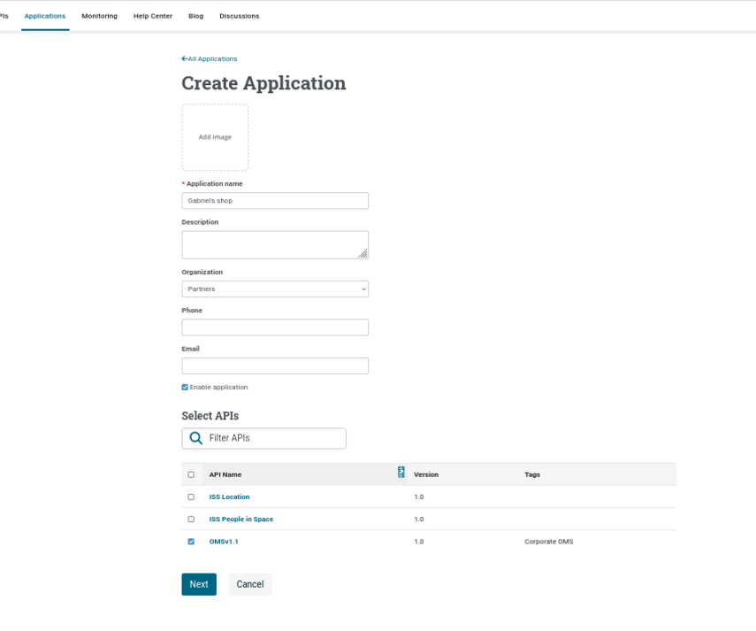

Now we will continue with the generation of authentication elements.

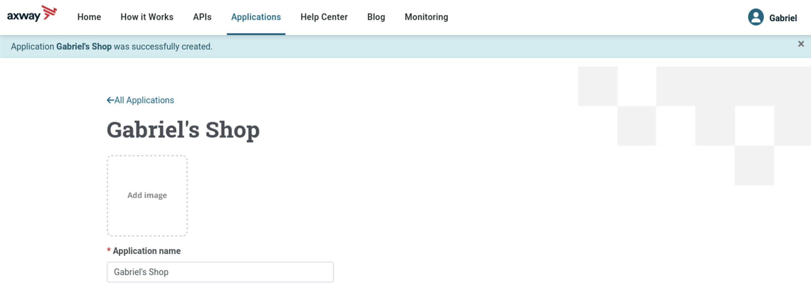

* Scroll down to the authentication section
* Under **API KEYS**, click **Generate**

An API Key is generated:

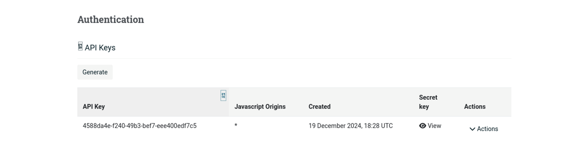

Click on **Save**

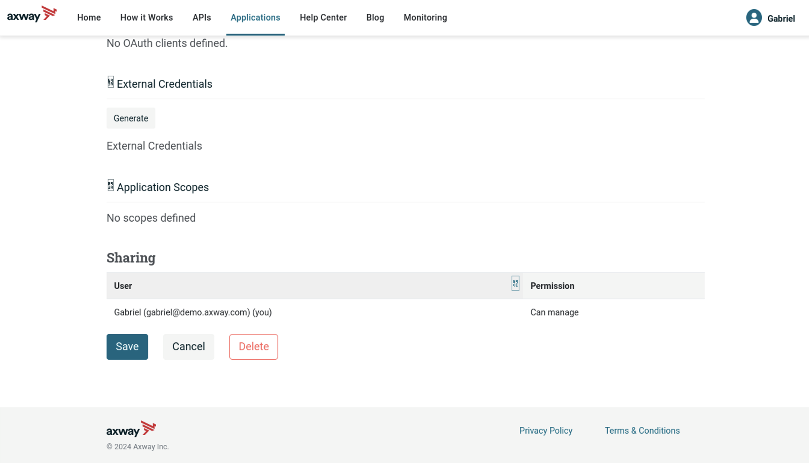

It is now time to test the API.
* Click on the menu **APIs**
* In the methods section for the **OMSv1.1** API, click the drop-down selection for **Security method** and select the **Gabriel’s shop** key.

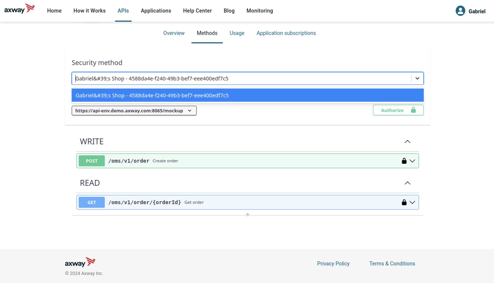

You can now test the GET method in of the OMSv1 API. 
* Click **Get order** 
* Click on **Try it out**

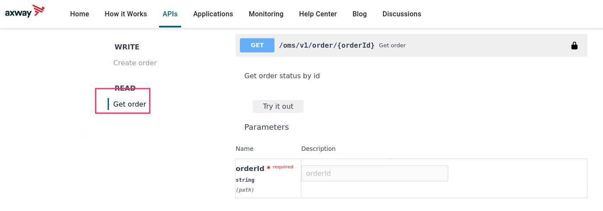

* Enter a random value (e.g.123123) in the `orderId` field
* Click **Execute**

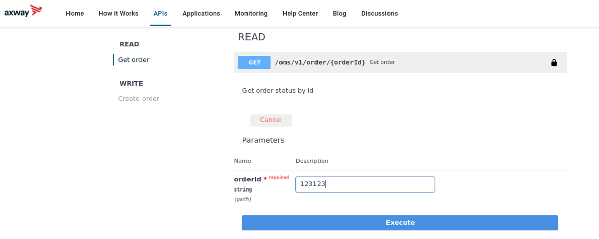

It works, you have a successful response! 

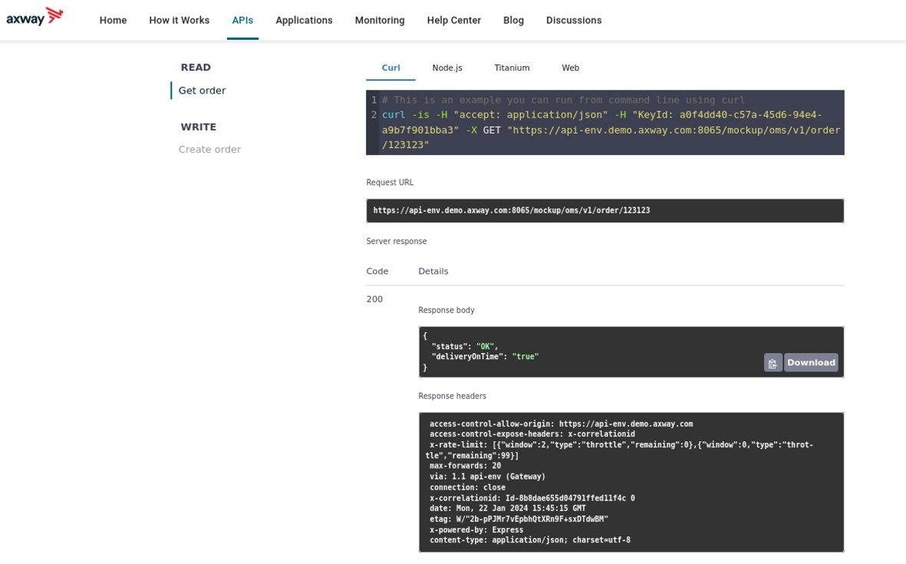

### 5.4.1. Monitoring

Gabriel can also check details on the consumption of his application with the embedded monitoring.
* Click **APIs** 
* Click **Documentation** link for **OMSv1.1**
* Click on **Usage**

Gabriel can access all his applications and select search criteria: per application, API, time. For now, he is only testing his app, but in the future, he hopes to have a lot of users for his new application.

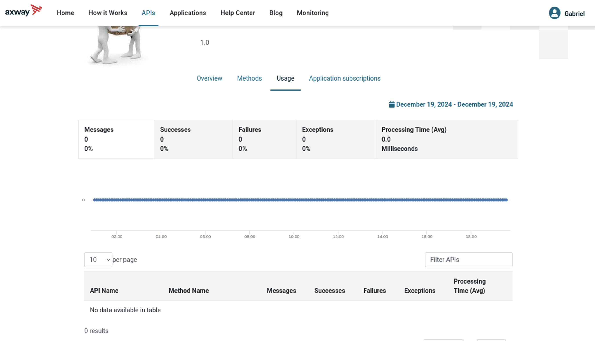

## 6. Summary

The API Manager is an easy to use interface to
* Virtualize APIs in just a few steps
* Expose APIs with authentication mechanisms and quotas
* Manage APIs consumers

The API Portal is the interface for consumers to
* Self-register and self-service for user independence
* Search with filters into API Catalog and documentation
* Test API with inline Try-it
* Monitor API usage

