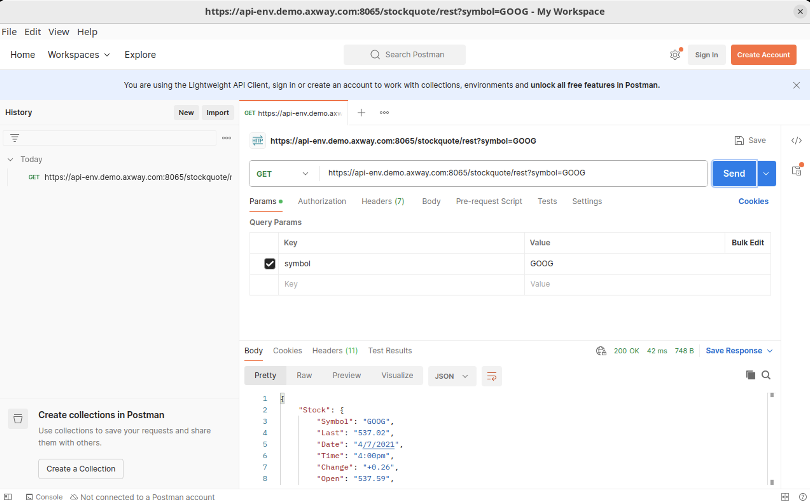
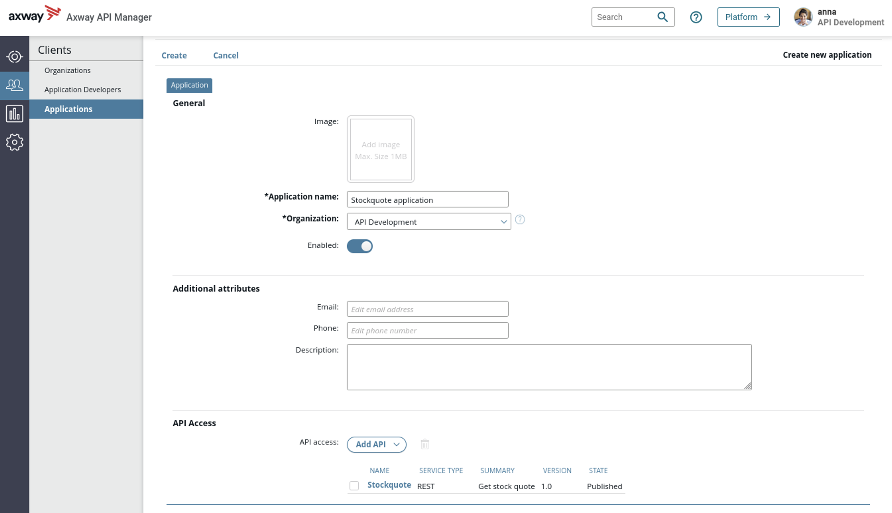
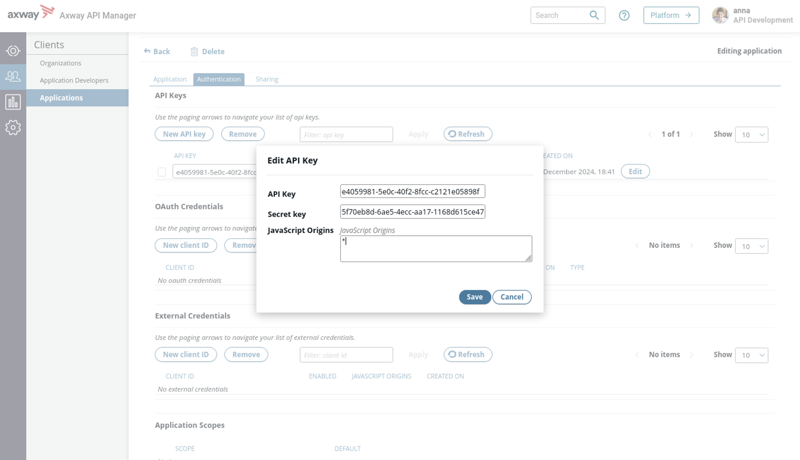
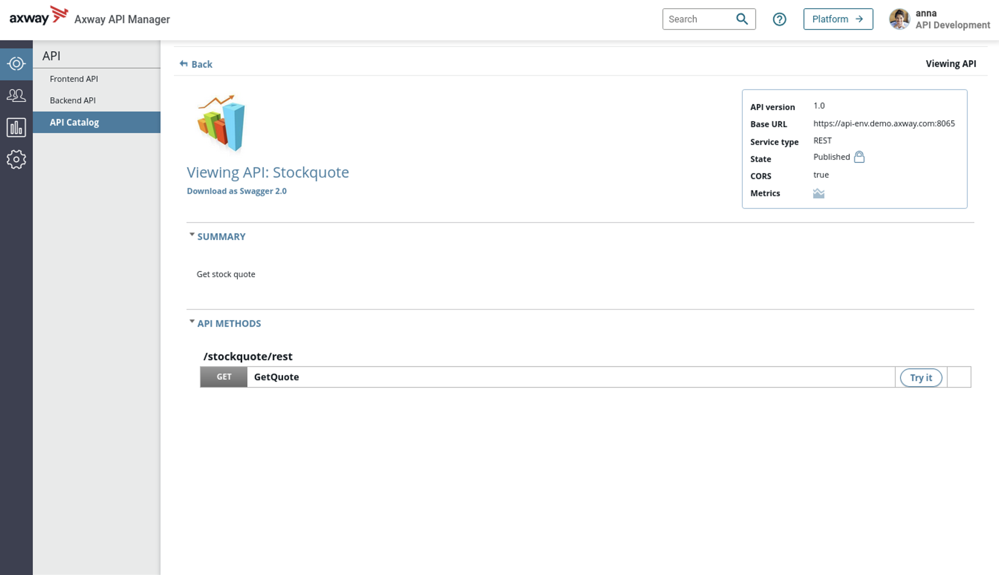
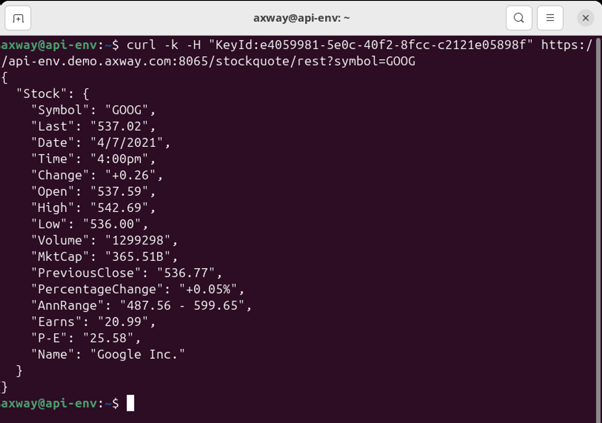

# API Testing

In this lab, you will perform some tasks that will help you to get familiar with API testing using API Manager and API Portal. You will also be introduced to some other common and basic ways to test the API.

## Test from API Management interfaces

### Try-out API method - from API Portal and API Manager

StockQuote is a trading API providing the value of a company stock

**Task**: Test the GET method of Stockquote, for the company Google, meaning with parameter `symbol = GOOG`. Get a positive response
* Note : Stockquote is running on the Backend Server, backend services must be started

#### With API Portal

* Connect with `anna/anna` to API Portal and test Stockquote API

#### With API Manager

* If API Portal is not present, you have to know how to use API Manager
* It works exactly like API Portal
* Connect with `anna/anna` to API Manager and test Stockquote API

## Test from Postman

**Task**: Test the Stockquote API with Postman.

* Open Postman 
* Invoke `https://api-env.demo.axway.com:8065/stockquote/rest?symbol=GOOG`
* Set the header `KeyId=<API key from API Manager or Portal>`

## Test from your browser

The API Gateway has an API to test the connection to an API Gateway instance called healthcheck.

**Task**: Test the healthcheck API with the following parameters
* **Method:** `GET`
* **Security:** `HTTP`
* **Host:** `api-env`
* **Port:** `8080`
* **Path:** `healthcheck`

## Test from the command line

* Syntax : `curl [options] url`
* Options :
    * **-X HTTP verb:** GET, POST PUT, DELETE
    * **-H "--header: header"** e.g. `-H “keyId: YTphB”`
    * **-u `<user:password>`**: send user and password over HTTP Basic
    * **-d data payload**. Prefix by @ to load a file. Use `--data-binary` if required
    * **-k --insecure**:  validates any HTTPS certificate
    * **-v -- verbose**: used for debugging purposes

* Type `man curl` in the terminal for more info

**Task**: Test the healthcheck API with a CURL command and the following parameters
* **Method:** GET
* **Security:** HTTP
* **Host:** api-env
* **Port:** 8080
* **Path:** healthcheck

**Task**: Test the Stockquote API with a CURL command and the following parameters
* **Method:** GET
* **Security:** HTTPS
* **Host:** api-env
* **Port:** 8065
* **Path:** /stockquote/rest
* **Parameter:** symbol=GOOG
* **KeyId:** get the apikey from an application in API Portal or API Manager

**Task**: Test the Stockpurchase API with a CURL command and the following parameters
* **Method:** POST
* **Security:** HTTP
* **Host:** api-env
* **Port:** 5080
* **Path:** /mockup/stockpurchase/rest
* **Parameter:** symbol=GOOG
* **Data to provide in the request body:**  {“buyStockSymbol” : ”1”}

## Activity troubleshooting 

* Connect to API Gateway Manager to follow transactions  
    `https://api-env.demo.axway.com:8090/` with user/password : `admin/changeme`
* Look at the dashboard and see traffic overview: which are the calls?
* Click on the messages in the graph to see transaction details
    * Click on a request and see HTTP request and response

## Solutions

## Test from API Management interfaces - API Portal

* Connect to API Portal with `anna/anna`: `https://api-env.demo.axway.com/`
* In Applications tab, create an application to define rights for API Stockquote called `Stockquote app`
* Select Stockquote API and click **Next**

* Scroll down to **Authentication**
* Under API Keys, click **Generate**
* Click **Save**

* Go to the APIs tab. 
* From the API Catalog, test the API from the **Methods** tab

* From the **Security method** dropdown, select the Stockquote app key that you generated previously.

* Click on **Try it out** under the **GET** method
* Add the query parameter **GOOG** for the symbol and execute the Get method

* See the `200 OK` result, and the response headers and body. 

If the result is not 200 OK, check that backend services have been started.

## Test from API Management interfaces - API Manager

* Connect to API Manager with `anna/anna`: `https://api-env.demo.axway.com:8075/`

* Go to **Clients > Applications** and create a new application named  **Stockquote application**

* Add API access for **Stockquote** by checking the checkbox

* Click **Create** to save the application

* Go to the **Authentication** tab
* Click on **New API Key**
* Click on **Edit**
* Add `*` for javascript origins
* Click **Save**

* Go to **API > API Catalog** and click on **Stockquote**
* Click **Try it** for API method **GetQuote**

* Select the **Application** and **KeyId** you have just created
* Add **GOOG** for the symbol
* Click **Try method**

## Test from a browser

* Type `http://api-env:8080/healthcheck` in a browser

## Test from the command line

* Type `curl http://api-env:8080/healthcheck` in the terminal

    * You should see the result:  
    `<status>ok</status>`

* Type `curl -k -H "KeyId:<API_Key>" https://api-env.demo.axway.com:8065/stockquote/rest?symbol=GOOG` in the terminal

    * You should see the result:
    

* Type `curl -k -H "Content-Type: application/json" -X POST --data '{“buyStockSymbol” : ”1”}' http://api-env.demo.axway.com:5080/mockup/stockpurchase/rest?symbol=GOOG` in the terminal

    * You should see the result:  
    `{"OrderResult": "Stockquote purchased",
  "Stock": “GOOG"}`

## Conclusion

You now know how to test the APIs using API Portal and API Manager. You can also now use CURL commands for unit testing or automation of testing.

API Gateway Manager can be used to monitor dashboards and troubleshoot issues.

