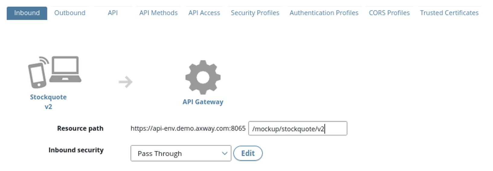
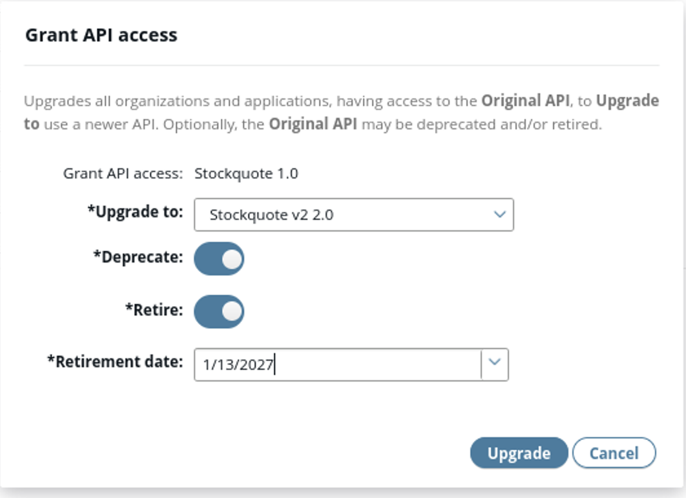

# API lifecycle management using API Manager

In this lab, 

## 1. Learning objectives

At the end of this lab, you will be able to 
* Manage the lifecycle of an API in API Manager

## Scenario introduction

A company is exposing an API, `Stockquote v1`. The API returns the quote of a given company on the market.

API consumers would like to get the quote for a given date in addition to a given company. The company has created a new version  `Stockquote v2` and wants to expose it, with a new parameter: the quote date
| Anna | Dave |
| ------ | ------ |
|  **Anna** is an internal developer, and is part of the **API Developer** Organization | **Dave** is an external application developer, and is part of the **Partner** Organization |
|  |  |

* Both Anna and Dave have access to `Stockquote v1`, and they are both interested in using `Stockquote v2`

* Let’s see how to create a new version of Stockquote API and how to provide rights to `Stockquote v2`, to internal and external users

## Creation of an API

### API Lifecycle

An unpublished API corresponds to the state Develop/Configure/Test

**Task:**
* Test `Stockquote v1` with API Manager, with users `anna/anna` and `dave/dave`
    * Validate that Anna and Dave can test `Stockquote v1`

**Task:**
* Connect to API Manager with administrator user `apiadmin/changeme`
    * Create Backend
        * Import **Stockquotev2.json** swagger file from **/home/axway/demo/data/api_library** into the **API Development** Organization
    * Create Frontend
        * Expose the API on path `/stockquote/v2` (exposing is in the inbound tab)  
	    Best practice: always add the version to the path, to manage versions correctly
    * In the API tab, add the image **Stockquote** to the API, from **Home > demo/data/images/Stockquote.jpg**
    * Do not add any security (meaning pass through)

**Task:**
* Test `Stockquote v2` with the following parameters and user/password `anna/anna` and `dave/dave`.
    * `symbol=GOOG`
    * `date=01/01/2018`
* What happens? Why?

### Live and scheduled end-of-life

A published API corresponds to a live API

**Task:**
* Connect to API Manager with administrator user
* First, add the security (API Key) to `Stockquote v2`
* Publish `Stockquote v2`
* Select `Stockquote v1` and Upgrade access to the newer API `Stockquote v2`
    * Deprecate `Stockquote v1`
    * Retire `Stockquote v1` in two years

**Task**
* Test `Stockquote v2` with user `dave/dave`
    * `symbol=GOOG`
    * `date=01/01/2018`
* Is Dave now able to test the API? Why?

## Solutions

* Connect to API Manager with `apiadmin/changeme`

* Go to **API > Backend API**
    * Select **New API > Import Swagger API**
    * Select the file from **/home/axway/demo/data/api_library/Stockquotev2.json**
    * Select **Organization** as **API Development**
    * Click **Import**

* Go to **API> Frontend API**
    * Select **New API > New API from backend API**
    * Select **Stockquote v2**, click Ok
    * In the inbound tab
        * Change `resource path` to `/stockquote/v2`
        * Select `Inbound security` as `Pass Through`
    * Click **Save**

* Go to the API tab
    * Change the API name to `Stockquote v2`
    * Click on **add image** and add the stockquote image from `Home > demo/data/images/Stockquote.jpg`
    * Click **Save**

* Go to **API> API Catalog**
    * Click on **Stockquote v2**
    * Try the method **GetQuote** with
        * `symbol=GOOG`
        * `date=01/01/2018`
    * Click **Try method**

The testing works with Anna, but not with Dave. Why?  
* Because a user can consume any API of his or her Organization, without any granted access

Anna and Stockquote APIs (v1 and v2) belong to the same **API Development** Organization, so it works

Dave belongs to the Organization **Partner**. So, he needs a grant access to use an API of another Organization. 

Let’s grant him access!

* Login into API manager with `apiadmin/changeme`
* Select `Stockquote v2`
* Click `Manage selected`
* Select `Grant access`
* Grant API access to `The following organizations`
* Click on `+` to add Partners organization to which **Dave** belongs

* Logout as **apiadmin**
* Login as **Dave** and check that he now has access to **Stockquote v2**

* Connect to API Manager with `apiadmin/changeme`
* Go to **API > Frontend API**. Open `Stockquote v2`, go to the `Inbound` tab and add `API Key` as `Inbound security`. Click **Save**
* Select `Stockquote v2` by checking the box. 
* Click on **Manage Selected** and then click **Publish**.

* Select `Stockquote API`

* Click **Manage selected**

* Select **Upgrade access to newer API**

* This opens a new window **Grant API access**. Upgrade the API to `Stockquote v2`

* Deprecate and retire `Stockquote v1` API in two years

* Click **Upgrade**

* Connect to API Manager with `dave/dave`
* Go to **APIs > API Catalog** and click on `Stockquote v2`
* Click `Try it` for API method `GetQuote`

* Select the **Stockquote application** and **KeyId** that was created for `Stockquote v1`
* Add `GOOG` for the `symbol`
* Add `01/01/2018` for the `date`
* Click **Try method**

> It works!  When upgrading access to a newer API, the solution grants the same rights for the new version than for the previous version. Dave is now allowed to test without creating a new application and credentials

## Conclusion

* API Manager allows to manage the full life cycle of APIs from creation - with multiple versions - to end of life
* The available status are 
    * Unpublished for development
    * Published, for live
    * Deprecated, to warn users of the end of life
    * Retired, to stop access to the API - with a rollback possibility

* API Manager is able to copy rights from one API version to another: a user doesn’t have to create a new application and credentials to use a new version of the same API

