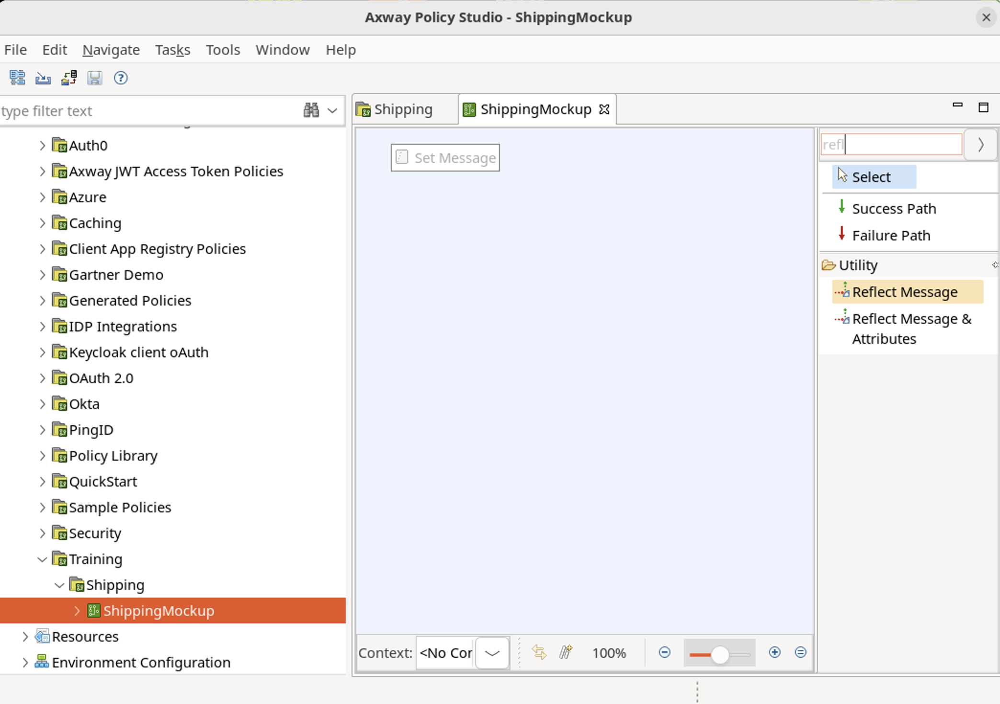
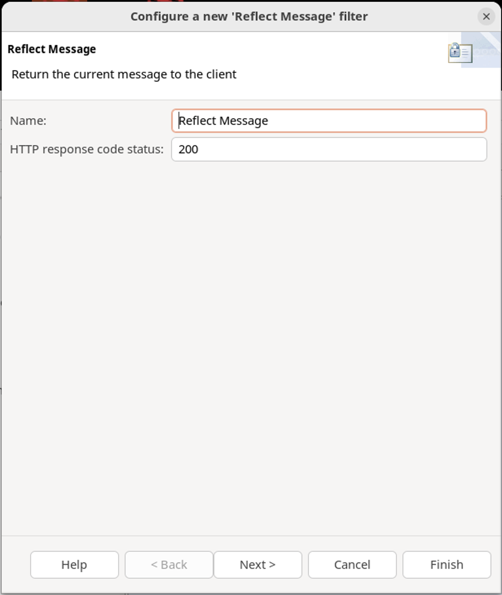
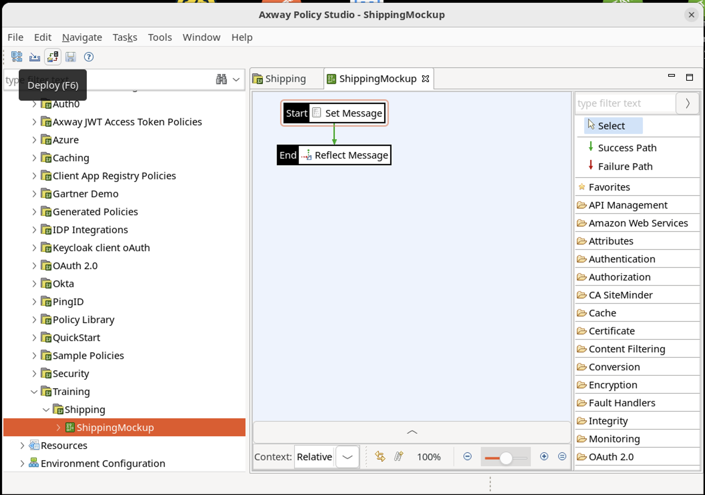
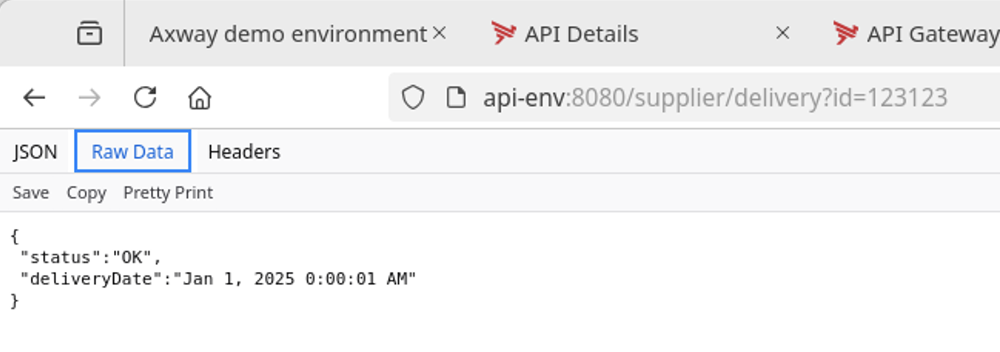

# Policy Studio Lab - My first mockup

Welcome to the Policy Studio Lab - My First Mockup! In this lab, we'll delve into the intricacies of Policy Studio, exploring various filters and learning how to craft policies from scratch. But first, let's demystify the concept of a mockup. In the world of design and development, a mockup serves as a prototype, aiding in teaching, evaluation, and demonstration. Within the API realm, a mockup simulates a server's backend behavior, invaluable during the development phase to mitigate technical and organizational impacts. Today, we'll embark on a journey to create a mockup service, tackling the challenge of improving Company orders' tracking system by harnessing the power of Policy Studio.

As we delve deeper into this lab, we'll unravel the essence of creating a mockup service using Policy Studio. Our goal is to simulate a shipping partner's response to order statuses via API, crucial for seamless development without imposing test impacts. Together, we'll navigate through the steps of building an API that encapsulates specific logic, crafting policies within Policy Studio, and ultimately fashioning a mockup service. Through hands-on exercises, you'll gain firsthand experience in setting up policy studio containers, designing policies, and deploying configurations, all essential skills for crafting robust API solutions. So, let's dive in and unlock the potential of Policy Studio to revolutionize API development!

## 1. Learning objectives

**Remembering:**
   - Recall the purpose and utility of mockups in the context of API development.
   - Recognize the significance of using mockups to simulate server behavior during the development phase.
   
**Understanding:**
   - Explain the concept of a mockup and its role in API development, including its applications in teaching, demonstration, and design evaluation.
   - Interpret the scenario presented where a mockup is used to simulate a shipping partner's response to order statuses via API.
   
**Applying:**
   - Utilize Policy Studio interface to create and configure mockup services effectively.
   - Demonstrate the ability to design and deploy mockup services using Policy Studio to simulate specific backend behaviors.
   
**Analyzing:**
   - Evaluate the advantages of using mockups in API development to avoid technical and organizational impacts.
   - Assess the implications of mockup services on the testing process and the overall efficiency of API development workflows.
   
**Creating:**
   - Design customized mockup services tailored to specific organizational requirements and development scenarios.


## Introduction
### What is a mockup?

* In manufacturing and design, a mockup is a model of a design or device, used for teaching, demonstration, design evaluation, promotion, etc.

* In API context, it is used to describe a server emulating a back-end behavior

* It is often used in development to avoid technical or organizational impacts

### Scenario

* The goal of the whole exercise suite is to improve the way Company orders are followed

* The shipping partner provides an order shipping status via API

* To avoid test impact during development phase, we will simulate the partner server response: by creating a mockup

#### What the company is trying to achieve?


#### How we are going to test partner services without impact?


## Tasks

### Instructions to develop an API

* Create an API (Policy) that implements a specific logic

* Associate a path to the policy

* Deploy the configuration

### Service definition - request/response

* The mockup is hosted in API Management solution
    * In this case, in the same API Gateway instance

* Request :
    * Request to shipping partner: 	`GET /supplier/delivery`
    * If there are additional parameters to the request, the service will not take them into account and will provide the same response  
	For example : `GET /supplier/delivery?id=${id}`, with **id** for the **order id**

* Response :
    * Response from shipping partner:
    ```json 
    {  "status" : "OK",
        "deliveryDate" : "Jan 1, 2016 0:00:01 AM"}

Before looking at solution in next section, try to think about what is required for a mockup
* Expose a service
* Accept a request
* Provide a consistent response

*Hint:* The simplest mockup policy requires only 2 filters

### Step-by-step instructions

* Create an API (Policy) that implements a specific logic
* Create a container called **Training**
* Create a sub container called **Shipping**
* Create a policy called **ShippingMockup**
* Add 2 filters to the policy (see next slide for complete path and policy implemented)
    * 1 filter to create the response body
    * 1 filter to set the HTTP response code to `200`
* Associate a path to the policy to accept requests

* Deploy the configuration

* Test the new service with a curl or a web browser

### Expected result

* A simple service with a predefined response


## Solution

### Open QuickStart project

* Open Policy Studio
    * Double click the Policy Studio icon on the desktop
* Open the **QuickStart** project
    * Under **Recent Projects**, click on the **QuickStart** project
    * Click **OK** on the **Passphrase** popup box, leaving the Passphrase blank.


### Create containers and policies

* Create container named **Training**
    * Right-click on **Policies**
    * Select **Add container** and name it **Training**

* Create sub-container named **Shipping**
    * Right-click on the new **Training** container
    * Select **Add container** and name it **Shipping**

* Create policy **ShippingMockup**
    * Right-click on new container
    * Select **Add policy** and name it **ShippingMockup**
    * Leave the category and description as is


### Create filters

* Open policy by double-clicking
* Type `set` to search for filter `Set Message`
* Click on **Set Message** and drag in center of policy
* Drop it on the policy canvas


### Set message

* Type content type `application/json`

* Copy paste the JSON message below in **Message Body**
```json 
{
 "status":"OK,
 "deliveryDate":"Jan 1, 2021 0:00:01 AM"
}
```

* Click on **Finish**


### Reflect message

* Type **refl** to search for filter **Reflect Message**
* Click on **Reflect Message** and drag and drop on top of filter **Set Message**
* Drop it on top of the **Set Message** filter to link it automatically



* Set response code to `200`

* Click on **Finish**



### Set as start

* Select **Set Message** filter and right-click

* Execute **Set as Start**


### Expose the service

* Expose service by clicking on **Add relative path**

* On new panel use the path `/supplier/delivery`

* Uncheck Global policies links

* Click **OK**


### Deploy the configuration

* Deploy either by
    * Clicking on deploy button, or
    * Using F6 shortcut



* Add default username and password: `admin/changeme`
* Click **Next**


* Click **Next** to deploy on default group (QuickStart)


* After successful deployment, click on **Finish**


### Testing

From your favorite browser, call the newly created API with a URL similar to the following:

`http://api-env:8080/supplier/delivery?id=123123`




## Conclusion

* This is a perfectly valid mockup…

* … but not a good API
    * No business logic; content is static
    * It accepts parameters but does not check it or use it
    * No concern about identity or protection
    * No documentation

* Keep mockup simple: main purpose is for testing

* Policy Studio allows to create simple services with preconfigured filters
You created a mockup service with just 2 filters!


