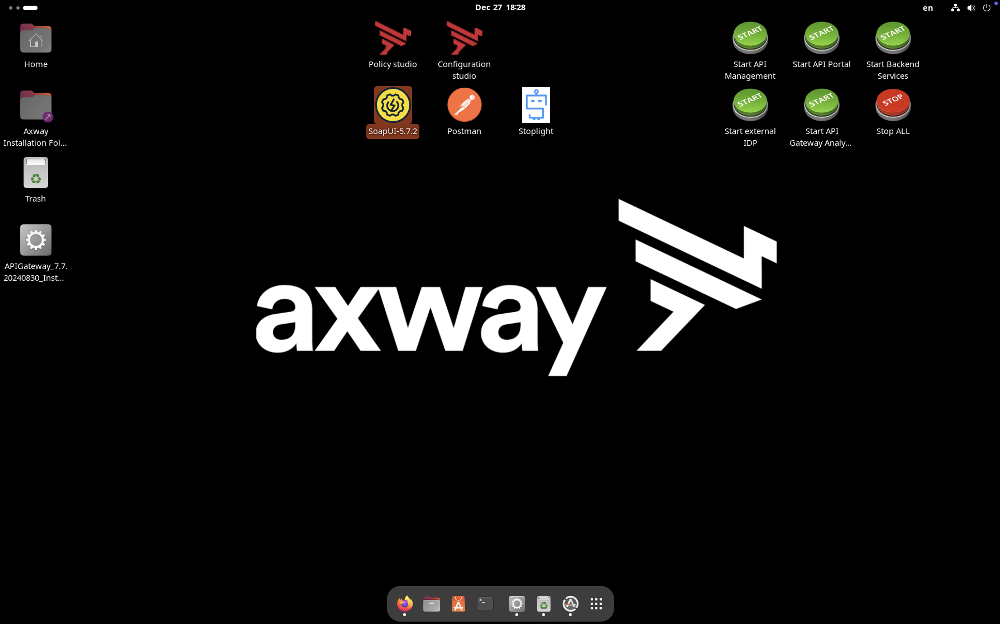
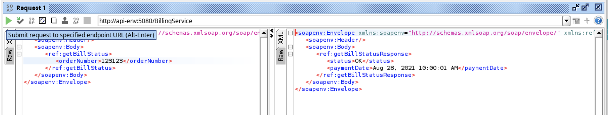
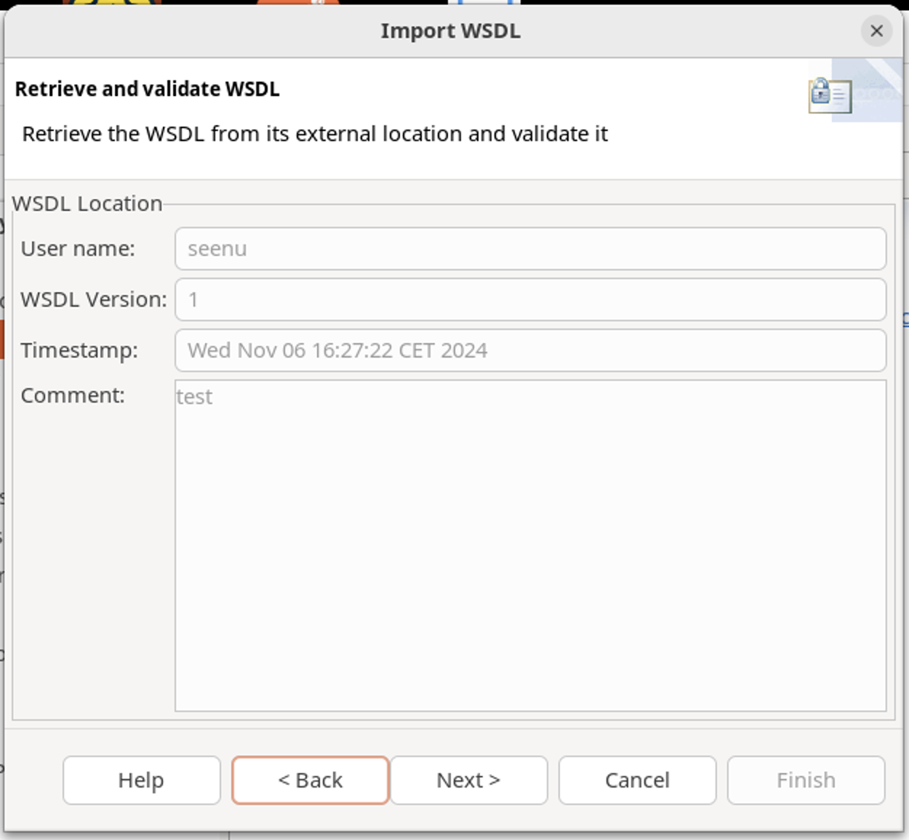

# Policy Studio Lab - Virtualization with policies

Welcome to the Policy Studio Lab on virtualization with policies! In this session, we will delve into the intricacies of virtualizing SOAP web services using Policy Studio. By the end of this lab, you will gain a comprehensive understanding of how to effectively virtualize SOAP web services and seamlessly integrate them into your development environment. 

Virtualizing SOAP web services is a crucial aspect of modern API management, allowing developers to simulate backend behaviors without impacting existing systems. Throughout this session, we will explore step-by-step instructions to virtualize a SOAP web service using Policy Studio, providing you with hands-on experience and valuable insights into the virtualization process. Let's dive in and uncover the power of Policy Studio in simplifying the virtualization of SOAP web services!

## Learning objectives

**Remembering:**
   - Recall the purpose of SOAP web services and their role in modern application development.
   - Identify the steps involved in virtualizing a SOAP web service using Policy Studio.
   
**Understanding:**
   - Explain the significance of virtualizing SOAP web services in development and testing environments.
   - Interpret the advantages of using Policy Studio for virtualization over other methods like API Manager.
   
**Applying:**
   - Utilize Policy Studio to virtualize a SOAP web service by following step-by-step instructions.
   - Demonstrate the ability to test the virtualized SOAP web service using tools like SoapUI.
   
**Analyzing:**
   - Evaluate the differences between virtualizing SOAP web services using API Manager and Policy Studio.
   - Assess the impact of virtualizing SOAP web services on development workflows and project timelines.
   
**Creating:**
   - Design a comprehensive virtualization strategy tailored to specific project requirements using Policy Studio.

## Billing Soap WS virtualization

* Billing application is providing a SOAP Web Service

* How to virtualize the SOAP WS?
    * SOAP WS can be virtualized by :
        * API Manager 
        * Policy Studio - historical method before API Manager
        * A mix of both

* In this lab, we will choose Policy Studio as it offers more flexibility in virtualization

## Task

**Task** 
* Virtualize SOAP Service with following service endpoint:  
	 http://api-env:5080/BillingService

**Steps:**
* Get WSDL from service endpoint
* Test existing service
* Virtualize existing service
* Test virtualized service

> Try by yourself before looking at the solution!

## Solution

* Open a browser and type URL:  
`http://api-env:5080/BillingService?wsdl`

* Open **SoapUI** from the Desktop

* Click on **SOAP**
* Add **Project Name** as **BillingService**
* Import WSDL from `http://api-env:5080/BillingService?wsdl`

* Expand `getBillStatus`
* Click **Request 1**

* Set in XML request order number to `123123`
* Send request by clicking on green arrow
* Response will appear on right pane

* In Policy Studio, select under **APIs >  Web Service Repository > Web Services**
* Click on **Register Web Service**

* Select **WSDL URL** and use `http://api-env:5080/BillingService?wsdl`
* Click **Next**

* Provide a name and a comment (documentation fields)

* Select **ALL** operations by checking the topmost checkbox
* Click on **Next**

* WS-Policy can be used to secure virtualized backend
* Just skip it by clicking on **Next**

* Finish by selecting a listener
    * Check **Default Services**
    * Click on **Finish**

* To conclude, a popup appears with some options
* Keep the default selections and click on **OK**

* Deploy the configuration (“F6” button)

* Go back to **SOAP UI** and click on operation name `getBillStatus` to open request settings
* Change port `5080` to `8080` for URL and WSDL
* Run it

* Get a `OK` status

* Verify on **API Gateway Manager** that a request went correctly through **API Gateway**

## Conclusion

* Policy Studio provides a wizard to easily virtualize SOAP Web Services
* API Manager is meant to be used by default
    * Use the Policy Studio method only when you need Policy capabilities
