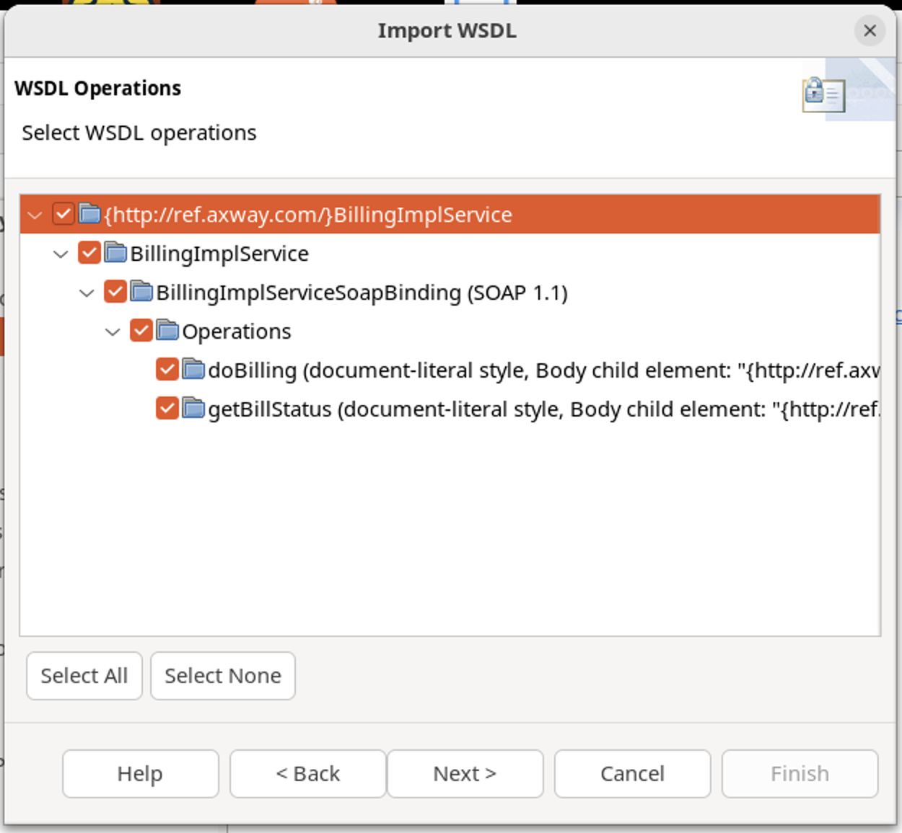

# Policy Studio Lab - Virtualization with policies

In this lab, 

## Learning objectives

At the end of this lab, you will be able to 
* Virtualize a SOAP web service using Policy Studio

## Billing Soap WS virtualization

* Billing application is providing a SOAP Web Service

* How to virtualize the SOAP WS?
    * SOAP WS can be virtualized by :
        * API Manager 
        * Policy Studio - historical method before API Manager
        * A mix of both

* In this lab, we will choose Policy Studio as it offers more flexibility in virtualization

## Task

**Task** 
* Virtualize SOAP Service with following service endpoint:  
	 http://api-env:5080/BillingService

**Steps:**
* Get WSDL from service endpoint
* Test existing service
* Virtualize existing service
* Test virtualized service

> Try by yourself before looking at the solution!

## Solution

* Open a browser and type URL:  
`http://api-env:5080/BillingService?wsdl`

* Open **SoapUI** from the Desktop

* Click on **SOAP**
* Add **Project Name** as **BillingService**
* Import WSDL from `http://api-env:5080/BillingService?wsdl`

* Expand `getBillStatus`
* Click **Request 1**

* Set in XML request order number to `123123`
* Send request by clicking on green arrow
* Response will appear on right pane

* In Policy Studio, select under **APIs >  Web Service Repository > Web Services**
* Click on **Register Web Service**

* Select **WSDL URL** and use `http://api-env:5080/BillingService?wsdl`
* Click **Next**

* Provide a name and a comment (documentation fields)

* Select **ALL** operations by checking the topmost checkbox
* Click on **Next**

* WS-Policy can be used to secure virtualized backend
* Just skip it by clicking on **Next**

* Finish by selecting a listener
    * Check **Default Services**
    * Click on **Finish**

* To conclude, a popup appears with some options
* Keep the default selections and click on **OK**

* Deploy the configuration (“F6” button)

* Go back to **SOAP UI** and click on operation name `getBillStatus` to open request settings
* Change port `5080` to `8080` for URL and WSDL
* Run it

* Get a `OK` status

* Verify on **API Gateway Manager** that a request went correctly through **API Gateway**

## Conclusion

* Policy Studio provides a wizard to easily virtualize SOAP Web Services
* API Manager is meant to be used by default
    * Use the Policy Studio method only when you need Policy capabilities
