# Policy Studio Lab - Mediation

| Average time required to complete this lab | 45 minutes |
| ---- | ---- |
| Lab last updated | December 2024 |
| Lab last tested | December 2024 |

In this lab, we'll delve into the world of API mediation using Policy Studio. The focus of this session is on restifying a SOAP Web Service, a crucial skill in modern API management. 

As organizations increasingly move towards RESTful architectures for enhanced integration and scalability, the ability to transform existing SOAP services into RESTful ones becomes invaluable. In this lab, we'll learn how to virtualize a SOAP service and provide a REST interface using Policy Studio, empowering you to adapt legacy systems to meet modern integration requirements. Let's dive in and explore the exciting world of API mediation together!

## Index

- [1. Learning Objectives](#1-learning-objectives)
- [2. Introduction](#2-introduction)
- [3. Task](#3-task)
- [4. Solution](#4-solution)
- [5. Conclusion](#5-conclusion)

## 1. Learning objectives

**Remembering:**
   - Recall the steps involved in restifying a SOAP Web Service using Policy Studio.

**Understanding:**
   - Explain the concept of API mediation and its role in modern API management.
   - Describe the significance of restifying SOAP services in facilitating integration and scalability within organizations.

**Applying:**
   - Demonstrate the ability to configure Policy Studio filters to transform SOAP requests into RESTful API calls.

**Analyzing:**
   - Evaluate the advantages and challenges of restifying SOAP services compared to maintaining them in their original form.
   - Assess the impact of API mediation on the overall architecture and performance of an API ecosystem.

**Creating:**
   - Design a customized mediation strategy tailored to specific organizational requirements for restifying SOAP services.


## 2. Introduction

MyCompany decided that having all services in REST would simplify integration in the future

Asking Billing SOAP service to be changed is nearly impossible.
But presenting REST interface of this SOAP service would be pretty simple

Let’s restify **Billing** service

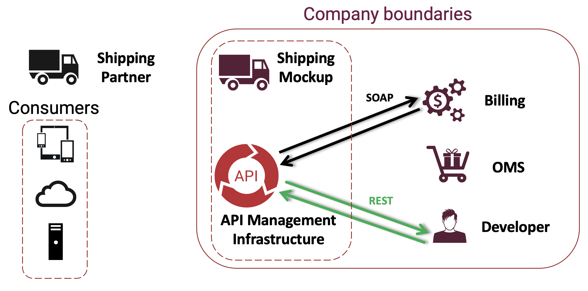


## 3. Task

Virtualize Billing SOAP service and provide a REST interface

* Request: `GET /bill/status?order=${id}`

* Response:  
If id < 1000, then
```json
{
	"status": "OK",
	"paymentDate": "Aug 28, 2021 10:00:01 AM"
}
```


Try yourself before looking at the solution!

*Note:* 

* Create a container named **Training/Billing**
* **Connect to URL** filter is required

## Expected result

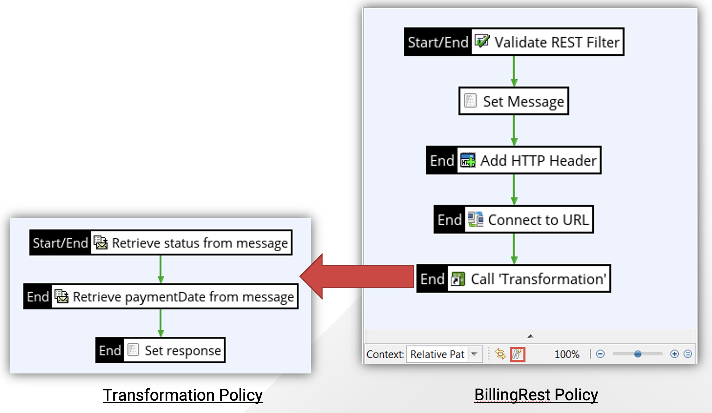


## 4. Solution 

### 4.1. Create a policy

* Create a new container called **Billing** under the **Training** container.
* Create a policy **BillingRest** in container **Training/Billing**

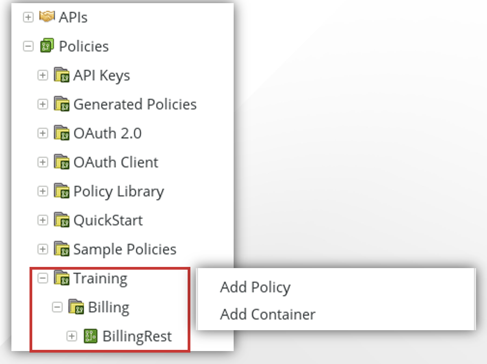

### 4.2. Get parameters

* Validate/retrieve parameters with a **Validate REST filter**
* Follow the screenshot to add **URI Template** and the **Request Parameter**
* Click the check box  to extract parameters
* Click **Finish**
* Right click and click **Set as Start**

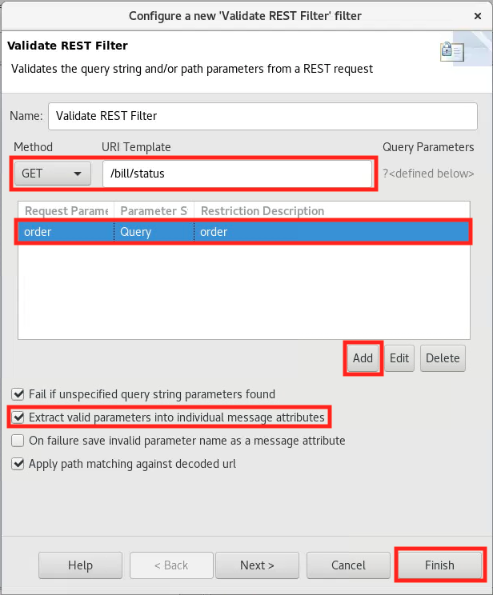

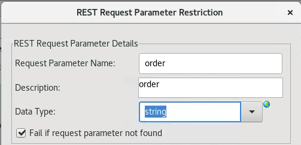

### 4.3. Set SOAP message

* On previous filter, drag and drop **Set Message** filter
* Set content type to `application/xml` 
* Copy the request message example from **SoapUI** for the **getBillStatus** method
   * You can use the **Populate** dropdown, locate the **getBillStatus** method and import the message body
* Change **orderNumber** value to `${params.query.order}`
* Click **Finish**

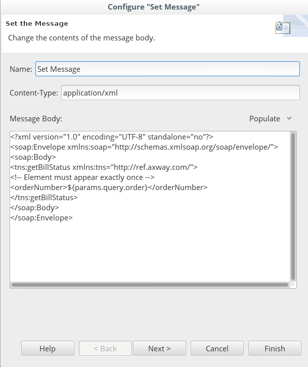

### 4.4. Add HTTP header

* On previous filter, drag and drop  **Add HTTP Header** filter 
* Set HTTP Header Name to **SOAPAction**
* Set HTTP Header Value to `“getBillStatus”`. Make sure to include the double quotes
* Click **Finish**

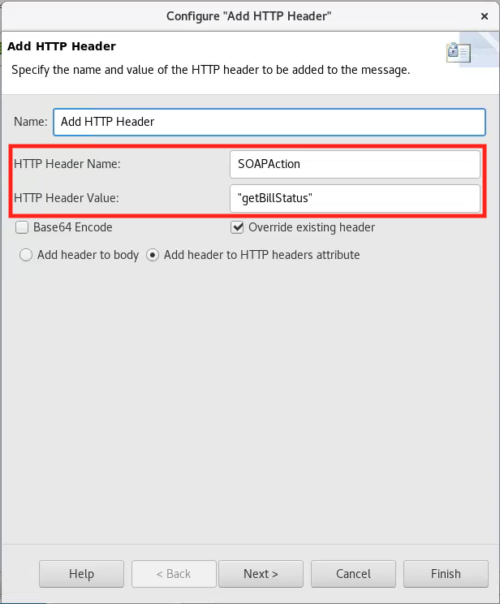

### 4.5. Connect to URL

* On previous filter, drag and drop **Connect to URL** filter
* Set URL to `http://api-env:5080/BillingService`
* Set **Method** to **POST**
* Click **Finish**

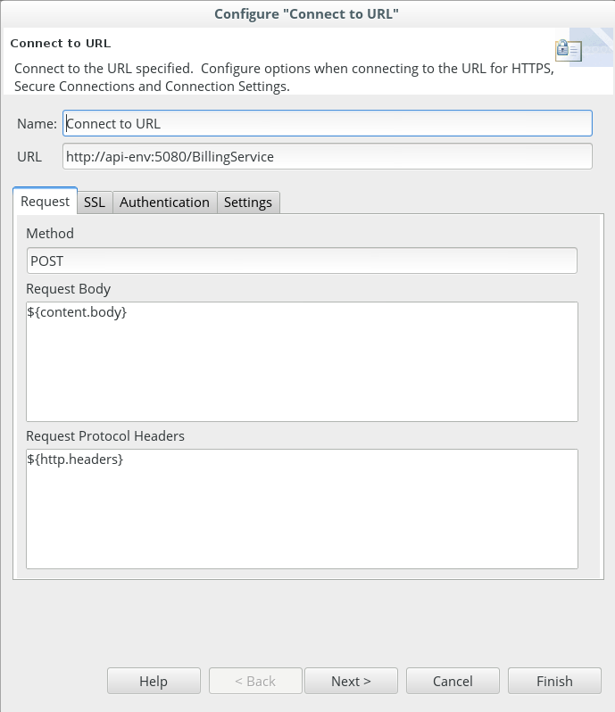

### 4.6. Transformation policy

* Create a policy called “Transformation” in container Training/Billing  
*A policy dedicated for transformation will provide more flexibility*

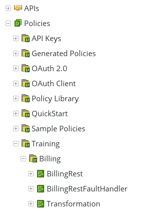

* Drag and drop **Transformation** policy on the last filter

* Open **Transformation** policy and then drag and drop **Retrieve from message** filter
* Rename to **Retrieve status from message**
* Type **status** for attribute name for content storage


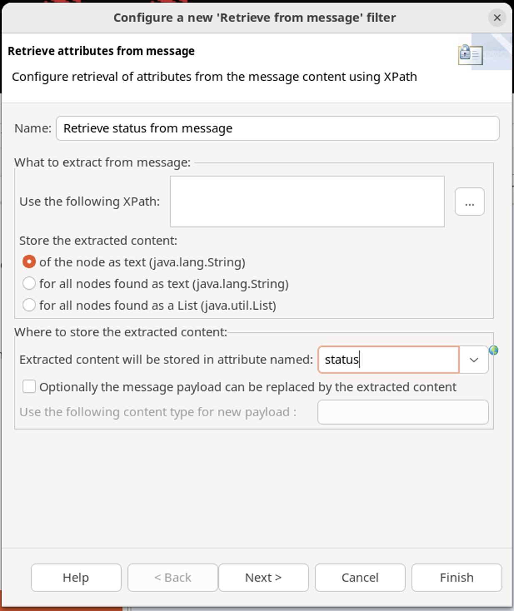

* Create an Xpath:
    * Click on “…” 

### 4.7. Save response message from **SoapUI**
* In **SoapUI**, right click on the response message from the `getBillStatus` method.
* Select the **Save As** option
* Save **response.xml** to your VM desktop

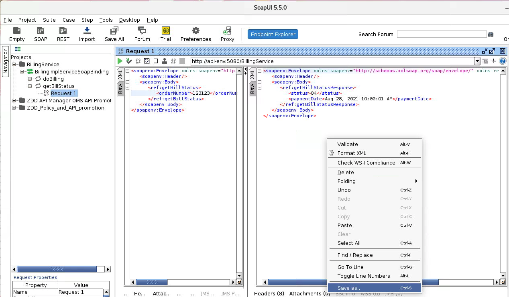

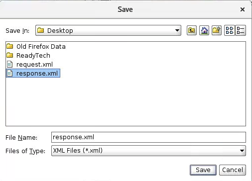

### 4.8. Retrieve **status** from message
* Right click on **Attribute Locations**
* Click **Add** to open Xpath Expression
* Add the name **status**
* Click on wizard icon (right of Xpath expression)
* Select the response file that you have previously saved on the desktop
* Select `status` node
* Click on   
	**Use this path**
* Click on **OK**
* Select **status** in **Attribute Locations** and click on **OK**
* Finish filter
* Right click and **Set as Start**


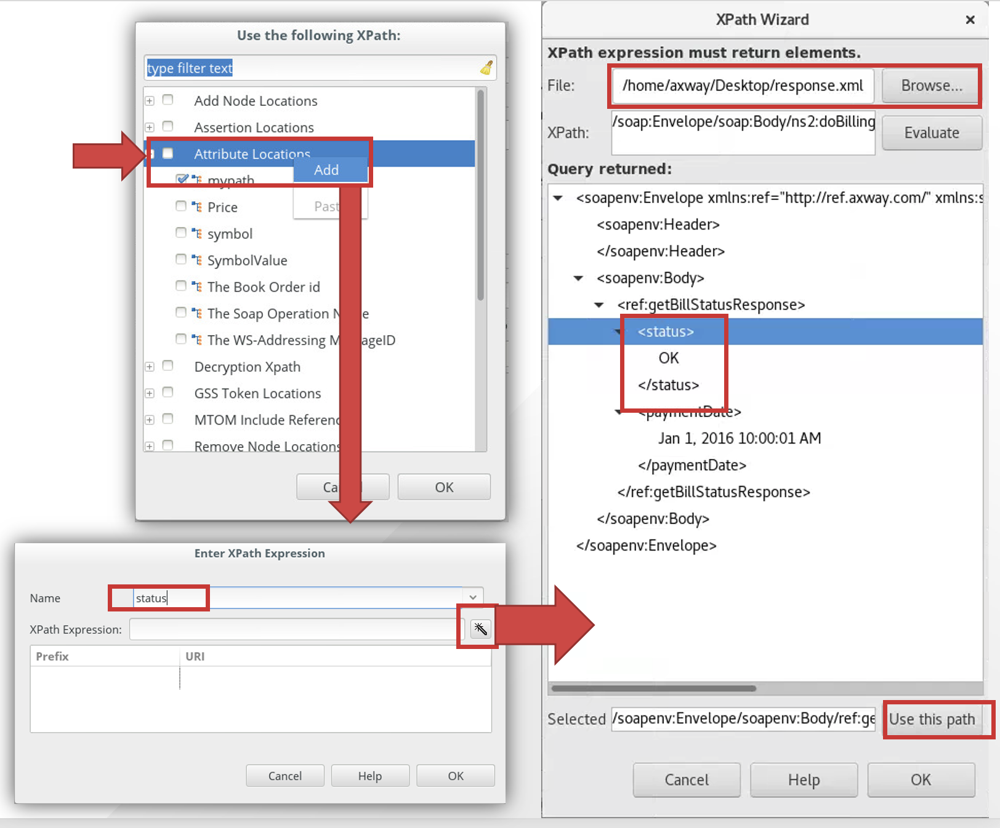

### 4.9. Retrieve **paymentDate** from message

* On previous filter, drag and drop another **Retrieve from message** filter
* Rename as **Retrieve payment date from message**
* Extract `paymentDate` node value and store it in a content attribute named `paymentDate`
    * Same steps as the ones you followed to extract `status`


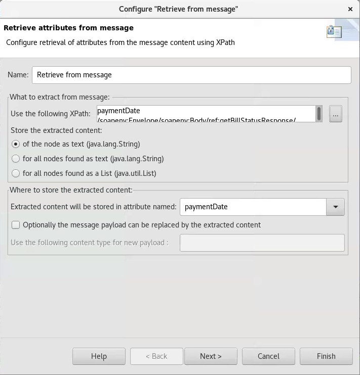

### 4.10. Set response message

* On previous filter, drag and drop **Set Message** filter
* Rename it **Set response**
* Set **Content-Type** to `application/json`
* Use the following message body:  
```json
{
	"status": "${status}",
	"paymentDate": "${paymentDate}"
}
```

### 4.11. Check the policies

* Verify that your policies look like this
* Set first filters as start
* Expose **BillingRest** to `/bill/status`


### 4.12. Deploy the configuration

* Deploy configuration by clicking the icon at the top of **Policy Studio** or press **F6**

### 4.13. Test

* Open your browser

* Test with the following URL:  
`http://api-env:8080/bill/status?order=123123`


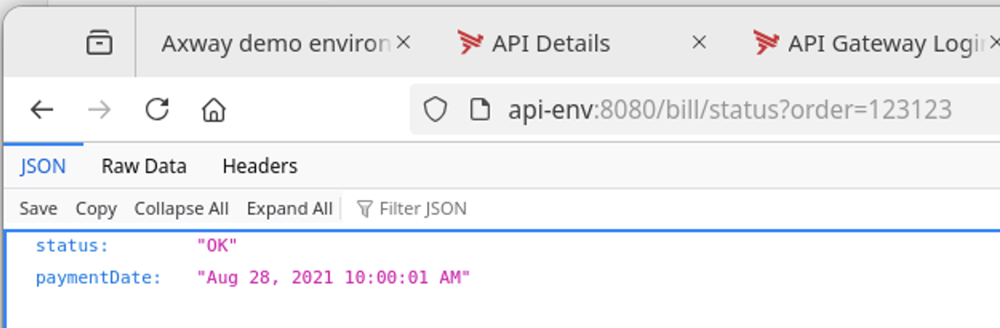

* Look at API Gateway Manager
    * Policy Path
    * XML and JSON payloads


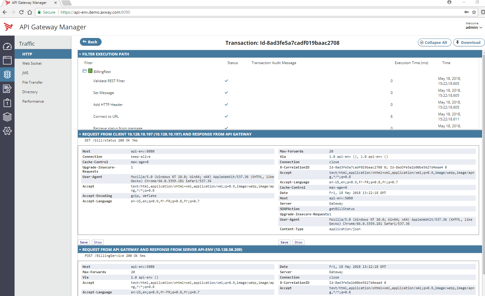

## 5. Conclusion

* Restification is first about defining the API
    * Done as the target definition
* Policy Studio provides flexible ways to restify SOAP web services
    * Here using path manipulation
    * And all mediation topics in general


