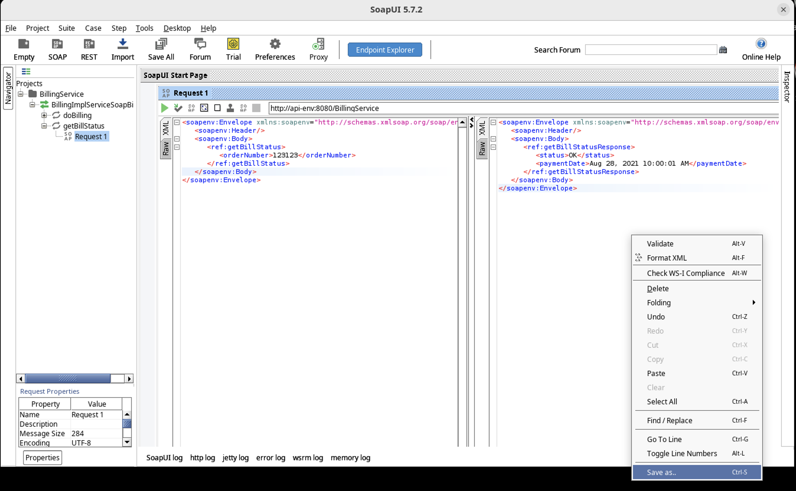
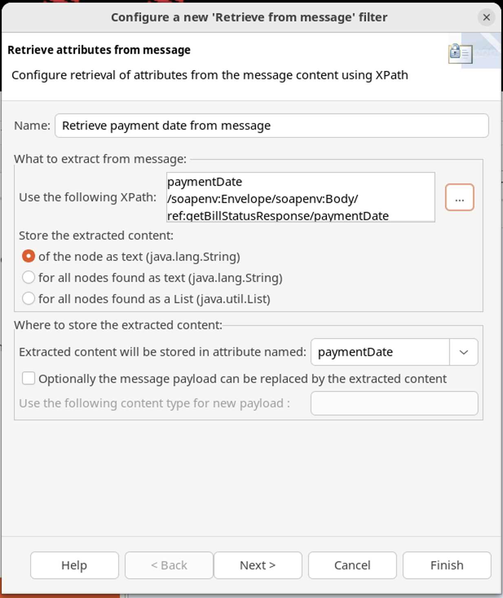
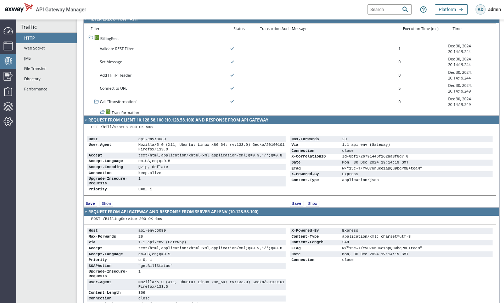

# Policy Studio Lab - Mediation

In this lab, 

## Learning objectives

At the end of this lab, you will be able to 
* Restify a SOAP Web Service with Policy Studio

## Introduction

MyCompany decided that having all services in REST would simplify integration in the future

Asking Billing SOAP service to be changed is nearly impossible.
But presenting REST interface of this SOAP service would be pretty simple

Let’s restify **Billing** service


## Task

Virtualize Billing SOAP service and provide a REST interface

* Request: `GET /bill/status?order=${id}`

* Response:  
If id < 1000, then  
```json
{
“status”: “OK”, 
“paymentDate”: “Jan 1, 2016 10:00:01 AM”
}
```

Try yourself before looking at the solution!

*Note:* 

* Create a container named **Training/Billing**
* **Connect to URL** filter is required

## Expected result


## Solution 

### Create a policy

* Create a new container called **Billing** under the **Training** container.
* Create a policy **BillingRest** in container **Training/Billing**


### Get parameters

* Validate/retrieve parameters with a **Validate REST filter**
* Follow the screenshot to add **URI Template** and the **Request Parameter**
* Click the check box  to extract parameters
* Click **Finish**
* Right click and click **Set as Start**


### Set SOAP message

* On previous filter, drag and drop **Set Message** filter
* Set content type to `application/xml` 
* Copy the request message example from **SoapUI** for the **getBillStatus** method
* Change **orderNumber** value to `${params.query.order}`
* Click **Finish**


### Add HTTP header

* On previous filter, drag and drop  **Add HTTP Header** filter 
* Set HTTP Header Name to **SOAPAction**
* Set HTTP Header Value to `“getBillStatus”`. Make sure to include the double quotes
* Click **Finish**


### Connect to URL

* On previous filter, drag and drop **Connect to URL** filter
* Set URL to `http://api-env:5080/BillingService`
* Set **Method** to **POST**
* Click **Finish**


### Transformation policy

* Create a policy called “Transformation” in container Training/Billing  
*A policy dedicated for transformation will provide more flexibility*


* Drag and drop **Transformation** policy on the last filter

* Open **Transformation** policy and then drag and drop **Retrieve from message** filter
* Rename to **Retrieve status from message**
* Type **status** for attribute name for content storage


* Create an Xpath:
    * Click on “…” 

### Save response message from **SoapUI**
* In **SoapUI**, right click on the response message from the `getBillStatus` method.
* Select the **Save As** option
* Save **response.xml** to your VM desktop




### Retrieve **status** from message
* Right click on **Attribute Locations**
* Click **Add** to open Xpath Expression
* Add the name **status**
* Click on wizard icon (right of Xpath expression)
* Select the response file that you have previously saved on the desktop
* Select `status` node
* Click on   
	**Use this path**
* Click on **OK**
* Select **status** in **Attribute Locations** and click on **OK**
* Finish filter
* Right click and **Set as Start**


### Retrieve **paymentDate** from message

* On previous filter, drag and drop another **Retrieve from message** filter
* Extract `paymentDate` node value
    * Same steps as the ones you followed to extract `status`



### Set response message

* On previous filter, drag and drop **Set Message** filter
* Rename it **Set response**
* Set **Content-Type** to `application/json`
* Use the following message body:  
```json
{
	"status": "${status}“,
	”paymentDate": "${paymentDate}"
}
```

### Check the policies

* Verify that your policies look like this
* Set first filters as start
* Expose **BillingRest** to `/bill/status`


### Deploy the configuration

* Deploy configuration by clicking the icon at the top of **Policy Studio** or press **F6**

### Test

* Open your browser

* Test with the following URL:  
`http://api-env:8080/bill/status?order=123123`


* Look at API Gateway Manager
    * Policy Path
    * XML and JSON payloads



## Conclusion

* Restification is first about defining the API
    * Done as the target definition
* Policy Studio provides flexible ways to restify SOAP web services
    * Here using path manipulation
    * And all mediation topics in general


> Lab last updated: March, 2024  
Lab last tested: March, 2024

