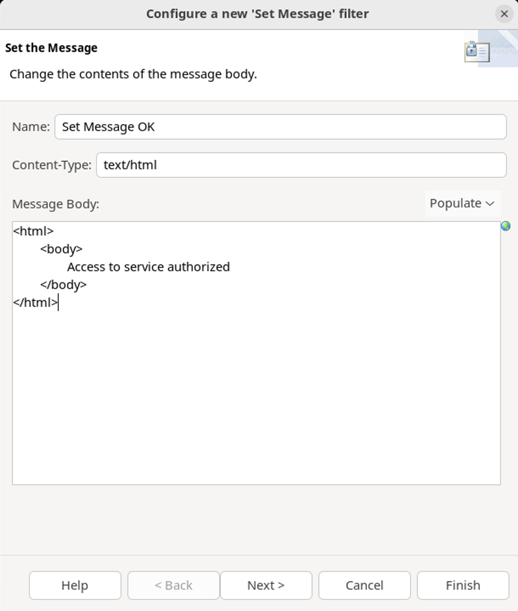
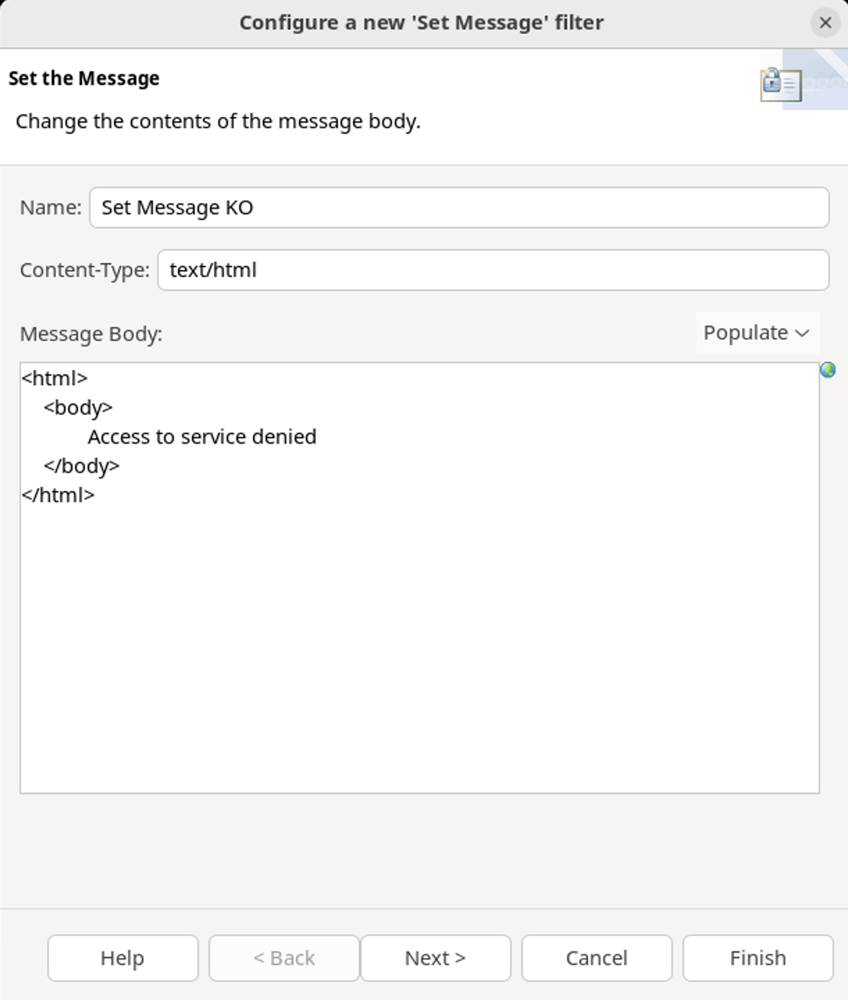

# Policy Studio Lab - Quota System

In this lab, 

## Learning objectives

At the end of this lab, you will be able to 


## Introduction

### Scenario

Web Services and service-oriented architectures (SOA) form an integral part of business information systems. This is the case for the Roboulot Group, a group of businesses equipped to tackle the increasingly important question of globalization.

At the Information Systems Division of the group, Peter Smith is an architect, designer, developer, debugger, and security manager. He is also a "modder" but that's another story.

To put applications in place more quickly, Peter Smith must allow existing Web Services to be used for a greater number of purposes and by a greater number of applications, and of course users, of the Roboulot Group.
The problem Peter encounters is to some extent the price of success: the web services are working so well that the number of users is constantly increasing.

Peter must now find a solution to avoid deterioration of the quality of service and the overloading of his servers.

The solution is simple: he will adapt the flow rate to the absorption capacity of the available servers. He can limit the overall number of requests per unit of time, but this will have a negative effect on the quality of service for all his users. This is perhaps an excessively dramatic solution; some users will not appreciate it. Peter Smith wishes to fine-tune the solution. He should be able to adapt the flow rate to the types of use, the applications, and the organization of the Group (and he must serve the head office first if he wants to retain his budgets).

And as always, it must be possible to develop the solution quickly and easily to be implemented in order to adapt to the available resources.

The challenges for Peter lie in the following points:
* "How to implement this efficiently without jeopardizing the existing architecture?" 
* "Given that we know how to implement quotas, is it possible to distinguish them by user profile? With what level of detail?"

Do you know how to use the API Gateway available to you to help Peter with his management, guaranteeing optimum operation, while at the same time preserving his budget.

### Tasks

We propose the "Quota System" policy. This production involves three stages, thus offering three variants on the policy.

#### Task 1: Implementation of quotas
This is the quota management policy in its basic state. We will produce the policy which restricts access to any service to one request every 5 seconds.

#### Task 2: Quota policy based on authentication
In this second version of the policy, we will add authentication. If the user is recognized by the platform, they can access the service as many times as they wish. However, if the user is not recognized, the quota policy is applied, based on the restrictions described below.

#### Task 3: Quota policy based on membership of a group
A user may belong to different groups. These groups may have limited access rights to certain services. 
To simulate this partitioning, we will develop the policy to take into account three levels of authorization to access the services:
* Gold level: Unlimited access;
* Silver level: Access Limited to 5 requests every 5 seconds;
* Bronze level: 1 request every 5 seconds that is the default policy for an unauthenticated user.


## Solution

### Virtual machine environment

* If you are disconnected, click on the username `Axway`


* Enter `axway` in the field **Password**.
* Click on the button **Unlock**


* If API Management is not started (you can check with the command `statusAll` anywhere from a terminal)
    * Double click the following desktop shortcut **Start API Management** 


* Policy Studio is the tool to configure the API Gateway.
    * Open the policy design interface by double-clicking the **Policy Studio** icon on the desktop


QuickStart is a way to quickly explore the API Management solution. It is based on a standard configuration with good documentation for beginners.

Let’s open the **QuickStart** project and add modifications to the configuration.

In **Policy Studio**, you will open and modify the **QuickStart** project.

* Click **QuickStart**


In the menu that will pop up, click **OK**, to specify no passphrase.


The **Policy Studio** shows the following screen


### Task 1: Quota system

By the end of this section, you will have implemented restrictions on usage per unit of time: the quotas. The policy that you are going to create will limit the number of requests to the API Gateway to a single request every 5 seconds.

This is the policy that you are going to implement:


If you respect the quota, you will see the message `Access to service authorized`.   
You will receive an error message, `Access to service denied`, if you are exceeding your quota.

In the tree view on the left of the screen
* Expand **Policies**
* Right-click on the **TechLabs** container (*if it doesn’t exists Add Container “TechLabs” before adding the policy*)
* Select **Add Policy**


In the window that appears,
* For the **Name** field, enter `Quota System`
* Click **OK**.


To implement quota checks, you will use a filter which reacts based on a limit of use per unit of time: **Throttling**.

In the search zone, located at the right top, start entering **thro**

The **Throttling** filter appears in the **Content Filtering** section

* Drag and drop this filter on the main canvas


The default configuration for this filter authorizes processing one message every second.

We will configure the filter to accept the processing of one message every 5 seconds.
* Choose **Floating Time Window** as the **Rate Limit Algorithm**
* Replace the value `1` in the **every** zone with the value `5`


* Click **Finish**.

* To specify that this stage is the first in the sequence, right-click on the **Throttling** filter and select **Set as Start**


You have the following:


Now that the "Throttling" filter is in place, we will set the result of the request based on the current quota. 

To do this, we will use the **Set Message** and **Reflect Message** filters.
* The **Set Message** filter is used to initialize the format and the content of a message.
* The **Reflect Message** filter is used to return the message of the request. 

We will now set the content of the message in the eventuality that the quota is not reached
* Start entering **Set Message** in the search bar at the top-right hand corner.
* Select the **Set Message** filter 
* Drag and drop this filter on the **Throttling** filter.


In the **Configure a new 'Set Message' filter** window,
* For the **Name** field, enter `Set Message OK`
* For the **Content-Type** field, enter `text/html`
* For the **Message Body** field, enter 
```
<html>
	<body>
		Access to service authorized
	</body>
</html>
```
* Click on the **Finish** button




* Start entering **Reflect Message** in the search bar in the top-right.
    * Select the **Reflect Message** filter 
* Drag and drop this filter on the **Set Message OK** filter.


In the **Configure a new 'Reflect Message' filter** window, 
* For the **Name** field, add `Reflect Message 200`
* For the **HTTP response code status** field, enter `200`
* Click on the **Finish** button


We will now put in place the processing of an error message informing that the quota has been reached.
* Start entering **Set Message** in the search zone in the top-right.
* Select the **Set Message** filter 
* Drag and drop this filter on top of the **Throttling** filter.

As the **Throttling** filter already has a success path (green arrow), adding another filter will create a failure path (a red arrow).


In the **Configure a new 'Set Message' filter** window,
* For the **Name** field, enter `Set Message KO`
* For the **Content-Type** field, enter `text/html`
* For the **Message Body** field, enter 
    ```
    <html>
	    <body>
		    Access to service denied
	    </body>
    </html>
    ```
* Click on the **Finish** button




* Start entering **Reflect Message** in the search zone in the top-right.
* Select the **Reflect Message** filter
* Drag and drop this filter on top of the **Set Message KO** filter.


* In the **Configure a new 'Reflect Message' filter** window, 
* In the **Name** field, enter `Reflect Message 500`
* In the **HTTP response code status** field, enter `500` 
* Click on the **Finish** button


The **Set Response Status** filter is used to explicitly add a message in the Monitoring displays. 

If this policy proceeds correctly, it will by default be considered positive (whether or not the quota is reached).

However, if the quota is reached, the result of the policy must be an error situation in order to be highlighted in the Monitoring displays (logical and non-technical error). 


