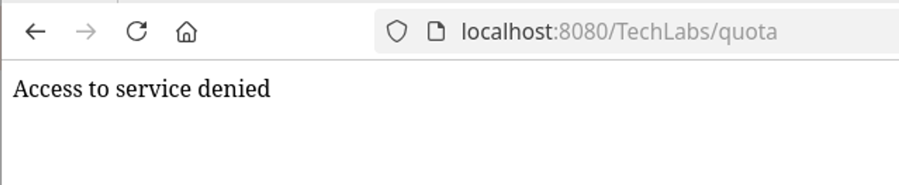

# Policy Studio Lab - Quota System

| Average time required to complete this lab | 60 minutes |
| ---- | ---- |
| Lab last updated | March 2024 |
| Lab last tested | March 2024 |

In this lab, 

## Learning objectives

At the end of this lab, you will be able to 


## Introduction

### Scenario

Web Services and service-oriented architectures (SOA) form an integral part of business information systems. This is the case for the Roboulot Group, a group of businesses equipped to tackle the increasingly important question of globalization.

At the Information Systems Division of the group, Peter Smith is an architect, designer, developer, debugger, and security manager. He is also a "modder" but that's another story.

To put applications in place more quickly, Peter Smith must allow existing Web Services to be used for a greater number of purposes and by a greater number of applications, and of course users, of the Roboulot Group.
The problem Peter encounters is to some extent the price of success: the web services are working so well that the number of users is constantly increasing.

Peter must now find a solution to avoid deterioration of the quality of service and the overloading of his servers.

The solution is simple: he will adapt the flow rate to the absorption capacity of the available servers. He can limit the overall number of requests per unit of time, but this will have a negative effect on the quality of service for all his users. This is perhaps an excessively dramatic solution; some users will not appreciate it. Peter Smith wishes to fine-tune the solution. He should be able to adapt the flow rate to the types of use, the applications, and the organization of the Group (and he must serve the head office first if he wants to retain his budgets).

And as always, it must be possible to develop the solution quickly and easily to be implemented in order to adapt to the available resources.

The challenges for Peter lie in the following points:
* "How to implement this efficiently without jeopardizing the existing architecture?" 
* "Given that we know how to implement quotas, is it possible to distinguish them by user profile? With what level of detail?"

Do you know how to use the API Gateway available to you to help Peter with his management, guaranteeing optimum operation, while at the same time preserving his budget.

### Tasks

We propose the "Quota System" policy. This production involves three stages, thus offering three variants on the policy.

#### Task 1: Implementation of quotas
This is the quota management policy in its basic state. We will produce the policy which restricts access to any service to one request every 5 seconds.

#### Task 2: Quota policy based on authentication
In this second version of the policy, we will add authentication. If the user is recognized by the platform, they can access the service as many times as they wish. However, if the user is not recognized, the quota policy is applied, based on the restrictions described below.

#### Task 3: Quota policy based on membership of a group
A user may belong to different groups. These groups may have limited access rights to certain services. 
To simulate this partitioning, we will develop the policy to take into account three levels of authorization to access the services:
* Gold level: Unlimited access;
* Silver level: Access Limited to 5 requests every 5 seconds;
* Bronze level: 1 request every 5 seconds that is the default policy for an unauthenticated user.


## Solution

### Virtual machine environment

* If you are disconnected, click on the username `Axway`


* Enter `axway` in the field **Password**.
* Click on the button **Unlock**


* If API Management is not started (you can check with the command `statusAll` anywhere from a terminal)
    * Double click the following desktop shortcut **Start API Management** 


* Policy Studio is the tool to configure the API Gateway.
    * Open the policy design interface by double-clicking the **Policy Studio** icon on the desktop


QuickStart is a way to quickly explore the API Management solution. It is based on a standard configuration with good documentation for beginners.

Let’s open the **QuickStart** project and add modifications to the configuration.

In **Policy Studio**, you will open and modify the **QuickStart** project.

* Click **QuickStart**


In the menu that will pop up, click **OK**, to specify no passphrase.


The **Policy Studio** shows the following screen


### Task 1: Quota system

By the end of this section, you will have implemented restrictions on usage per unit of time: the quotas. The policy that you are going to create will limit the number of requests to the API Gateway to a single request every 5 seconds.

This is the policy that you are going to implement:


If you respect the quota, you will see the message `Access to service authorized`.   
You will receive an error message, `Access to service denied`, if you are exceeding your quota.

In the tree view on the left of the screen
* Expand **Policies**
* Right-click on the **TechLabs** container (*if it doesn’t exists Add Container “TechLabs” before adding the policy*)
* Select **Add Policy**


In the window that appears,
* For the **Name** field, enter `Quota System`
* Click **OK**.


To implement quota checks, you will use a filter which reacts based on a limit of use per unit of time: **Throttling**.

In the search zone, located at the right top, start entering **thro**

The **Throttling** filter appears in the **Content Filtering** section

* Drag and drop this filter on the main canvas


The default configuration for this filter authorizes processing one message every second.

We will configure the filter to accept the processing of one message every 5 seconds.
* Choose **Floating Time Window** as the **Rate Limit Algorithm**
* Replace the value `1` in the **every** zone with the value `5`


* Click **Finish**.

* To specify that this stage is the first in the sequence, right-click on the **Throttling** filter and select **Set as Start**


You have the following:


Now that the "Throttling" filter is in place, we will set the result of the request based on the current quota. 

To do this, we will use the **Set Message** and **Reflect Message** filters.
* The **Set Message** filter is used to initialize the format and the content of a message.
* The **Reflect Message** filter is used to return the message of the request. 

We will now set the content of the message in the eventuality that the quota is not reached
* Start entering **Set Message** in the search bar at the top-right hand corner.
* Select the **Set Message** filter 
* Drag and drop this filter on the **Throttling** filter.


In the **Configure a new 'Set Message' filter** window,
* For the **Name** field, enter `Set Message OK`
* For the **Content-Type** field, enter `text/html`
* For the **Message Body** field, enter 
```
<html>
	<body>
		Access to service authorized
	</body>
</html>
```
* Click on the **Finish** button


* Start entering **Reflect Message** in the search bar in the top-right.
    * Select the **Reflect Message** filter 
* Drag and drop this filter on the **Set Message OK** filter.


In the **Configure a new 'Reflect Message' filter** window, 
* For the **Name** field, add `Reflect Message 200`
* For the **HTTP response code status** field, enter `200`
* Click on the **Finish** button


We will now put in place the processing of an error message informing that the quota has been reached.
* Start entering **Set Message** in the search zone in the top-right.
* Select the **Set Message** filter 
* Drag and drop this filter on top of the **Throttling** filter.

As the **Throttling** filter already has a success path (green arrow), adding another filter will create a failure path (a red arrow).


In the **Configure a new 'Set Message' filter** window,
* For the **Name** field, enter `Set Message KO`
* For the **Content-Type** field, enter `text/html`
* For the **Message Body** field, enter 
    ```
    <html>
	    <body>
		    Access to service denied
	    </body>
    </html>
    ```
* Click on the **Finish** button


* Start entering **Reflect Message** in the search zone in the top-right.
* Select the **Reflect Message** filter
* Drag and drop this filter on top of the **Set Message KO** filter.


* In the **Configure a new 'Reflect Message' filter** window, 
* In the **Name** field, enter `Reflect Message 500`
* In the **HTTP response code status** field, enter `500` 
* Click on the **Finish** button


The **Set Response Status** filter is used to explicitly add a message in the Monitoring displays. 

If this policy proceeds correctly, it will by default be considered positive (whether or not the quota is reached).

However, if the quota is reached, the result of the policy must be an error situation in order to be highlighted in the Monitoring displays (logical and non-technical error). 

We will therefore use the **Set Response Status** filter, to raise this error result, when the **Throttling** filter detects that the quota has been reached.
* Start entering the policy name **Set Response Status** in the search zone in the top-right.
* Select the **Set Response Status** filter 
* Drag and drop this filter on top of the **Reflect Message 500** filter.


* In the **Configure a new 'Set Response Status' filter** window, 
* For the **Name** field, enter `Set Response Status fail`
* For the **Response Status** field, select the `Fail` radio button
* Click on the **Finish** button


You obtain the following result:


For the service to be operational, the listener of the service must be defined.

There is a shortcut to expose a policy to **Default Services** (an HTTP listener).

Click the **Add relative path** icon at bottom of the screen:


* For the **When a request arrives that matches the path** field, enter `/TechLabs/quota`
* Uncheck the Global policy options
* Then click **OK**


*Note:* the created relative path can be seen in the **Default Services** listener. Path resolvers are managed from this menu.


The environment is now ready to be deployed.  
To do this, you have two possibilities:
* Press **F6**.
or
* Click on the deployment icon in the top menu  

The window **Deploy** appears. You connect to the system by identifying yourself: 
* Enter `changeme` in the field **Password**
* Click **Next**


* In the field **Group**, select `QuickStart Group`
* Click **Next**


* Once the configuration has been deployed, click **Finish**


#### Test the quota system

* To proceed with the tests, use your Firefox browser. 
* In the browser, enter the URL: `http://localhost:8080/TechLabs/quota`


* Click several times on the refresh button to simulate successive requests.


**Expected result:**

On the first request, the service returns a positive response. The request submitted has been accepted by the **Throttling** filter.

If the number of requests is less than one every 5 seconds, the responses returned will be `Access to service authorized`.

If the number of requests is greater than one every 5 seconds, the responses will be negative: `Access to service denied`.



The API Gateway Manager is the web console for the administration of the API Gateway server. It is a monitoring tool and helps API developers:
* Open a new tab by clicking **+**, then click **API Gateway Manager** shortcut.


* If authentication is prompted,  
Enter `admin` in the field **Username**   
Enter `changeme` in the field **Password**


The **Dashboard** tab displays:
* The statistics for traffic on the platform.
* The deployment topology for nodes, instances and their associated states.
* The top 5 most-used services on the server.

The **Dashboard** tab displays the total number of messages processed by the API Gateway platform. This corresponds to the total number of clicks made to simulate calls to the **Quota System** policy.


The positive responses are listed in **Messages passed** and the negative ones listed in **Messages Failed**.

The **Monitoring** tab offers:
* A real-time view of the statistics of the API Gateway server activity.
* These statistics are grouped into categories: System / API Services / API Methods/ Clients / Remote Hosts.


The **Traffic** tab is an interface dedicated to developers and administrators in order to view the details of a specific request. 

In the **Traffic** tab, it is possible to identify the requests which have been accepted (`Status: 200 OK`) and those which have been rejected (`Status: 500 Internal Server Error`)


### Task 2: Quota system based on user authentication

In this scenario, we will modify the behavior of the previously created policy.
* If the user is not recognized by the API Gateway platform, the quotas rule is applied automatically.
* Otherwise, the quotas rule is not applied.
This is how the policy will look like when implemented.


#### Create a new **Authentication** policy

We are going to isolate the identification part in an independent Policy. At the same time, you will test the reuse of policies.

We are therefore going to create a new policy named **Authentication**. This policy will authenticate the user using basic authentication (use of an identifier / password pair) when logging in.
* Return to the **Policy Studio** interface 

* Right click on the **TechLabs" container in the Axway Policy Studio explorer, on the left-hand section of the interface.

* Click on the **Add Policy**


In the window which appears, 
* For the **Name** field, enter `Authentication`
* Click on **OK**


The **HTTP Basic** filter is used to manage the basic user authentication.
* In the search zone, located at the top of the right-hand column, enter **http**
* Select the **HTTP Basic** filter
* Drag and drop this filter on the main canvas


Using this filter, the user authentication will be performed against a user store located on the API Gateway.

In the **Configure 'http Basic'** window, 
* Select the following in the respective fields:  
`Credential Format:` `User Name`
`Repository Name:` `Local User Store`
* Leave the **Allow client challenge** option checked
* Click **Finish**


* To define the start of the Policy, right-click on the **HTTP Basic** filter and select **Set as Start**.


You obtain the following policy, which will succeed or fail depending on whether or not the identifiers provided are valid.


We are now going to return to the **Quota System** policy and use the **Authentication** policy which has just been created.
* Click on the **Quota System** tab


* Select the **Authentication** policy in the explorer on the left.
* Drag and drop the **Authentication** policy to the canvas.


* In the **Configure a new 'Policy Shortcut' filter** window which appears, check that the **Authentication** policy is selected.
* Leave the default values and click **Finish**


We are now going to define the **Call 'Authentication'** filter as the start filter.

* Right-click on the **Call 'Authentication'** filter and select **Set as Start** in the pop-up menu. 


* If the authentication succeeds, there are no limits to apply, and we therefore pass directly to the positive processing of the message. In the right-hand column, select the green **Success Path** arrow, corresponding to the correct execution of the filter 
* Click on the **Call 'Authentication'** filter to position the start of the arrow, then click on the **Set message OK** filter to indicate the end of the arrow.


* In the right-hand column, select the red **Failure Path** arrow

* Connect the **Call 'Authentication'** filter to the **Throttling** filter in the same way.


The final policy diagram should look similar to the following picture.


