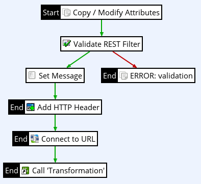

# Policy Studio Lab - Error Management

| Average time required to complete this lab | 20 minutes |
| ---- | ---- |
| Lab last updated | March 2024 |
| Lab last tested | March 2024 |

In this lab, 

## Learning objectives

At the end of this lab, you will be able to handle error management using Policy Studio.


## Introduction

### Billing REST error management

* The ‘restified’ service **Billing** works well when used correctly.

* However, what happens when something is not right, say in providing the input parameters?

* Let’s add minimum error management to this service


#### Default error attributes

* Go to `BillingRest` policy 

* Add **Copy / Modify attributes** filter in the policy  
See the following image for options

* Create 2 attributes
    * `error.message`: `Request failed`
    * `error.http.code`:`500`

* Then, link it at beginning of the policy and set it as start


#### Validation error attributes

* Add another **Copy / Modify attributes** filter (or copy it)

* Set name `ERROR: validation`

* Create 2 attributes
    * `error.message`:`Validation failed`      
    * `error.http.code`:`500`

* Then link it to **Validate Rest** filter



#### Connection error attributes

* Add another **Copy / Modify attributes** filter (or copy it)

* Set name `ERROR: connection`

* Create 2 attributes
    * `error.message`: `Service not available`
    * `error.http.code`: `500`

* Then link it to **Connect to URL** filter


#### False filter

* Add a **False** filter

* Link all **ERROR** named filters to it


#### Set error message

* Create a new policy **BillingRestFaultHandler** in the same container

* Add a **Set Message** filter with type `application/json` and the following message:
```json 
{ 
“id”: “${id}”,
“message”: “${error.message}”
}
```

* Add a **Reflect Message** filter with `${error.http.code}`

* Set **Set Message** filter as start


#### Fault handler

* Add **BillingRestFaultHandler** in **BillingRest**

* Set **BillingRestFaultHandler** as Fault Handler (right-click on it)

* Deploy to Gateway

* Test it! 


#### One sample test


Please test for other errors.

## Some notes

* Notice there are still some filters having **End** tag
    * So, default error notification will be triggered

* **Connect to URL** failure path will be triggered only if service cannot be reached, not for http code other than 200 

* Adding accurate error management can be an important part of policy (like in any program)

## Conclusion

* Implementation starts by getting something to work.
* But there are often few correct paths, for many incorrect ones. Take care of this error management from the beginning.
* Leverage Failure path, Fault Handler and Transaction Audit filters of Policy Studio.


