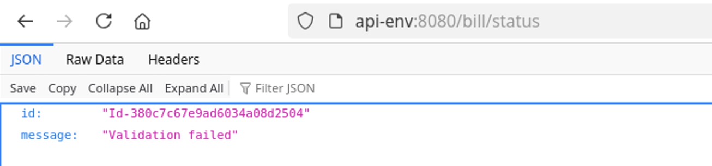

# Policy Studio Lab - Error Management

| Average time required to complete this lab | 20 minutes |
| ---- | ---- |
| Lab last updated | December 2024 |
| Lab last tested | December 2024 |

Welcome to the Policy Studio Lab on Error Management! In this session, we'll delve into handling error scenarios using Policy Studio within the context of APIM (Axway API Management). Picture a scenario where the 'restifed' service for billing operates seamlessly under normal conditions. But what if there are glitches, such as incorrect input parameters? This lab equips you with the skills to add basic error management functionalities to such services, ensuring smoother operations even when things go awry.

Throughout this session, we'll explore various facets of error management within Policy Studio. From defining default error attributes to handling validation and connection errors, you'll gain practical insights into configuring error management components effectively. By the end of this lab, you'll be proficient in setting up fault handlers, designing error messages, and deploying error management policies, all crucial aspects for maintaining robust and resilient API services. Let's dive in and master the art of error management within APIM's Policy Studio!

## Index

- [1. Learning Objectives](#1-learning-objectives)
- [2. Introduction](#2-introduction)
- [3. Some Notes](#3-some-notes)
- [4. Conclusion](#4-conclusion)

## 1. Learning objectives

**Remembering:**
   - Recall the steps involved in handling error management using Policy Studio within APIM.
   - Recognize the default error attributes required for error management configurations in APIM.

**Understanding:**
   - Explain the importance of error management in maintaining smooth operations within API services.
   - Interpret the significance of fault handlers, error messages, and transaction audit filters in Policy Studio.

**Applying:**
   - Utilize Policy Studio to configure error management policies within APIM.
   - Apply fault handlers and error message configurations to handle validation and connection errors effectively.

**Analyzing:**
   - Evaluate different types of errors and their impact on API services.
   - Assess the effectiveness of error management configurations in mitigating potential disruptions in API operations.

**Creating:**
   - Design customized error management strategies tailored to specific API service requirements.


## 2. Introduction

### 2.1. Billing REST error management

* The ‘restified’ service **Billing** works well when used correctly.

* However, what happens when something is not right, say in providing the input parameters?

* Let’s add some minimum error management to this service


#### 2.1.1. Default error attributes

* Go to `BillingRest` policy 

* Add **Copy / Modify attributes** filter to this policy  
See the following image for options

* Create 2 attributes
    * `error.message`: `Request failed`
    * `error.http.code`:`500`

* Then, link it at beginning of the policy and set it as start


#### 2.1.2. Validation error attributes

* Add another **Copy / Modify attributes** filter (or copy it)

* Set name `ERROR: validation`

* Create 2 attributes
    * `error.message`:`Validation failed`      
    * `error.http.code`:`500`

* Then link it to **Validate Rest** filter


#### 2.1.3. Connection error attributes

* Add another **Copy / Modify attributes** filter (or copy it)

* Set name `ERROR: connection`

* Create 2 attributes
    * `error.message`: `Service not available`
    * `error.http.code`: `500`

* Then link it to **Connect to URL** filter


#### 2.1.4. False filter

* Add a **False** filter

* Link all **ERROR** named filters to it


#### 2.1.5. Set error message

* Create a new policy **BillingRestFaultHandler** in the same container

* Add a **Set Message** filter with type `application/json` and the following message:
```json
{
  "id": "${id}",
  "message": "${error.message}"
}
```

* Add a **Reflect Message** filter with `${error.http.code}`

* Set **Set Message** filter as start


#### 2.1.6. Fault handler

* Add **BillingRestFaultHandler** in **BillingRest**

* Set **BillingRestFaultHandler** as Fault Handler (right-click on it)

* Deploy to Gateway

* Test it! 


#### 2.1.7. One sample test




Please test for other errors.

## 3. Some notes

* Notice there are still some filters having **End** tag
    * So, default error notification will be triggered

* **Connect to URL** failure path will be triggered only if service cannot be reached, not for http code other than 200 

* Adding accurate error management can be an important part of policy (like in any program)

## 4. Conclusion

* Implementation starts by getting something to work.
* But there are often few correct paths, for many incorrect ones. Take care of this error management from the beginning.
* Leverage Failure path, Fault Handler and Transaction Audit filters of Policy Studio.


