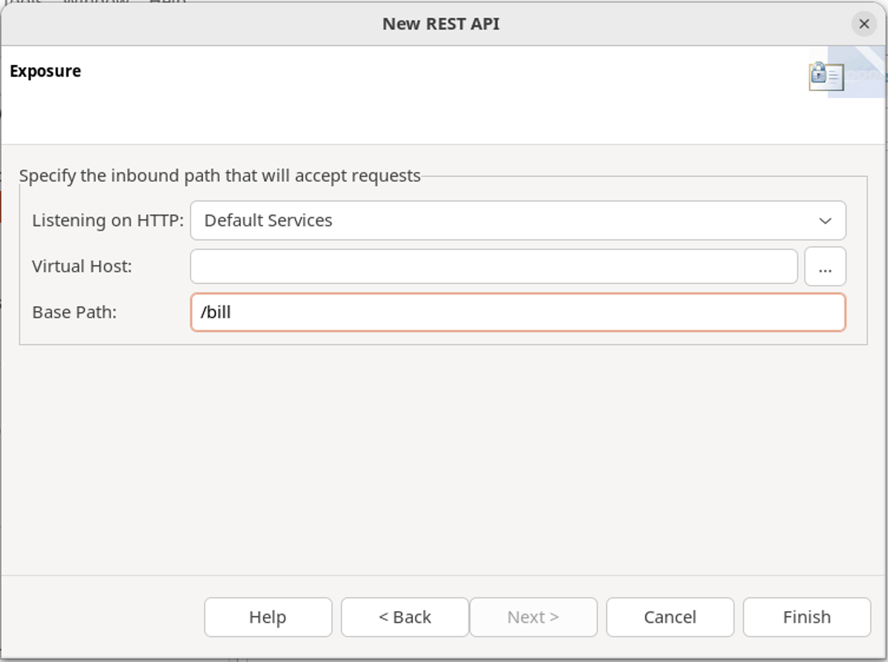
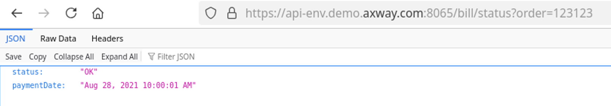

# Policy Studio Lab - From Policy to API

| Average time required to complete this lab | 20 minutes |
| ---- | ---- |
| Lab last updated | March 2024 |
| Lab last tested | March 2024 |

In this lab, 

## Learning objectives

At the end of this lab, you will be able to expose a policy on API Manager using REST Business Services

## Introduction

We want to have same management simplicity as with **OMS** using **API Manager**
* Solution is to integrate **Billing services** in **API Manager**

* 2 versions of exercise: 
    * SOAP: Business Service already exists
    * REST: Create Business Service. 
        * We will create a REST business service

### Task instructions

1. First, define Billing REST Business Service in **Policy Studio**
    * Delete the existing execution path
    * Add a Business Service
    * Add a method
    * Add a parameter
    * Test the service

2. Then, expose Billing Business Service in **API Manager**
    * Import Business Service from Topology
    * Test the service

### Expected result

* A Business service for Billing in **Policy Studio**

* Billing business service imported and managed from API Manager

## Solution

### Define REST business service

#### Delete the existing execution path

* First delete existing path
    * Go to **Default Services --> Paths**
    * Select `/bill/status` and delete it by clicking **Remove** button

#### Add a business service

* Go to **APIs --> REST API Repository**
* Click **Add**
* Create an API
    * `Name`: `Billing`
    * `Summary`: `Billing API`
    * `Description` : `Billing API`

* Click **Next**

* Expose on 
    * `Listener`: `Default Services`
    * `Base Path`: `/bill`

* Click **Finish**

#### Add a method

* On new Billing API, create a new method by right clicking

* In the **New API method** window, add
    * **Name:** `get status`
    * **Summary:** `get status`
    * **Description:** `get status`

* Click on **Next**

#### Add a parameter

* Keep HTTP Method as `GET` 
* Using **path:** `/status`

* Add a parameter: `order`
    * Make it a required parameter

#### Select the policy

* Select `BillingRest` policy
    * Use the filter above and start typing to quickly find it

* Click **Next**

#### Option for monitoring

* This page is for monitoring
* Keep default inputs and click **Finish**

#### Deploy the configuration

* Deploy configuration by clicking the button at the top of **Policy Studio** or press **F6**

#### Test the service

Test `http://api-env:8080/bill/status?order=123123`

### Expose the business service

#### Import business service from topology

* Same operation can be done for **SOAP** and **REST**
    * Import **Billing** REST Service from topology

* In API Manager, go to **Backend API --> New API --> Import API from topology**

* Use `admin/changeme` to connect to configuration

* Select all values as per the screenshot below

* Click **Import**. A backend Service is created.

* Create a new **Frontend** from **Backend**

* Set **Inbound security** to **Pass Through**

* Click **Save**

### Test the service

* Test the newly virtualized API  
`https://api-env.demo.axway.com:8065/bill/status?order=123123`

## Conclusion

* API Management solution allows to virtualize services
    * From **API Manager**, with a simple management interface
    * From **Policy Studio** for a lot of flexibility
* To benefit from advantages of both products, create Business services from **Policy Studio** and import them in **API Manager**
