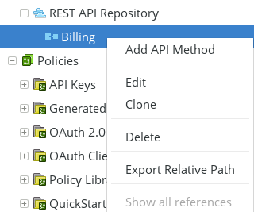
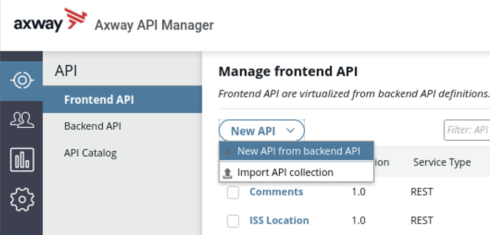

# Policy Studio Lab - From Policy to API

| Average time required to complete this lab | TBD minutes |
| ---- | ---- |
| Lab last updated | March 2024 |
| Lab last tested | March 2024 |

Welcome to the Policy Studio Lab - From Policy to API! In this lab, we'll embark on an exciting journey to explore the process of exposing a policy as an API using Axway's API Management solution. Our main objective is to integrate Billing services seamlessly into API Manager, enhancing management simplicity and efficiency. Whether you're familiar with SOAP or REST, this lab has two versions tailored to your needs, ensuring a comprehensive learning experience.

Through hands-on exercises, you'll gain practical insights into defining REST business services, configuring API methods, and testing service functionality within Policy Studio. Additionally, we'll delve into the API Manager interface, where you'll learn to import business services, create frontends from backends, and set inbound security measures. By the end of this lab, you'll understand the seamless integration between Policy Studio and API Manager, empowering you to virtualize services with flexibility and ease. Let's dive in and explore the transformative capabilities of Axway's API Management solution together!

## Index

- [1. Learning Objectives](#1-learning-objectives)
- [2. Introduction](#2-introduction)
- [3. Solution](#3-solution)
- [4. Conclusion](#4-conclusion)

## 1. Learning objectives

**Remembering:**
   - Recall the steps involved in defining a REST business service within Policy Studio.
   - Remember the process of configuring API methods and parameters for a REST API using Policy Studio.
   - Recall the steps required to import a business service into API Manager from Policy Studio.

**Understanding:**
   - Explain the significance of integrating Billing services into API Manager for management simplicity.
   - Understand the relationship between Policy Studio and API Manager in the context of virtualizing services.
   - Interpret the implications of exposing policies as APIs for seamless integration and enhanced management capabilities.

**Applying:**
   - Utilize Policy Studio to define and configure a REST business service for Billing.
   - Apply the provided guidelines to expose the Billing business service in API Manager.
   - Demonstrate the ability to test the functionality of the exposed service within API Manager.

**Analyzing:**
   - Evaluate different versions of the exercise (SOAP and REST) and compare the process of creating business services.
   - Analyze the advantages of virtualizing services from both Policy Studio and API Manager perspectives.
   - Assess the implications of virtualizing services on the overall management efficiency and flexibility.

**Creating:**
   - Design a customized approach to virtualizing services tailored to specific organizational requirements.

## 2. Introduction

We want to have same management simplicity as with **OMS** using **API Manager**
* Solution is to integrate **Billing services** in **API Manager**

* 2 versions of exercise: 
    * SOAP: Business Service already exists
    * REST: Create Business Service. 
        * We will create a REST business service

### 2.1. Task instructions

1. First, define Billing REST Business Service in **Policy Studio**
    * Delete the existing execution path
    * Add a Business Service
    * Add a method
    * Add a parameter
    * Test the service

2. Then, expose Billing Business Service in **API Manager**
    * Import Business Service from Topology
    * Test the service

### 2.2. Expected result

* A Business service for Billing in **Policy Studio**

* Billing business service imported and managed from API Manager

## 3. Solution

### 3.1. Define REST business service

#### 3.1.1. Delete the existing execution path

* First delete existing path
    * Go to **Default Services --> Paths**
    * Select `/bill/status` and delete it by clicking **Remove** button

#### 3.1.2. Add a business service

* Go to **APIs --> REST API Repository**
* Click **Add**
* Create an API
    * `Name`: `Billing`
    * `Summary`: `Billing API`
    * `Description` : `Billing API`

* Click **Next**

* Expose on 
    * `Listener`: `Default Services`
    * `Base Path`: `/bill`

* Click **Finish**

#### 3.1.3. Add a method

* On new Billing API, create a new method by right clicking

* In the **New API method** window, add
    * **Name:** `get status`
    * **Summary:** `get status`
    * **Description:** `get status`

* Click on **Next**

#### 3.1.4. Add a parameter

* Keep HTTP Method as `GET` 
* Using **path:** `/status`

* Add a parameter: `order`
    * Make it a required parameter

#### 3.1.5. Select the policy

* Select `BillingRest` policy
    * Use the filter above and start typing to quickly find it

* Click **Next**

#### Option for monitoring

* This page is for monitoring
* Keep default inputs and click **Finish**

#### 3.1.6. Deploy the configuration

* Deploy configuration by clicking the button at the top of **Policy Studio** or press **F6**

#### 3.1.7. Test the service

Test `http://api-env:8080/bill/status?order=123123`

### 3.2. Expose the business service

#### 3.2.1. Import business service from topology

* Same operation can be done for **SOAP** and **REST**
    * Import **Billing** REST Service from topology

* In API Manager, go to **Backend API --> New API --> Import API from topology**

* Use `admin/changeme` to connect to configuration

* Select all values as per the screenshot below

* Click **Import**. A backend Service is created.

* Create a new **Frontend** from **Backend**

* Set **Inbound security** to **Pass Through**

* Click **Save**

### 3.3. Test the service

* Test the newly virtualized API  
`https://api-env.demo.axway.com:8065/bill/status?order=123123`

## 4. Conclusion

* API Management solution allows to virtualize services
    * From **API Manager**, with a simple management interface
    * From **Policy Studio** for a lot of flexibility
* To benefit from advantages of both products, create Business services from **Policy Studio** and import them in **API Manager**
