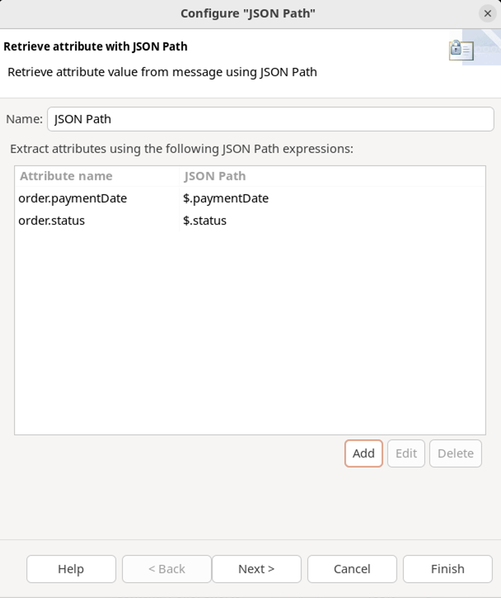
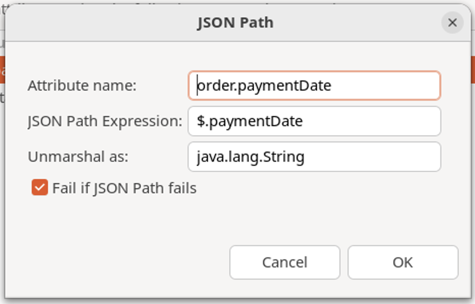
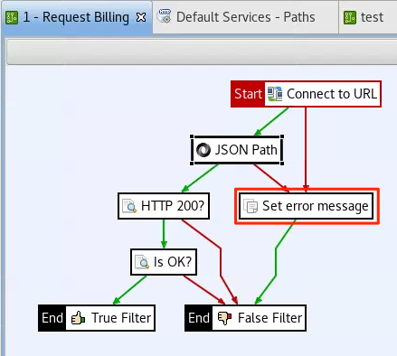
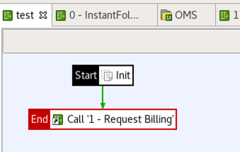
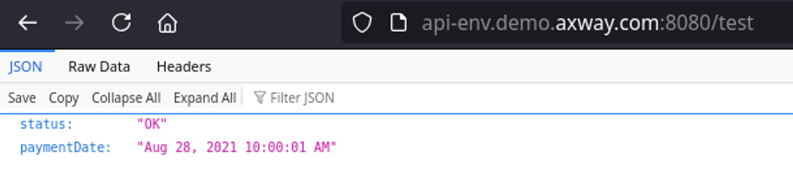
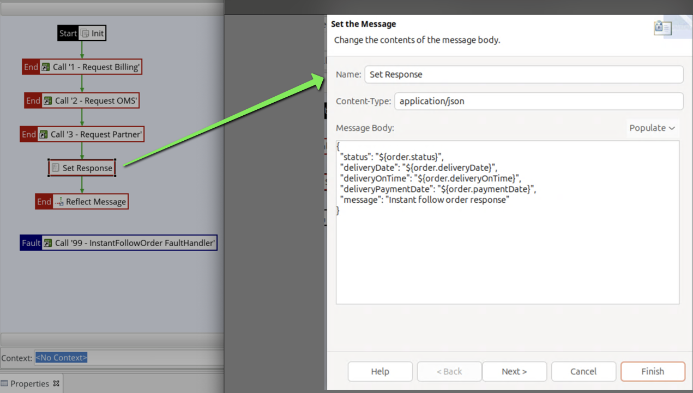
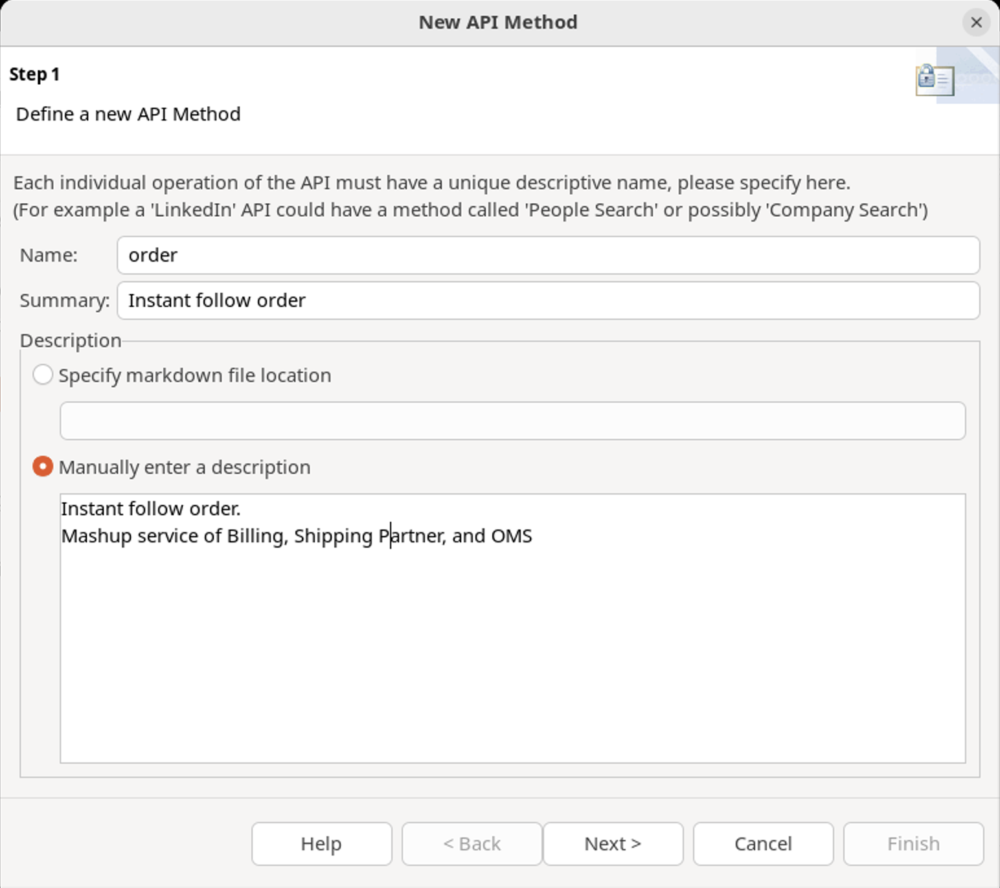

# Policy Studio Lab - Mashup

| Average time required to complete this lab | 60 minutes |
| ---- | ---- |
| Lab last updated | March 2024 |
| Lab last tested | March 2024 |

In this lab session, we delve into the intricacies of API management by exploring the concept of mashups, also known as Web Service Composition. A mashup involves blending various existing web services to create a new service that offers added value. This practice lies at the heart of Service-Oriented Architecture (SOA) and Digitalization, offering innovative ways to combine functionalities from disparate services.

Today's focus is on enhancing an Order Management System (OMS) to provide real-time updates to users. The existing OMS version lacks optimization, as its status updates are batched nightly, leaving users seeking immediate information about their orders' payment status, stock availability, and shipment updates. Through this lab, we aim to design and create a new API version, OMS v2, by integrating and optimizing various backend services to deliver instant follow-up capabilities, all accessible through API Portal with OAuth authentication.

## Learning objectives

**Remembering:**
   - Recall the key concepts of mashups (Web Service Composition) in Service-Oriented Architecture (SOA) and Digitalization.
   - List the main components involved in creating a mashup, such as combining existing web services to create a new service with added value.

**Understanding:**
   - Explain the significance of optimizing an Order Management System (OMS) to provide real-time updates to users.
   - Interpret the task of creating a new version of the OMS API (OMS v2) to include functionalities like validating customer purchases, indicating stock availability, and showing delivery status.

**Applying:**
   - Utilize the provided instructions to create a new version of the OMS API (OMS v2) that integrates various backend services and provides instant follow-up capabilities.
   - Demonstrate the ability to deploy and test the OMS v2 service, ensuring it functions as expected and provides real-time updates to users.

**Analyzing:**
   - Evaluate the effectiveness of using a mashup approach to enhance the OMS, considering factors such as real-time data availability and user satisfaction.
   - Assess the implications of error management strategies and authentication mechanisms on the reliability and security of the OMS v2 API.


## Introduction

A mashup (or Web Service Composition) is a combination of existing Web Services to create a new service with added value.

A mashup is a key concept in Service Oriented Architecture (SOA) and Digitalization.

Today, Order Management System **OMS v1** provides a `follow order` method
This service is not optimized. OMS status is updated by batch every night, but users need data in real time. They need more information about the order; has it been paid? is it in stock? and was it shipped?

### Task

* Create a new version of API **OMS v2**

The new version will do the following :
* Validate the customer purchase (Billing backend service). If the customer has paid for the order, the service will acknowledge it
* Indicate the stock availability (OMS backend service). The service indicates if the order is in stock
* Show the delivery status (Shipping mockup service). If the order has been shipped, it will return the status OK
* Merge the 3 services and provide a status with all information

Users will try the new service with **API Portal** and **OAuth** authentication


### Instructions

* Create a new version of OMS API to provide an instant follow order

* New method must implement the following algorithm
```
1. Check Billing status is “OK”
2. If not, report status and a message: “Payment status is not correct”
3. Check OMS status is “OK”
4. If not, report status and a message: “Payment is OK, availability issue” 
5. Check Shipping status is “OK”
6. If not, report status and a message: “Payment and availability OK, shipping in progress”
7. If yes, report status OK, paymentDate, deliveryDate and message “Everything OK!”
```

### Some advice

This exercise uses many features we have seen, and some new features
* Think about error management from the beginning.
* Using prepared request message is the simplest solution for composition.
* Look at **Connect to URL** filter documentation to know how to make a call with TLS and HTTP Basic.
* Create a business service to import the new service into API Manager.
* Protect OMS with OAuth and test service through **API Portal**.

### Solution principles: sub-policies

There are 3 big steps to create the new service:
1. Call Billing service : use service virtualized in API Manager, lab “Policy Studio - Lab - From policy to API”
2. Call OMS backend service : 
    * **Host** : `api-env`
    * **Port** :  `5080`
    * **Path** : `/mockup/oms/v1/order`
    * **Parameter** : `orderId` as a query string, as a 9-digit number
    * **Protocol** : `HTTP`
3. Call Shipping mockup service. Use the service created in the lab titled **Policy Studio - Lab - My first mockup**

Let’s create one policy for each step (even if there is only one filter for each)

*Best practice:*
- Start main policy name with 0, to display it first
- It makes sense to prefix other policies 1, 2, 3... but only if these steps are clearly identified
- Sub-policy defined at logical level will simplify maintenance later

### Solution principles: attributes

According to specifications, the following variables are used during the process
* `status`
* `message`
* `deliveryDate`
* `paymentDate`

Let’s create a variable for each one
* `order.status`
* `order.message`
* `order.deliveryDate`
* `order.paymentDate`

*Best practice:* 
* List variables you are using when developing
* If it is not a standard attribute, use a prefix to avoid collision

### Solution principles: error management

* Policy will be designed with attributes and sub-policies
* If one sub-policy returns false, this must be sent as an error message
* Fault Handler will return a simple message using
    * `order.status`
    * `order.message`
    * `Id` (transaction id)

* Attributes used in error message need to be initialized

*Best practice:* 
* Think of error management from the beginning.
* Sending too much information is a security risk. Providing transaction Id will simplify support, without giving information about the solution

### Expected result

* A main policy calling 3 policies

* A REST business service declared in API Manager

* Test the API with API key in **API Portal**


## Solution

### Main policy

* Create base frame by creating policies and putting them in main policy
    * 0 – InstantFollowOrder
    * 1 - Request Billing
    * 2 - Request OMS
    * 3 - Request Partner
    * 99 - InstantFollowOrder FaultHandler

* Set Fault Handler


* For starters, policy requires
    * Init error variables
    * Get the order
* Set error variables using a **Copy / modify attributes** filter
* Put it first and set as start
* `Order id` is already available through `params.query.order`, thanks to API Manager


### Fault handler

* Define fault handler

* In this case, it will consist of a message and a **500** HTTP code
```json
{
  "status": "${order.status}",
  "message": "${order.message}",
  "transaction": "${id}"
}
```


### Policy - Request Billing

* Find how to access **Billing** service
* Already exposed through Business Service
* So best answer is **API Catalog** in **API Manager**


* GET `https://api-env.demo.axway.com:8065/bill/status?order=123123`

* Design policy as shown in the screenshot below

* Notice how query parameters are set in URL

* Notice that a mix of string and selector are used


* Notice that it is **https**

* By default, `Trust all Certificates` is activated


*Best practice:* 
* For security reasons, trusted certificates should be explicitly chosen


* Add **JSON Path** filter for extracting info
    * `message`
    * `deliveryOnTime`
    * `status`
* See how JSON paths are defined
* Type expected is `java.lang.String` for both
* Status and payment date should trigger a failure if absent






* **Connect to URL** and **JSON Path** can fail without setting status and message attributes
* Set error messages for fault handling
* Set in a **Copy /modify attributes** filter
* **“True Filter** is a way to identify success path. It does not have any other function.




* Use “Evaluate selector” filter

* This step evaluates if HTTP response has a 200 return code


* Use another **Evaluate selector** filter

* This step evaluates if status has been set to `OK`


*Best practice:* Intermediate test

* It is important to do unitary test during development
* It can be achieved easily
    * Add a test policy
    * Initialize attributes, especially `params.query.order` used
    * Copy/paste from main policy
    * Drag and drop **1 - Request Billing** policy on **Init** filter
    * Expose it on the path `/test`




* Deploy configuration by clicking the deploy icon at the top of **Policy Studio** or press **F6**

* Test the service `http://api-env.demo.axway.com:8080/test`




### Policy - Request OMS

* Use same technique as the one you used with **Request Billing** policy to create **Request OMS** policy 
* Retrieve OMS backend URL
* Retrieve response status and message
* Update default error message


`http://api-env.demo.axway.com:5080/mockup/oms/v1/order/${params.query.order}`

*Note:* You can copy/paste **Request Billing** policy and then make the necessary changes

### Policy - Request Partner

* Use the same technique to create **Request Partner** policy 
    * Retrieve partner mockup url
    * Retrieve from response: `status`, `deliveryDate` and `message`
    * Update default error message
* Modify test policy to call main policy **0 - InstantFollowOrder**

`http://api-env.demo.axway.com:8080/supplier/delivery?id=${params.query.order}`


* Deploy configuration by clicking the deploy icon at the top of **Policy Studio** or press **F6**

* Test it! Is it working?

*Best practice:* Debugging

* If a message is not processed correctly, see more information in **API Gateway Manager**
* If info is not enough, change dynamically log levels or in development even add **Trace** filters to display attributes 


### Main policy - Create answer

* Finish main policy by creating response and adding reflect message

```json
{
  "status": "${order.status}",
  ”deliveryDate": "${order.deliveryDate}",
  "deliveryOnTime": "${order.deliveryOnTime}",
  "message": "Instant follow order response"
}
```




### Business service OMS

* Create **OMS**, a new REST Business Service for the new version of API - **OMS v2**


* Expose the Business service on **Default Services** on path `/oms/v2`


* Add a new method named **order**




* Add GET HTTP method
* Path `/order`
* Add required parameter `order`


* Link method to the main policy **0- InstantFollowOrder**
* Click **Finish**


* Deploy configuration by clicking the deploy icon at the top of **Policy Studio** or press **F6**
* Test it!

### Import business service from Topology

* In **API Manager**, go to **Backend API --> New API --> Import API from Topology**

* Use `admin/changeme` to connect to configuration


* Select all values as per the screenshot below

* Click **Import**

A backend Service is created.


* Create a new Frontend from Backend


* Set **Inbound security** to `OAuth`

* Click **Save**


### Test OMS v2 service

* Connect to API Portal with `anna/anna`  
`https://api-env.demo.axway.com/`


* Create an application called **FollowOrderApp**

* Add rights for **OMS** API

* Save and add authentication


* Generate OAuth Credentials


* Go back to **API Catalog** to test **OMS**


* Authorize with the scopes

* Select all scopes


* Add OAuth Client credentials
* Request token
* Select method GET order
* Add parameter `123123`
* Click **Try it!**


*Expected result:*

* HTTP return code 200
* Attributes filled in :
    * Status OK 
    * PaymentDate
    * DeliveryDate


### Traffic monitor


* Click on main policy execution line to see:
    * Policies called
    * Filters executed


## Conclusion

The Mashup is a complex exercise using many API Management concepts (Virtualization, Business Services, Error Management, Authentication, etc)
* Remember to always test a complex policy step by step

The Mashup exercise is difficult but complete.  If you can finish it without looking at the solution, you really have understood how to use the API Management solution
