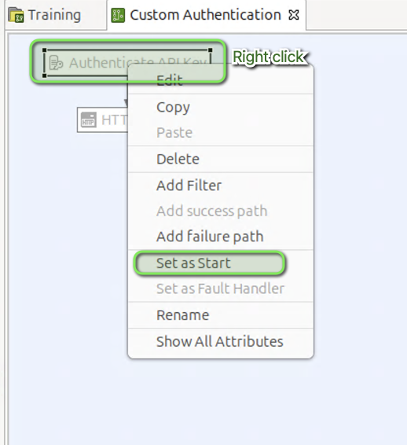
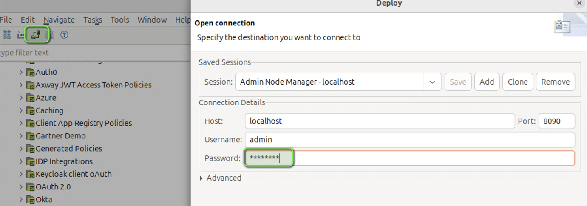
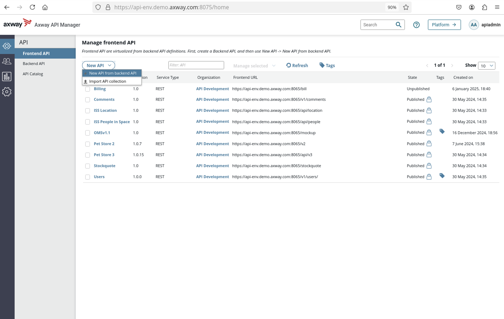
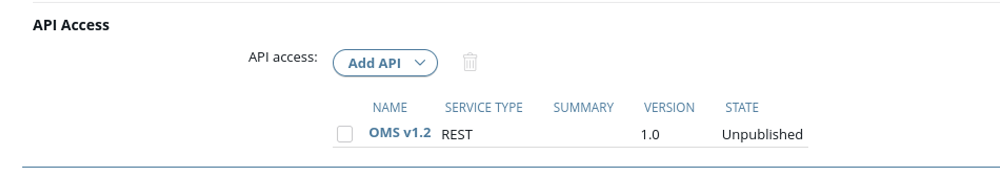
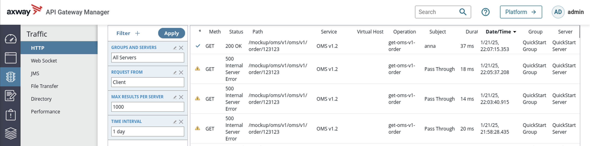

# Authentication Lab 

| Average time required to complete this lab | 30 minutes |
| ---- | ---- |
| Lab last updated | March 2024 |
| Lab last tested | March 2024 |

In this lab, 

## Learning objectives

At the end of this lab, you will be able to 
* Integrate an authentication Policy to API Manager
* Implement a simple example of Identity Management policy

## Introduction

A company uses API Manager for app authentication
* There is no user authentication
* User authentication depends on integration

The following are the goals to be achieved:
* Continue to use API Key as before
* Have authentication with HTTP Basic on a LDAP repository

## Instructions

* Create a simple policy with two filters
    * **Authenticate API Key**
    * **HTTP Basic**

* Declare the policy in **API Manager** as an invoke policy to protect **OMS** API

* Test it with **CURL** commands

## Expected result

* A simple authentication policy

* Call the authentication policy from **API Manager**

## Solution

* Open **Policy Studio**

* Open **QuickStart** project

* Create a policy

* Add **Authenticate API Key** filter

* Edit filter configuration as per the screenshot below.

* Click **Finish**

* Add **HTTP Basic** filter on the previous filter

* Edit filter configuration as per the screenshot below.

* Click **Finish**

* Set the start filter

* Make the policy available to **API Manager**

* Deploy the policy

* Connect to **API Manager**  
`apiadmin/changeme`

* Virtualization - create a Backend with Swagger

* Virtualization - create a Frontend

* Click **Save**

* Select authentication mechanism and save  
If the invoke policy does not appear, refresh the browser 

* Create an application

* Add the User **Anna** in the Sharing tab

### Test it!

* `curl -k  https://api-env.demo.axway.com:8065/mockup/oms/v1/oms/v1/order/123123`

* `curl -k  https://api-env.demo.axway.com:8065/mockup/oms/v1/oms/v1/order/123123?KeyId=MY_KEY`

* `curl -k -u anna:anna https://api-env.demo.axway.com:8065/mockup/oms/v1/oms/v1/order/123123`

* `curl -k -u anna:anna https://api-env.demo.axway.com:8065/mockup/oms/v1/oms/v1/order/123123?KeyId=MY_KEY`

### Troubleshooting

## Conclusion

* API Management solution allows to implement many authentication protocols with:
    * API Manager - a simple management interface
    * Policy Studio for a lot of flexibility, with easy-to-use predefined filters