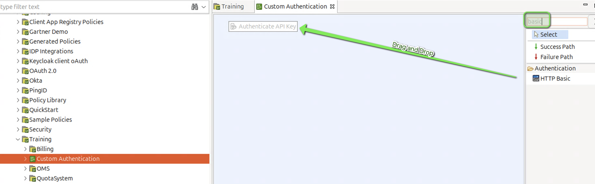
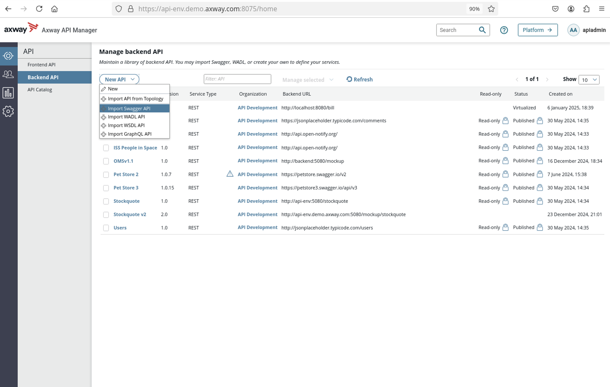

# Authentication Lab 

| Average time required to complete this lab | 30 minutes |
| ---- | ---- |
| Lab last updated | December 2024 |
| Lab last tested | December 2024 |

Welcome to the Authentication Lab, where you'll dive into the world of securing APIs using Axway's API Manager. In this session, we'll explore the essential concepts and hands-on techniques for implementing authentication policies within your API management infrastructure. As organizations increasingly rely on APIs to power their digital ecosystems, ensuring secure access to these resources becomes paramount, making authentication a crucial aspect of API management.

Throughout this lab, we'll focus on integrating authentication mechanisms, specifically API Key and HTTP Basic, into API Manager. By the end of this session, you'll gain the skills to protect your APIs effectively and understand the importance of identity management in ensuring secure API access. Let's embark on this journey together to unlock the potential of API authentication within Axway's API Management solution.

## 1. Learning objectives

**Remembering:**
   - Recall the purpose of API authentication within the context of API Manager.
   - Recognize the two authentication mechanisms covered in the lab: API Key and HTTP Basic.
   - List the steps involved in creating and configuring authentication policies in Policy Studio.

**Understanding:**
   - Explain the significance of implementing authentication policies in API Manager for securing APIs.
   - Describe the difference between API Key and HTTP Basic authentication methods.
   - Interpret the implications of using HTTP Basic authentication with LDAP repository integration.

**Applying:**
   - Utilize Policy Studio to create and configure authentication policies for protecting APIs.
   - Implement the provided guidelines to set up HTTP Basic authentication with LDAP repository integration.
   - Demonstrate the ability to test authentication policies using CURL commands.

**Analyzing:**
   - Evaluate the effectiveness of API Key and HTTP Basic authentication methods in different scenarios.
   - Analyze the advantages and disadvantages of using LDAP repository integration for authentication.
   - Assess the potential security risks associated with each authentication method and propose mitigation strategies.

## 2. Introduction

A company uses API Manager for app authentication
* There is no user authentication
* User authentication depends on integration

The following are the goals to be achieved:
* Continue to use API Key as before
* Have authentication with HTTP Basic on a LDAP repository

## 3. Instructions

* Create a simple policy with two filters
    * **Authenticate API Key**
    * **HTTP Basic**

* Declare the policy in **API Manager** as an invoke policy to protect **OMS** API

* Test it with **CURL** commands

## 4. Expected result

* A simple authentication policy

* Call the authentication policy from **API Manager**

## 5. Solution

* Open **Policy Studio**

* Open **QuickStart** project

* Create a policy named **Custom Authentication**

* Add **Authenticate API Key** filter

* Edit filter configuration as per the screenshot below.

* Click **Finish**

* Add **HTTP Basic** filter on the previous filter

* Edit filter configuration as per the screenshot below.

* Click **Finish**

* Set the start filter

* Make the policy available to **API Manager**

* Click **Save**

* Deploy the policy

* Connect to **API Manager**  
`apiadmin/changeme`

* Virtualization - create a Backend with Swagger

* Name the backend API as `OMS v1.2`
* Choose the organization as `API Development`

* Virtualization - create a Frontend

* Click **Save**

* Select authentication mechanism and save  
If the invoke policy does not appear, refresh the browser 

* Create an application

* Add the User **Anna** in the Sharing tab

### 5.1. Test it!

* `curl -k  https://api-env.demo.axway.com:8065/mockup/oms/v1/oms/v1/order/123123`

* `curl -k  https://api-env.demo.axway.com:8065/mockup/oms/v1/oms/v1/order/123123?KeyId=MY_KEY`

* `curl -k -u anna:anna https://api-env.demo.axway.com:8065/mockup/oms/v1/oms/v1/order/123123`

* `curl -k -u anna:anna https://api-env.demo.axway.com:8065/mockup/oms/v1/oms/v1/order/123123?KeyId=MY_KEY`

### 5.2. Troubleshooting

## 6. Conclusion

* API Management solution allows to implement many authentication protocols with:
    * API Manager - a simple management interface
    * Policy Studio for a lot of flexibility, with easy-to-use predefined filters