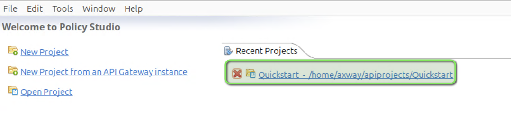
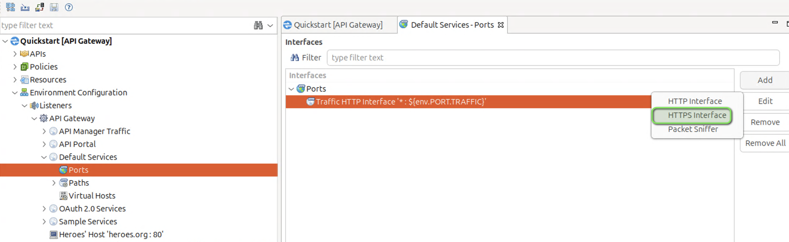
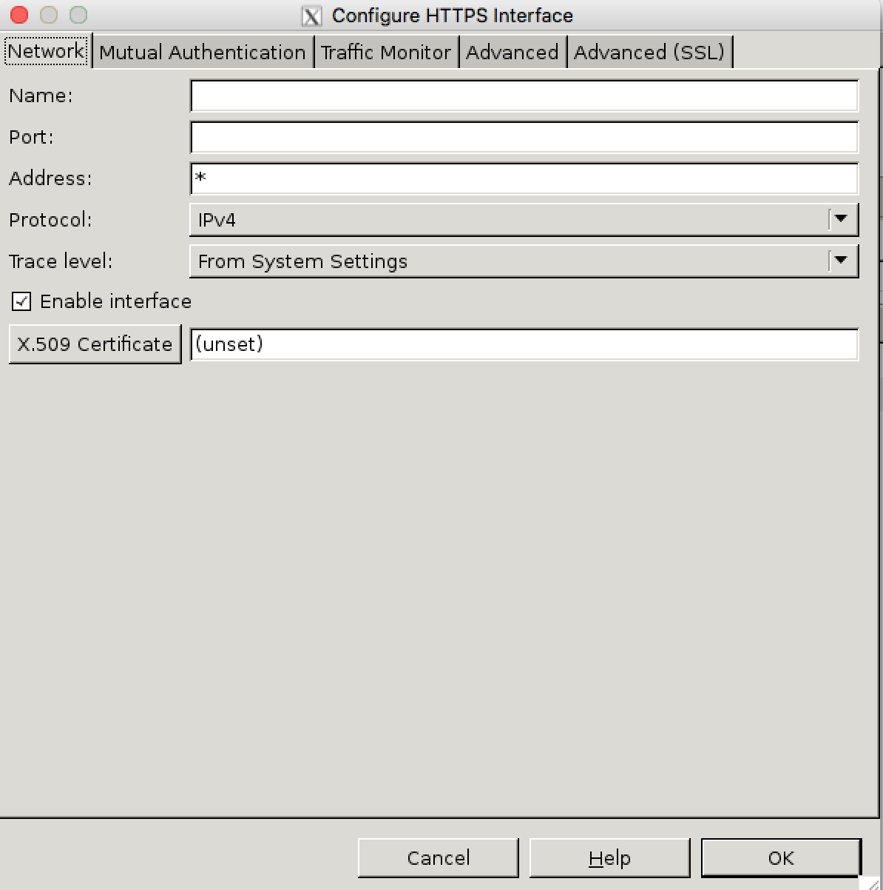
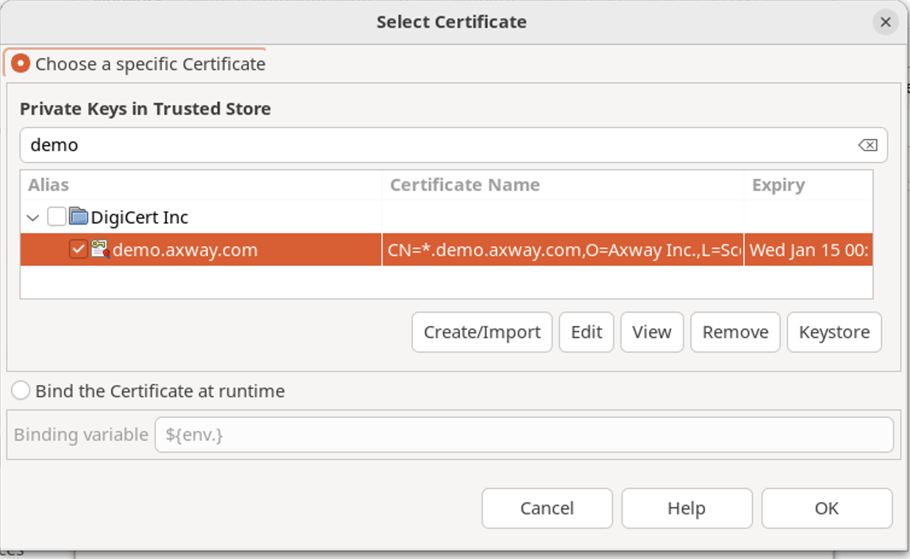
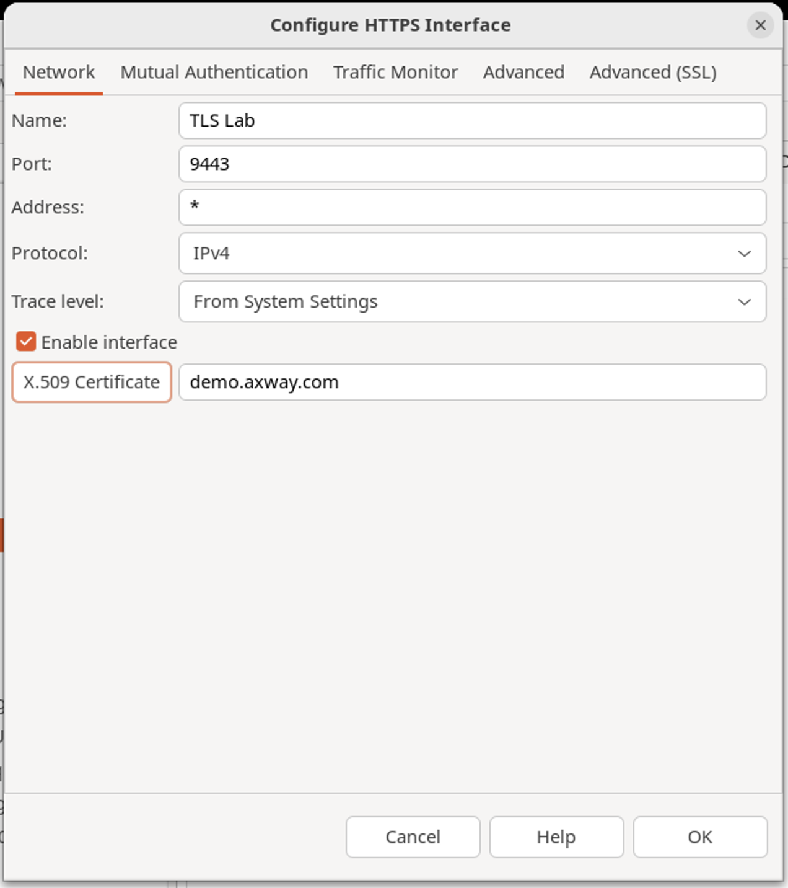
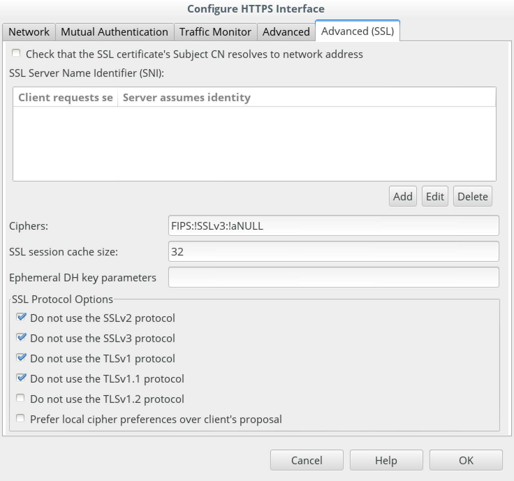
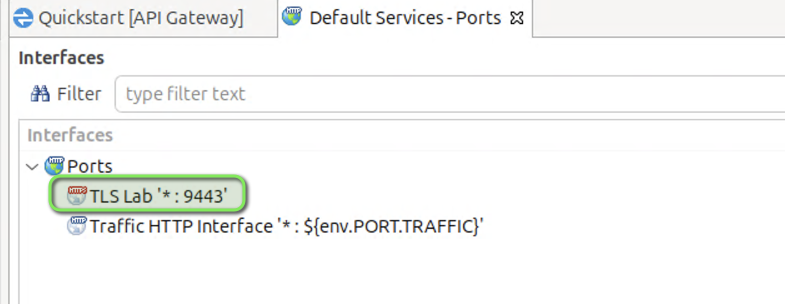
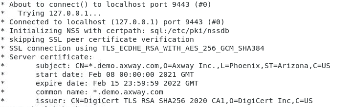
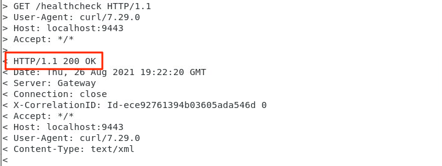

# TLS Lab 

| Average time required to complete this lab | 20 minutes |
| ---- | ---- |
| Lab last updated | December 2024 |
| Lab last tested | December 2024 |

Welcome to the TLS Lab! In this session, we will dive into the intricacies of Transport Layer Security (TLS) within the context of API Gateway configuration. TLS plays a critical role in securing communications over the internet, and understanding how to implement it effectively is paramount for any API management professional. Throughout this lab, we will explore the process of creating a TLS HTTPS listener on the API Gateway, setting up ports, and configuring certificates to ensure secure data transmission.

As organizations increasingly prioritize data security, the ability to configure TLS effectively has become a sought-after skill in the realm of API management. This lab offers a hands-on opportunity to gain practical experience in setting up TLS listeners and navigating through various configurations. By the end of this session, you will not only be equipped with the technical know-how to create TLS listeners but also gain insights into testing methodologies and understanding the implications of different TLS versions. So, let's embark on this journey to enhance our understanding of TLS and fortify our API infrastructure against potential security threats.

## 1. Learning objectives

**Remembering:**
- Recall the steps involved in creating a TLS HTTPS listener on API Gateway.
- Identify the port settings required for configuring a TLS listener.

**Understanding:**
- Explain the significance of Transport Layer Security (TLS) in securing data transmission over the internet.
- Interpret the purpose of configuring X.509 certificates for TLS listeners.

**Applying:**
- Utilize the API Gateway interface to create a TLS HTTPS listener and configure port settings.
- Demonstrate the ability to select and apply X.509 certificates for TLS configurations.

**Analyzing:**
- Evaluate the implications of disabling certificate verification in a TLS setup.
- Assess the impact of different TLS versions on security and performance.

**Creating:**
- Design a customized TLS listener configuration tailored to specific organizational security requirements.


## 2. Learn by doing

* Use the **QuickStart** project in the API Management Reference Environment



* Create a TLS HTTPS listener and set the port to `9443`
    * Navigate to **Environmental Configuration --> Listeners --> API Gateway --> Default Services --> Ports**
    * Click **Add** button and select **HTTPS Interface**



* Update the settings on the **Network** tab
    * Name the Listener as `TLS Lab`
    * Set the port to `9443`
    * Click the **X.509 Certificate** button




* Select the **DigiCert Inc** certificate and click **OK**
    * You can type `demo` in the filter text to quickly find this.




* The **Network** tab should look like the screenshot below. If so click **Advanced (SSL)** tab



For this lab we are going to disable or uncheck `Check that the SSL certificate’s Subject CN resolves to network address`  because we are using the sample certs.  <span style="color:red">**DO NOT DO THIS IN PRODUCTION**</span>




* Click **OK**

* Now you should see your new **TLS Lab** listener listed like the screenshot below.  
**Save** and **deploy** your configuration



* Let’s test our new TLS listener using CURL
    * `-v` is verbose
    * `-k` disables certificate verification (we need this; otherwise we’ll have to download the sample CA certificate)

```
curl -v -k "https://localhost:9443/healthcheck"
```

Expected output:





## 3. Conclusion

* Demo of HTTPS Listener
* Showed positive and negative test cases when we tried different TLS versions
