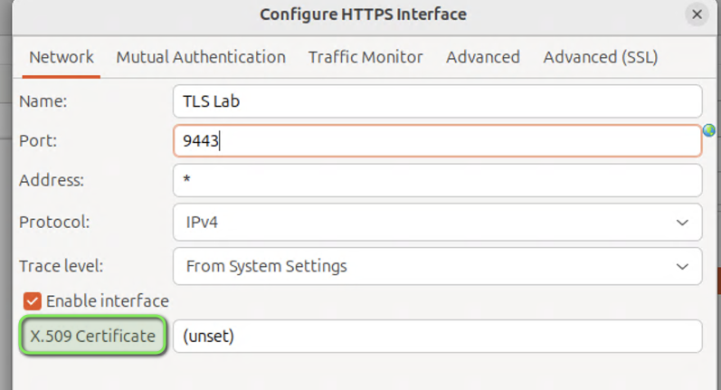
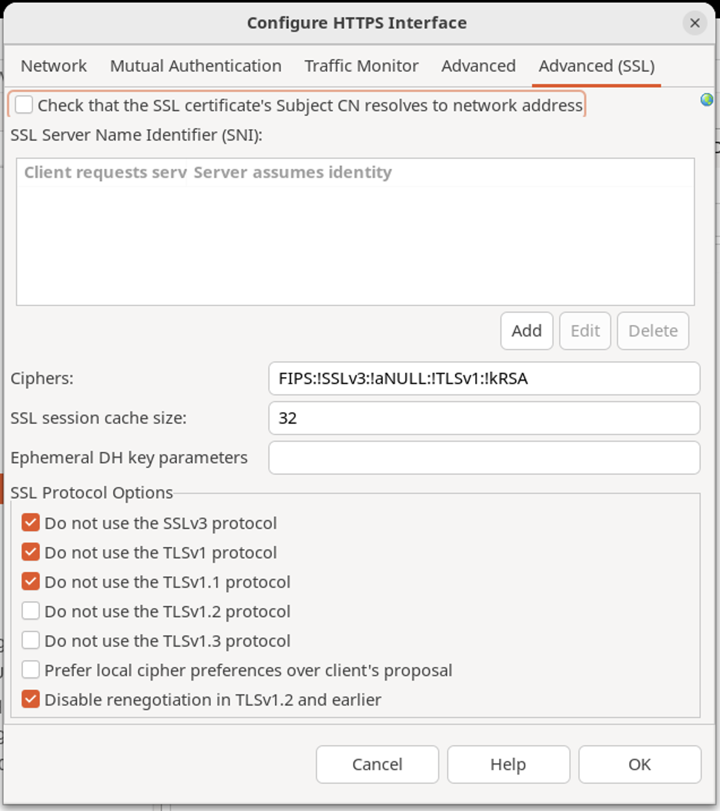

# TLS Lab 

| Average time required to complete this lab | 30 minutes |
| ---- | ---- |
| Lab last updated | March 2024 |
| Lab last tested | March 2024 |

In this lab, 

## Learning objectives

At the end of this lab, you will be able to 
* Create HTTPS TLS on API Gateway Listener

## Learn by doing

* Use the **QuickStart** project in the API Management Reference Environment

* Create a TLS HTTPS listener and set the port to `9443`
    * Navigate to **Environmental Configuration --> Listeners --> API Gateway --> Default Services --> Ports**
    * Click **Add** button and select **HTTPS Interface**

* Update the settings on the **Network** tab
    * Name the Listener as `TLS Lab`
    * Set the port to `9443`
    * Click the **X.509 Certificate** button

* Select the **DigiCert Inc** certificate and click **OK**

* The **Network** tab should look like the screenshot below. If so click **Advanced (SSL)** tab

For this lab we are going to disable or uncheck `Check that the SSL certificate’s Subject CN resolves to network address`  because we are using the sample certs.  **DO NOT DO THIS IN PRODUCTION**

* Now you should see your new **TLS Lab** listener listed like the screenshot below.  
Save and deploy your configuration

* Let’s test our new TLS listener using CURL
    * `-v` is verbose
    * `-k` disables certificate verification (we need this; otherwise we’ll have to download the sample CA certificate)

`curl -v -k "https://localhost:9443/healthcheck"`

Expected output:

## Conclusion

* Demo of HTTPS Listener
* Showed positive and negative test cases when we tried different TLS versions
