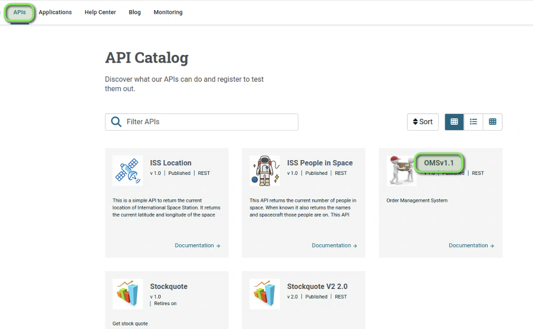
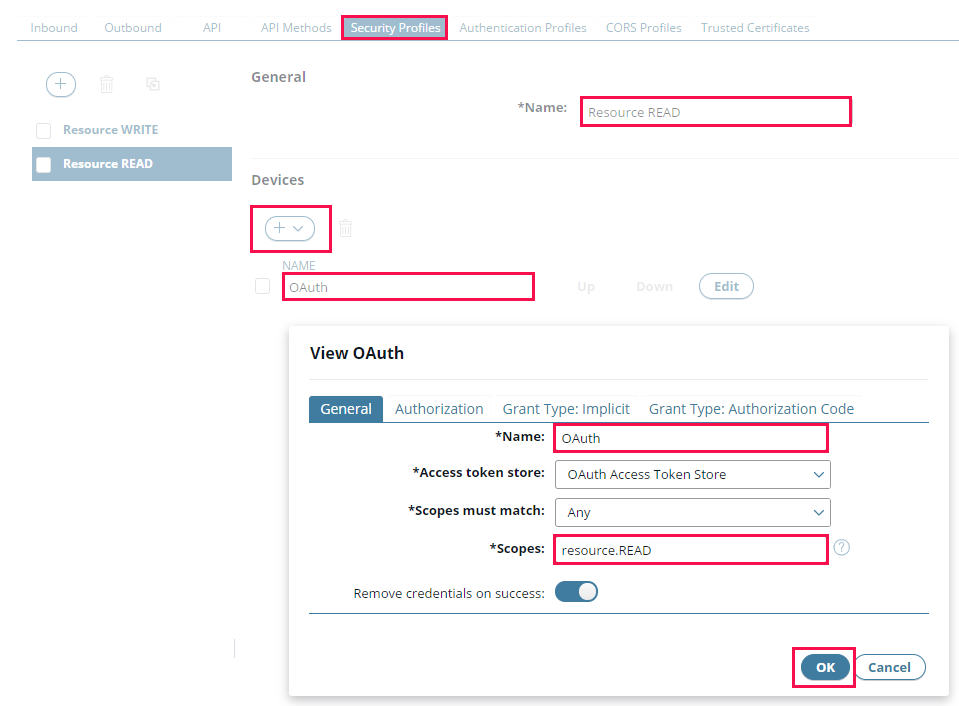
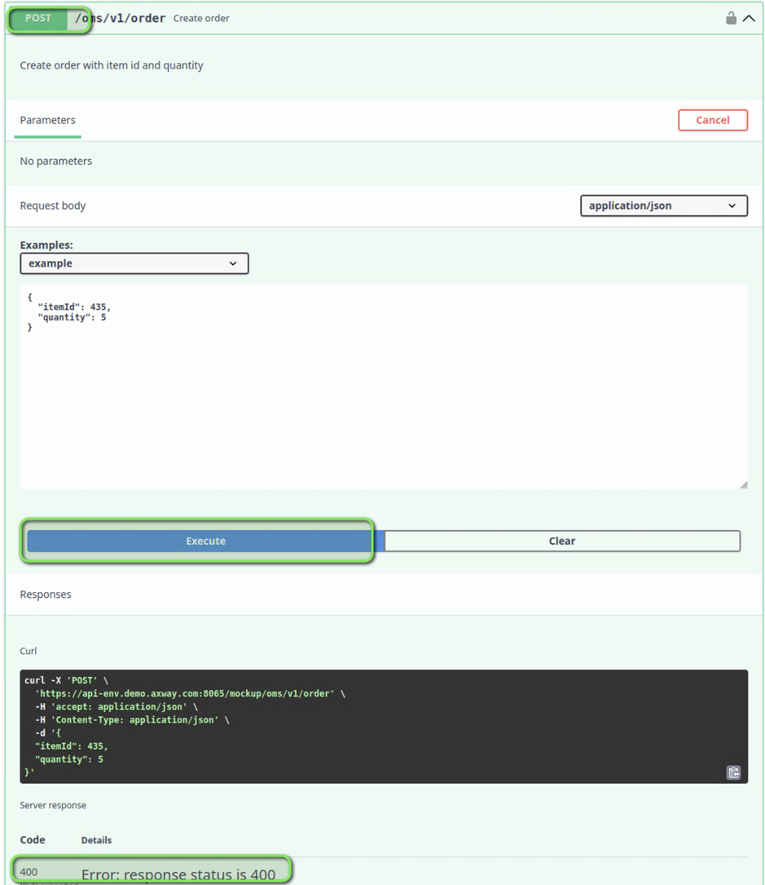

# OAuth Lab 

| Average time required to complete this lab | 30 minutes |
| ---- | ---- |
| Lab last updated | March 2024 |
| Lab last tested | March 2024 |

In this lab, we will navigate the roles of key components such as the Resource Server (API Manager), Authorization Server (API Gateway), and Client Application (API Portal). By immersing ourselves in a hypothetical scenario of a company providing an API to external developers, we will unravel the steps involved in virtualizing APIs and configuring OAuth authentication settings. Get ready to embark on a journey that will equip you with the skills and knowledge to effectively implement OAuth authentication within API Management environments.

## Learning objectives

1. **Remembering:**
   - Recall the fundamental components of OAuth authentication within API Management solutions, including the Resource Server, Authorization Server, and Client Application.
   - Identify the steps involved in configuring OAuth authentication settings, such as virtualizing APIs and granting access rights to external developers.

2. **Understanding:**
   - Explain the concept of OAuth authentication and its significance in securing API access for external developers.
   - Interpret the relationship between API Gateway, API Manager, and API Portal in the context of OAuth authentication.

3. **Applying:**
   - Utilize the provided guidelines to configure OAuth authentication settings within API Manager and API Gateway.
   - Demonstrate the ability to connect to API Portal as a Client Application and consume APIs using OAuth authentication.

4. **Analyzing:**
   - Evaluate different scenarios where OAuth authentication may be preferable over other authentication methods within API Management solutions.
   - Assess the implications of OAuth authentication settings on the security and accessibility of APIs for external developers.

5. **Creating:**
   - Design a customized OAuth authentication strategy tailored to specific organizational requirements within an API Management environment.
   - Develop a comprehensive documentation or guide outlining best practices for implementing OAuth authentication within API Management solutions.

These learning objectives encompass a range of cognitive levels, from basic recall to higher-order thinking skills, providing you with a holistic understanding of OAuth authentication in API Management.

## Introduction

Let's look at a high-level example of how OAuth works with API Management solution.

* API  Manager as a Resource Server

* API Gateway as an Authorization Server

* API Portal as a Client Application

* Resource Server & Authorization Server: API Gateway & API  Manager

* Client Application to access services: API Portal

## Exercise

A company wants to provide an API (called OMS) to external app developers with OAuth authentication

*Goal:* Virtualize the API and give access via OAuth to external developers with API Management products

* Virtualize the API with **API manager** with OAuth authorization
    * Use **API Manager** as the resource server
    * Use **API Gateway** as the authorization server

* Connect as an external developer to **API Portal** and consume API
    * Use **API Portal** as the Client Application

The API Administrator virtualizes the API via OAuth authentication with **API Manager** and shares rights to Organization Partners

Dave is an application developer belonging to **Partners** Organization. He browses the API Catalog, finds an interesting API (called OMS) requiring OAuth and tests it with API Portal

It is easy. Try it before looking at the solution!

## Solution

### API Manager – Inbound Authentication

* Connect to API Manager `https://api-env.demo.axway.com:8075/` as `apiadmin/changeme` 

* Virtualize an API, for example `OMS V1.1` (oms_v1.json located in TechLabs Resources)  
You can get some help to virtualize an API thanks to Amplify API Management demo guide

* Configure the Frontend API, Inbound tab, to use Oauth. In the popup, keep all options as default.

### API Manager - Outbound Authentication

* Configure the Frontend API, outbound tab, with no authentication, then save

### API Manager - Publish the API

### API Manager - Access Rights

* Grant API access to the organization **Partners**

### API Portal - Application creation

* Connect to API Portal `https://api-env.demo.axway.com` as `dave/dave` and create an application to access the API

* Add **OAuth** credentials in the Application **Authentication** tab

### API Portal - Test the OMS API

* Go to **API Catalog**, using **APIs** menu item

* Select the OAuth Client generated in the application, request a token, add an `orderID` and try out the API method `GET`

* Congratulations, you have obtained the resource!

## Fine scope management (Optional exercise)

### API Manager – Scope configuration (Read)

* Control the scope of authorized resources with Security Profiles.

* Unpublish the API, then add new Security Profiles for READ and WRITE resources

### API Manager – Scope configuration (Write)

### API Manager – Scope methods

* In the **Inbound** tab, click on Advanced/Simple, and add two per-method overrides for read and submit

* Save, publish and grant access to **Partners** organization

### API Portal – Check application API rights

* Connect to the **API Portal** with `dave/dave`

* Check **OMS v1** API for the use of the OMS application (unpublishing the API revokes rights for the application)

*Note : if an internal server error appears, recreate the application*

### API Portal – Scope testing

* Test the API. If Dave authorizes READ resources, he will only have access to “read” method and will get a “401” “scope not valid” error for the “submit” method.

* If Dave authorizes WRITE resources, he will only have access to “submit” method and will get an error for “read” method.

## Conclusion

API Management solution allows  to easily use OAuth authentication, with API Gateway, API Manager and API Portal
